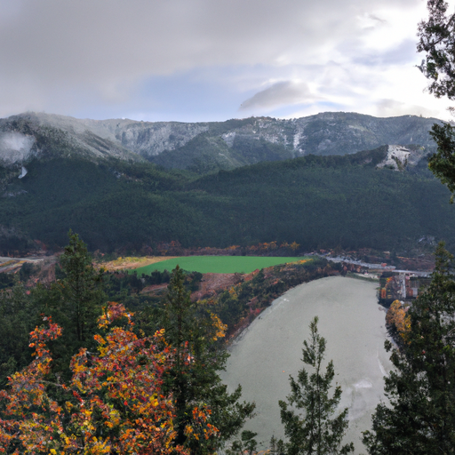
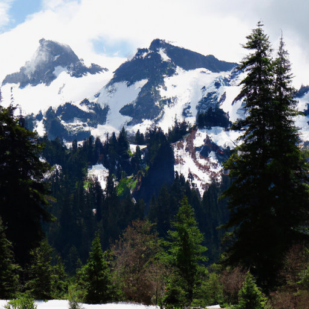
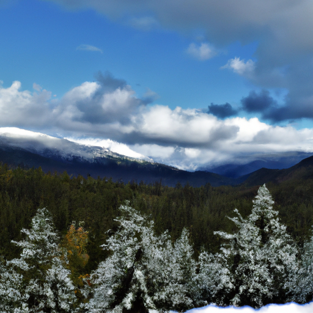

## [how my home-schooling experience changed my life - an alternative childhood](https://www.youtube.com/watch?v=fWNJmZAWRNg)

<table align="center">
	<tr>
		<td align="center">
			
		</td>
		<td align="center">
			
		</td>
		<td align="center">
			
		</td>
	</tr>
</table>

Living in the northern part of Washington state gives me the opportunity to observe the transition of the Four Seasons in contrast to milder environments. There is such a distinct difference between each and every part of the year. Since I was a little girl, I loved going out in nature and had the distinct privilege of being able to call it one of my teachers. I was schooled at home most of my childhood, and I would say overall my education was defined by outdoor expeditions, movement, endless reading, and writing, preserving an insatiable love of learning into my adulthood.

You've probably heard many different perspectives on alternative education, both positive and negative. I'm not here to affirm or defend because I know so many educations, traditional, non-traditional, and anything in between, can be imperfect and complicated. Not everyone has the opportunity to choose certain forms of education. Some don't have the opportunity to even learn how to read. So this video isn't meant to say anything except share a story of a child that grew up mostly barefoot and enjoyed an unconventional education and, in some ways, childhood, having known nothing to compare it to until she was older.

My homeschool experience enriched my life, and while I would not recommend it as I don't think it is possible or would suit everyone, sharing stories can be so beautiful and important for considering new perspectives. My mother chose to homeschool us partly because my father was in the military, and we were often moving around. For example, between the ages of 13 to graduation, I had the opportunity to go to about six different high schools. My mother was concerned that this constant change was difficult for me, as she noticed I was a very sensitive and often nervous child. When I would experiment with going to traditional school, I would have a hard time focusing in a classroom with over 30 students and couldn't process my lessons well when things got noisy and chaotic or when others were pulling my hair when I was trying to take a test.

I was used to using my body throughout the day to move and exercise, often reading my textbooks while I was walking around outside. It felt strange to me to sit in a chair for over six hours a day, treating my body as something I wasn't supposed to use most of the time. I'm not saying this as a criticism of schools. All I know is that I personally struggle to feel energized when I wasn't able to move. My mother also decided to homeschool us because she wanted to keep her native language alive. Being native Puerto Rican, her dream was for her children to grow up being fluent Spanish speakers, and I admit I'm very grateful for that because it helped me value my heritage and get employment opportunities later in life.

I became used to taking my books outside, conducting experiments on the dandelions growing on my sidewalk, and visiting museums if the opportunity arose. To this day, I value connecting and approaching learning in dynamic ways, and I think that our public libraries, galleries, and museums can always use more support. Being schooled at home also meant that my day was much shorter. I would do the same amount of work, but there was very little time spent waiting for other students or going over concepts that I already understood. I had a lot of time left over. This was extremely important for me, and that is why I will always advocate for anyone struggling with stress or simply hoping to try something new to embrace mindful boredom and allow that quiet time without scheduled activities to help you understand yourself better in your passions.

We so easily fill up our days to the point that we have no time for processing our experiences or simply to be. And I think I attribute these values to being at home a lot growing up, taking charge of my own learning when I had time off. I think it is complete. My schooling was focused on book learning, but we would get kits and science projects in the mail from an online program, often being able to take classes online with real teachers. I ended up exceeding expectations academically and later went on to university.

One aspect of my childhood that is interesting and a bit strange is that even though I was involved in clubs and did social activities all the time, I didn't spend the vast majority of my day surrounded by peers. So I had a lot fewer insecurities related to my hobbies and interests. For example, I played with dolls for years after many children would have stopped playing with them in exchange for more adult interests because I simply didn't have a point of reference, so I just liked what I liked. Now, I definitely see the benefits of having a thriving peer group, but I did find it interesting that I spent a lot longer enjoying being a child instead of trying to act like a young woman, which is what I would see in my friends.

I developed and matured at my own pace, and while I don't think this is necessarily positive or negative, it did all work out in the end as a highly sensitive child learning to regulate their emotions and with a vivid imagination, I found that schooling at home helped me take a growing up at a bit of a slower pace that worked for me. My childhood has made me who I am today, and I encourage you, no matter what your age, to attempt to rediscover the excitement and interest you had when you were young. Maybe back when you were five years old and building a tower of bricks at a preschool. Perhaps you have lost a little bit of that passion for learning, and everything just feels like homework. If you give yourself an opportunity to take an alternative approach to something that you're trying to learn, you may be surprised by what you discover.

I think that when we let go of judgment, so many more opportunities arise and openness to consider other stories. I have been working on these embroidery projects today, and it has been snowing outside, which was a bit of a surprise because it warmed up recently. So we've gotten several more inches of snow, and even though I'm excited for spring, this is really good news for a wonderful season of wildflowers. I have already been scattering wildflower seeds and preparing for when it warms up, and I'm so excited.

I was a little bit reticent to make a video talking about homeschooling and alternative schooling because there are so many strong opinions out there. And I think as well, there's a lot of myths and misunderstandings depending on people's experiences. So I did want to make it clear that I was simply sharing my own experience and the positives of it because I enjoyed my childhood, my education. However, there is certainly a variety of experiences, both good and bad, both in traditional and non-traditional educational systems.

When I first moved here to the valley, I worked at a Montessori-inspired preschool. It was extremely fruitful, and it made me really value all these variety of different types of education and finding what works best for the student, if those opportunities are available in the first place, which they not always are. In my personal case, homeschooling really benefited me and my personality. Both my siblings did it and enjoyed it, but they also thrived in just traditional school. I, however, struggled because I found it very difficult to pay attention in classes where there were 35 other students all making noise, and often the classes were quite short. They were like 40 minutes, and so if I had questions about something I wanted to learn, I was always running out of time to be able to ask questions. And the sheer amount of people, the noise, the distractions just made it very difficult and overwhelming for me, and I would come home quite exhausted.

My mother not only noticed that when I experienced more traditional schooling, I was quite exhausted, she also noticed that I was less creative and didn't have as much interest in hobbies that I once enjoyed, such as music and art, because I was just so worn out from a day of just experiences. Being a more sensitive child, I think I benefited a lot from an environment that was a lot more quiet and a lot more focused, and I was able to really spend time really carefully learning things that I was struggling with, like mathematics, which was something very difficult for me, and I really needed kind of a one-on-one support in order to be able to learn.

Choosing alternative forms of school can often be an incredible blessing and a privilege because that is just not always possible in many places and in many family situations. My mother, as well, is Puerto Rican, and in her culture, it's much more normal to have your children at home all the time and have multiple generations in the same home. And so I think the idea of having her children home all the time instead of being at school seemed a lot less strange.

I certainly think that there are certain personalities and types of people that struggle to learn and thrive in environments that are very chaotic, and that was my experience in school. And I'm sure there are many schools that are able to keep an environment that is not like that, but my experience was that I just found it very difficult to love learning. I was also in a home that quite limited technology, and there just wasn't that much technology available. I mean, this is the early 2000s. And so I think as well, I was very motivated at home to kind of entertain myself and find new hobbies and things to preoccupy myself with, whether it was going into a forest or spending time learning something new and reading so many books.

But yes, I think especially when we got older, there were a lot of computer programs we could do online to do a lot of our learning, and that was really helpful, especially in high school because I did go to high school part-time, but I also learned from home part-time, and I did those online. And it was really fun. It got me very prepared for online college courses.

Well, obviously, a lot of you are not parents who homeschool their children, nor are you children who experienced an alternative education. But I thought it would be interesting to share just because I think there's a lot of misconceptions and a lot of stereotypes out there that weren't true in my personal case. I feel like my education was very focused on reading books and going out in nature and going to museums and really taking my education to a lot of different places instead of learning all of it in one building.

I think traditional schooling, as well, I'm sure really prepares you for a lot of aspects of the adult world and all that. And I see how there are so many positives to it and positives to alternative education for some individuals as well. One thing for me is that I remember when I first started going to school with a huge amount of my peers, I realized that I was completely out of the loop in regards to trends because at home, I would just follow whatever my interests were. I also had music taste that was not modern because my father would listen to kind of rock music and just hits from the '70s and '80s. And so that was the music I had heard. And my sister was studying classical music. So the music I listened to was either symphonies or rock songs from the '80s.

I remember walking into school and hearing about Taylor Swift for the first time and wondering if anyone knew about Billy Joel. Oh my goodness, it was hilarious thinking of my 11-year-old self trying to convince people to listen to Billy Joel instead of Taylor Swift. It's hilarious. And don't worry, I bought a Taylor Swift album immediately after going to school because I realized I needed to catch up with what the cool kids were doing. But yes, I hope this video was entertaining and different and unique. I think that I had a rather unusual childhood. I think not only alternative schooling but paired with moving a lot due to my father's job and experiencing other countries in a military setting is an interesting combination. So I just thought I would share it for entertainment purposes.

Do share your academic experiences. What type of schooling did you do, and did you find it extremely positive or negative? I know I've met friends who went to boarding school, others who went to very rigorous, intense academic programs. And I think there's so much interest and wisdom and stories to be shared. So I'm wishing you all a wonderful week. I'm sending all of you my love. I did not have a video last week because I had a cold, but I'm doing much better now. So I will see you very soon. Take care. Goodbye. Thank you.