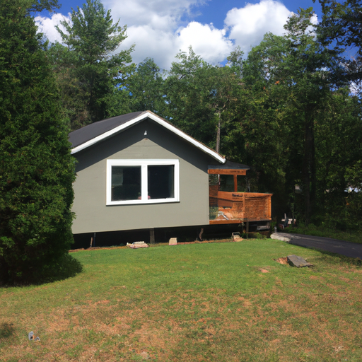

## [life after addiction - a story of renewal and recovery in the countryside](https://www.youtube.com/watch?v=jd28-FKH9ho)

<table align="center">
	<tr>
		<td align="center">
			
		</td>
		<td align="center">
			
		</td>
		<td align="center">
			
		</td>
	</tr>
</table>

Today I’m telling you a story, and don’t worry, it’s a happy one. I have made several videos on why I moved to my cottage, but I’ve always left out an important part of the tale. Mostly because I was reticent to address it, but as my channel has grown and I’ve seen what a beautiful community this is, I wanted to share a bit about my journey in hopes that it can help others, or at least to help you feel empowered even if changing your life seems impossible at times.

Also, I don’t want the word of addiction to feel alarmist. Especially because addiction is common, and I think we should recognize that. The term is broad, and can cover all types of behaviors that affect our health and relationships on different levels of intensity. At its most extreme, if left untreated, it can throw off the entire course of your life.

Mine was, for the most part, an invisible struggle that I kept secret from everyone I knew. At my worst, I was still spending time with friends, keeping up straight A’s at school, and performing well at my job. No one knew, and yet my health was slipping away, and it was only a matter of time until the charade had to end.

My addictions weren’t anything that many would consider very extreme, and the fact is that many of us are addicts. Many people have habits and behaviors that negatively affect their lives in one shape or form, and yet often never recognize a need to change. Hopefully, those habits never severely affect them, but sometimes they do, and need to be taken seriously.

In my case, in an attempt to manage my worries, I over-worked, barely slept, drank liters of caffeine a day in order to keep myself in motion. It was awful haha, I’m amazed my teeth still exist. I had an extremely poor diet, and coupled with a very intense job, my health was in shambles. I was constantly sick, and was so nervous I could barely eat without getting an upset stomach. I was addicted to all these behaviors because they kept me from feeling things too intensely and simplified the world.

But, when I would open up about them to someone, they often shrugged it off as not very serious, mostly because their image of an addict was something different and far more extreme. I am concerned about this mentality because it feeds a notion that we shouldn’t take behavior problems seriously until they are directly threatening our lives, or have caused our lives to completely fall apart. By waiting until that moment to try to change or give support, there are far more permanent consequences and the road to recovery is far more difficult.

To this day, I try to step in and offer support to others the first time they express to me what they’re going through. It doesn’t matter whether or not I think the problem is serious, because I can always offer my love and be ready to listen, knowing that at the end the only person that can change their life is them.

I prefer to share the period of recovery that followed that time in my life. It was a slow process, so slow that sometimes it felt like I was making no progress at all. It wasn’t until many years later that I realized how far I’d come. The journey led me to this little cottage in the mountains, and adopting a way of living that strived to make home life a haven.

I still had to have long work days, manage my relationships, deal with deadlines, worries, and mistakes. But I had to also add new things into my life, things that brought me peace and joy and made me curious about the world again - and through that connecting with nature, aligning myself with a new rhythm completely opposite with how I lived before.

To this house I brought my very grumpy bunny named Mr. Darcy, and later purchased my first dog, a very goofy English lab named Aegir. He has the ability to be so incredibly annoying that you are practically forced to take him on multiple walks everyday no matter the weather. And for that, I am so grateful, because it takes me outdoors, even if normally I may have stayed at home.

Of course moving somewhere is never necessary in order to make great change, you can transform your life no matter where you are. If I still lived in the city I would put more emphasis on my home life, seek out more positive friendships while cutting myself off from people who influence me in negative ways. I would go to museums and exhibitions, visit the library and maybe even join a book club. I would be growing my balcony or windowsill herb and flower garden, no matter how small - even if I only have a couple of flower pots and some low light plants. I’d track the phases of the moon and sun and seasons, create a spiritual practice, and enjoy what little patches of nature I could find, even if that meant now and then taking a drive to a nearby park or lake. We can connect with our world and beyond no matter where we are, sometimes it just takes a bit of creativity.

At the time I began my recovery, I had no choice but to move in order to find a better paying job as a teacher. After coming to my little house, I finally had to face a lot of things I was running away from. I was near my family, and while they were supportive and loving they also held me accountable for my health and wellbeing. I wasn’t invisible anymore, I couldn’t get away with my former lifestyle.

When I first arrived, I was gifted a book on personalities that was very helpful to me. In it, the writer talks about her theory on how a certain portion of the population are born highly sensitive. Not only do noises, smells, and experiences affect them intensely - but so do feelings. They may be prone to anxious thoughts or melancholy, but they also have the ability to connect deeply with others, enjoy a rich interior life, and experience an almost uncanny level of empathy.

She likened this personality trait to the metaphor of the ‘canary in a coal mine’. It is said that miners used to bring caged canary birds into the mines with them because the bird - having a more fragile body, would be the first to be affected by carbon monoxide in the air and succumb to it, therefore giving the miners time to escape without being severely harmed. The writer argued that some humans, similar to the canaries, are perhaps more aware of their surroundings than others. But also, more likely to be affected by stressors. They are born this way, and are often misunderstood - even by themselves.

Unfortunately, in a world that can be quite fast-paced and loud, highly sensitive people may have a tendency to seek out negative coping mechanisms in order to help them deal with unwanted emotions, sometimes self-medicating with destructive behaviors. This can also sometimes lead to addiction. While of course this definitely does not apply to everyone, it was what led me to seek out unhealthy ways to deal with adult life. Ways to feel numb and alleviate the thoughts and feelings racing through my head. To make the world feel simpler, even if only for a short while. I was willing to sacrifice long-term happiness in order to make the short-term more bearable.

However, over time I became more aware of how much I desperately wanted to be happy. And to do that, I needed to not be so afraid of life anymore. I know that fear definitely holds a lot of us back, and it’s very understandable. For me, recovering from my addiction meant leaving everything that I knew, the only comfort I had. It felt like losing a good friend.

As a lover of fairytales, I began to heal by romanticizing aspects of my life, seeing fear as the inevitable challenge all my storybook heroes had to face in order to fulfill their destiny. I think, perhaps one of the hardest parts of my recovery is accepting that my life will never be as easy as it was when I self-medicated. I would always have stressful moments when I would look at the past through a rose-colored lens, and miss a time that - while painful - was simpler.

But every day I wake up and notice something new, perhaps it's the spider's web covered with dew on my trellis, or a fairy ring growing in the forest. And I remember that to live a great life you must have the courage to pursue it.

Like I said, this is a very happy story - I think it’s so important to normalize such a common issue as addiction, mostly because addiction comes in all forms. It is common. And recovery is possible. And life is beautiful because it is hard sometimes.