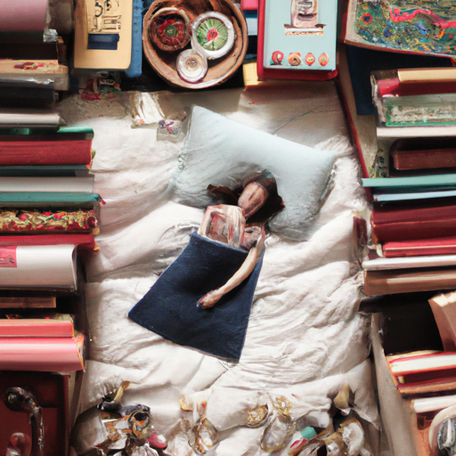
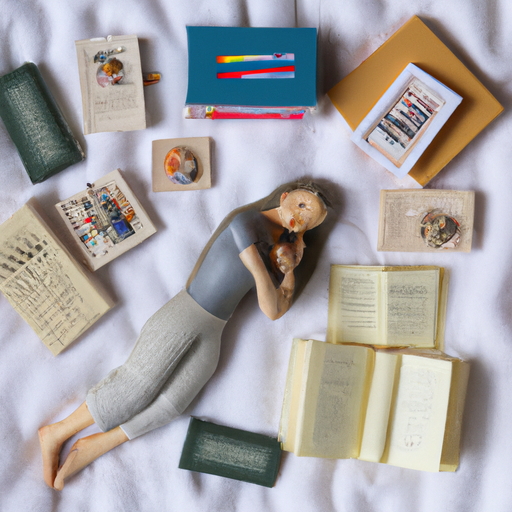
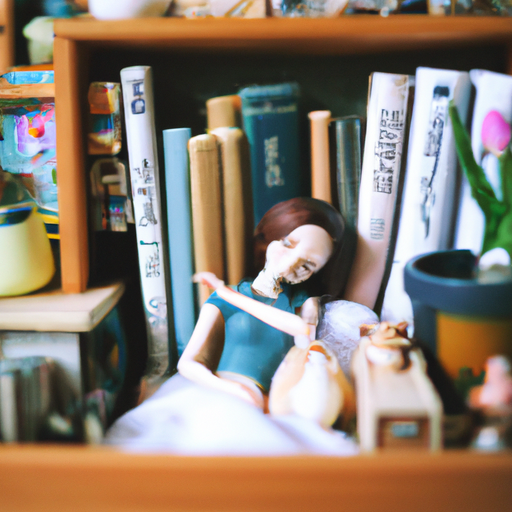

## [life as a low energy person - not leaving my cottage for a week](https://www.youtube.com/watch?v=VJnp23nZWpA)

<table align="center">
	<tr>
		<td align="center">
<<<<<<< HEAD
			
		</td>
		<td align="center">
			
		</td>
		<td align="center">
			
=======
			
		</td>
		<td align="center">
			
		</td>
		<td align="center">
			
>>>>>>> ffe52613361410ad9d371a0f80e81de4dd24175f
		</td>
	</tr>
</table>

This last week has been slow. I went to the hospital worried I had appendicitis. Thankfully, I didn't, but in the process of being examined, the source of my malaise was found to be an infection that needed to be treated. And if there is one thing you might know about the process of recovering from such a thing, it can leave you exhausted for several days. I'm now much improved, but it was surprisingly difficult to accept that I just needed to spend a few days in bed.

I've always been someone that has been more mellow, having lower energy as a whole. I was never that kid bouncing off the walls in school. I enjoyed swimming and horseback riding, things that I could choose the pace I took them at. I didn't like unexpected events; instead, I wanted to know ahead of time the order of the day so that I can mentally prepare. I could go on a hike, and then I would go home and read a book for the rest of the day and putter about. I quickly ran out of steam. I've always found it easy to take naps, and yet only now as an adult would I admit to any of these personality traits, mostly because it seemed that my world really valued efficiency and speediness.

If you pay close attention, you'll notice that a huge amount of our advertising sells products for the specific purpose of saving us time. This is certainly a trait we seem almost to worship in our busy world, and sometimes I wonder if there are downsides to that. If by making each task faster, we forget how to slow down when we actually do get the chance to do so. I internalized productivity trends and efficiency goals, believing I just had to power through my innate slowness. That led me to become quite addicted to stimulants in university, trying to juggle multiple jobs and my degree. Thankfully, I'm now in a place where I understand myself better and do the best I can to push myself when needed, but also honor how I feel when I get time off work or like this week was affected by illness.

So instead of trying to tackle my enormous to-do list this week while feeling poorly, I decided to try to simplify things in any way I was able. Take time to rest and also try to do some projects just for me. And those were making some of my miniature kits and book nooks, as well as making a little cat toy for my kitten.

That tendency towards being a very kind of mellow, slower, more methodical person has never gone away since childhood. I often find my energy reserves kind of naturally being gone by the early evening, and fairly often I don't really have too much energy at all. And I know that is a relatable feeling as we, you know, each deal with some level of that sometimes. But I thought it was interesting to admit because I've often felt like being a more slow-going person is something I really need to fight against, even though I still now work full-time, sometimes still more than, you know, I maybe should at times. I do see myself in a different light.

So even though my lifestyle, you know, hasn't really changed, you know, my perception of it has. And for sure, there is no easier way to feel like you are lacking than to worship a personality that is not your own. And that is something that I did for a very long time. I have siblings that are far more kind of energetic and adventurous people than me, and I often always just admired them so much and saw them as someone I wanted to be. What I realized over time is that I should admire them and their beauty and vibrance and everything they give with their personality while still honoring my own and understanding that, you know, my best is my best, my limit is my limit. That is okay. You can be just as adventurous and having just as much energy as you want, as long as you are not comparing yourself to other people because that is where the awareness of perhaps you are, you know, lacking in some way comes, you know, no matter what your personality traits are, that you have something very special to offer.

Because I think life itself and this journey we're all on on this planet is extremely complex and mysterious. We can ever hope to understand our world better, to love better, to enjoy life better if we are able to experience it in a variety of unique ways and offer different perspectives in order to solve the problems we are facing and find, you know, more meaning and fulfillment and empathy for others. Your perception of yourself is so greatly influenced by comparing to other people, at least, you know, I know it is for many. I think it's also fruitful to ask yourself from time to time if the standard you are putting on yourself is realistic or not because sometimes, I know some personalities can set very high standards that are not necessarily sustainable. That isn't to say, you know, you should do what you can to, you know, live your best life and, you know, be productive in the ways that you want to be and you feel you need to be. There's certainly balance in everything, though, isn't there?

I think it's so important, too, to see some well-enjoyed time off as not a waste of time in any way, but to really see the value in it, to see the value of a quiet day spent at home with your family, to see all those things as successes. You do not need to produce anything in order to be of value. You are already of value. And I know that some of us might internalize that sense of we need to offer something in order to be worthy of receiving, and I think that mentality is something we really need to tread carefully through because, you know, there's a lot of sides to that. And I think sometimes it can potentially harm us, especially when we're put in situations where we need to receive and we are not capable of giving. I had that wake-up call recently, you know, when I was, um, quite ill and feeling like I just had to be in bed all the time because I was so nauseous.

I've always been a little embarrassed, you know, to admit that I'm someone that kind of runs out of steam really quick. Despite diet and lifestyle changes, you know, there are always things that help improve your mood and improve your energy. But for me, you know, my normal natural rhythm is a fairly slow one. So many of us function on this scale of normal, but when we admire one extreme, then anything less than that can often, you know, feel lacking. And isn't it wonderful to just celebrate all lifestyles and see what each perspective on life has to offer? I certainly feel that way. I take a lot of inspiration and wisdom from my siblings, and I like to think I can offer something in return.

So I hope you're all having an absolutely wonderful week. I am feeling considerably better now, thankfully. There should not be any concerns going forth into the future, so I am very grateful and very at peace. So I will see you very soon. I have a video I've been working on for quite a long time coming up very soon, so I hope to share it. Sending you all my love. Goodbye.