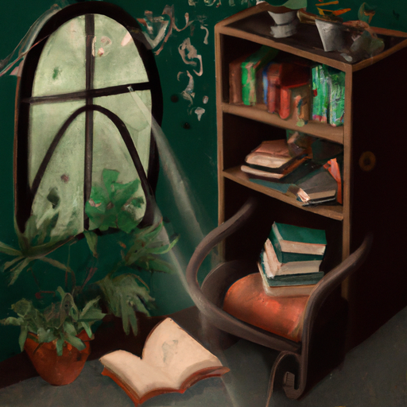
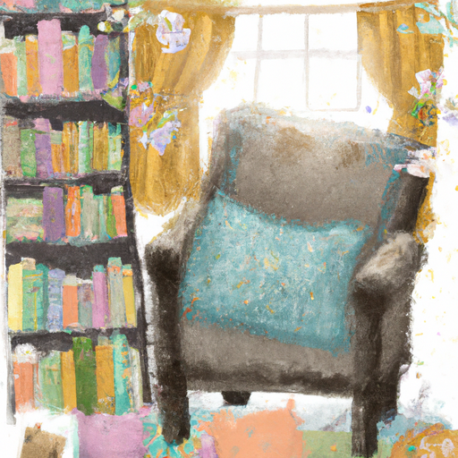
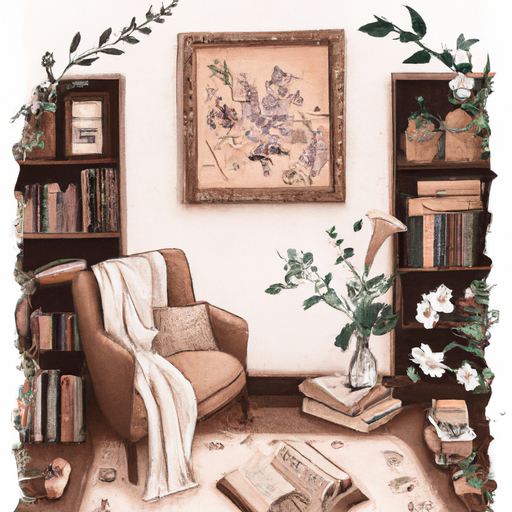

## [life at a bookshop in winter - my passion for reading heals me](https://www.youtube.com/watch?v=Qz9WIa0DAdM)

<table align="center">
	<tr>
		<td align="center">
<<<<<<< HEAD
			
		</td>
		<td align="center">
			
		</td>
		<td align="center">
			
=======
			
		</td>
		<td align="center">
			
		</td>
		<td align="center">
			
>>>>>>> ffe52613361410ad9d371a0f80e81de4dd24175f
		</td>
	</tr>
</table>

One of my favorite Beatrix Potter quotes is what heaven can be more real than to retain the spirit world of childhood. I must agree that if there is one thing that always feeds my soul, it is stories. That is why I work at a little bookshop in my town, selling stories, receiving stories, and being surrounded by strange and whimsical and wonderful worlds, all encompassed inside a binding and put on a shelf. Habits have definitely gotten worse since I started here. I get a discount and free books, and for a book lover, it is a recipe to find yourself quickly drowning in stories.

I've definitely had to control myself a bit, but today was different. I received a gift card for my birthday, so it was time to pick up a new stack to bring home. As I hear often echoed within the walls of this shop, there is no such thing as too many books. I returned home with several new books and some bags of wildflower seeds to cast on the snow in early spring.

I have a variety of old used books I was given this year, as well as some newly purchased ones. This book seems so sweet, and it is quite old, which I enjoy. And I also got one of Emily Martin's very early books because I wanted to support her as her art is very enchanting to me. As an early gift for my brother, I got him a book featuring his favorite animal, the otter, as well as another children's book for the daughter of a friend. I recently had a customer recommend this book, so I thought I'd give it a go. Though I don't read too much romance, I also really want to read "The Life of Elves." I don't know too much about it, and I'm very curious. And of course, I had to purchase Jackie Morris's newest books. Everything she does fills me with wonder, and she holds a special place in my heart. Her watercolors always inspire me to paint my daydreams.

Inspired by all these books, I decided to make some wood burned bookmarks for my future reading adventures. I admit that the nib I had on this pen was quite dull and old, so the project turned out rather rotten. But I thought I'd include it because it's a good reminder that our creative attempts may not always work out, but that only means that the end result has taught us something, and therefore, it has value. And for that, we can be grateful.

So, apart from the books that I recently purchased in order to support my small town bookstore business, but of course, my reading problem, I wanted to share with you my reading list for December. Maybe it will inspire you with some book ideas, or it will just get you in a cozy mood to spend the evening reading or partaking in any other crafts or hobby that you enjoy this time of year.

I know there are other people who feel this way, but I don't think there are too many adults who enjoy graphic novels that are intended for children. But I do, so I absolutely love the movie "The Song of the Sea." If you have not seen it on Netflix, it is enchanting. And the same creators also made a couple of other movies in a similar style and atmosphere. And so, one of them recently was called "Wolf Walker." I already watched it, and while "Song of the Sea" is definitely my favorite, this one was still enchanting and beautiful to watch. And there is a graphic novel version of it, so I thought that I would read this one. I'm sure that if it's anything like the movie, it is going to be very funny but also touch upon some very important aspects of our culture, especially in regards to nature preservation and respect for wild animals.

I'm also going to be trying out this graphic novel called "The Daughters of Ease" (I want to say I'm not sure I'm saying that right). But it seems to be kind of a haunting, rather spooky tale. But the illustrator is absolutely one of my favorite illustrators. I love all the work she does, so I'm excited to give this one a try, even though I have heard it is rather spooky.

I will also be, of course, rereading one of my favorite fantasy books of all time, which is "Nevermore: The Trials of Morrigan Crow." This book exists in a world that has an amazing holiday celebration, including Father Christmas and the Yule Queen. The description of the magical celebrations in December in this book are just so enchanting and always get me in the mood for the holidays.

I'm also going to be reading "A Nest for Celeste." It's a very simple children's book, but it features a little mouse that befriends a boy. I've heard it is rather a serious book, so I'm not quite sure what to expect. But the illustrations are adorable, so I thought I would give it a go.

I do, of course, plan to be reading some books meant for adults, but I haven't quite decided on my reading list yet. And I also am not a very fast reader. It takes me weeks sometimes to finish a single book, and I find it very difficult to speed read. So, I actually don't get through that many books. I think I'm just dedicated, so I do end up getting through more than I always think I will.

I do not have the physical copy in my hands right now, but I am also reading "The Body Keeps the Score," which is a non-fiction book about trauma and how it expresses itself in the physical body. It's definitely not a light read, so that one so far has been very moving and cathartic and fascinating. I highly encourage everyone to read it, especially if they have had experiences related to anxiety or other mental health challenges in their life.

I think that is it. I doubt I will get through all the books that I'm planning to read, but I am choosing a lot of graphic novels this month, which is rather unusual for me. I'm looking forward to it. So, I think I'm going to spend the rest of the day probably reading because I am back from work and I have the rest of the day off. And the bookstore is an extremely physical job, and I am tired. I think I'm gonna start with some graphic novels.

So, I'm sending you all my love. I hope you have a cozy and enjoyable evening and find a little bit of time to do what you love and treat it as a sort of ritual, an important part of self-care and mental health management. So, take care, and I will see you very soon.