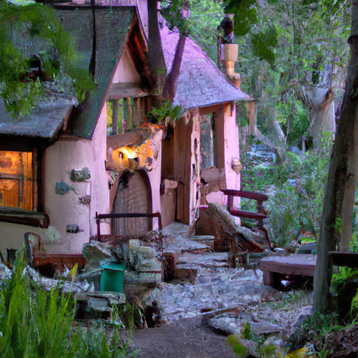
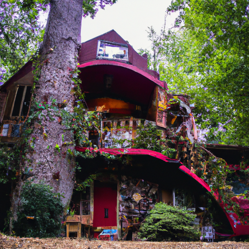
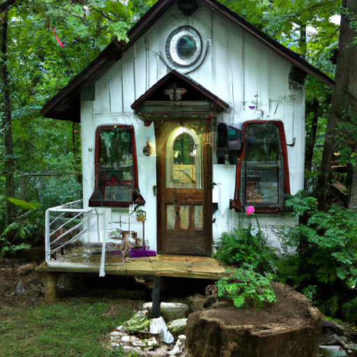

## [life away from home - a day at a vintage style tiny home and garden](https://www.youtube.com/watch?v=Lpii3hmeqNg)

<table align="center">
	<tr>
		<td align="center">
<<<<<<< HEAD
			
		</td>
		<td align="center">
			
		</td>
		<td align="center">
			
=======
			
		</td>
		<td align="center">
			
		</td>
		<td align="center">
			
>>>>>>> ffe52613361410ad9d371a0f80e81de4dd24175f
		</td>
	</tr>
</table>

Dearest Soul, it's been a while since I've seen you. I've been away on a vacation, one that was long overdue. I barely left my home this year, so going on a proper getaway is now a memory I will cherish forever. I found a two-room bed and breakfast hidden away in a forest. We've been putting aside money for a little trip like this for a while, and I feel so fortunate to get a few rare days off of work.

Exploring the grounds was a fairy tale come to life. The atmosphere made me feel as if I was living in a storybook, a little cottage in the woods housing a lost princess and prince. I spent much time daydreaming, but I was with my best friend, so I was in kindred company to enjoy some whimsical musings by the lake.

A friend once told me that we each carry a light of our souls within us, but we must nurture it and polish it so that it shines. I love that way of seeing things. It appeals to that little girl in my heart. I can feel her sighing in relief, happy to be heard and considered. This evening, I decided to create a little at-home spa just for fun. I felt I'd neglected myself a bit of late in regards to self-care and even took a bath, which was a treat as I only have a shower at home.

I believe that personal care is about a lot more than taking care of one's physical self. But there was something healing about brushing out those curly tangles, long avoided due to stress and work. Reminding myself that these slow motions are also important in their own way. I think anyone who has felt that awful emptiness of being burned out knows how difficult it can be to simply take care of oneself sometimes.

Sending my love, take care of yourself and remember to shine your light. It is what will carry you through dark days and encourage you at your best. And above all, it will shine down like moon rays on those around you. And just like that, in such a gentle, quiet way, you make the world a little better than a moment before because you are in it.

I hope you all have been having a wonderful week. It has been just the best experience, you know, getting away for a few days on a vacation. I feel so lucky to have found this adorable little BNB, and it has just some of the most beautiful area around it. I've just been enjoying every minute, and it really made me think about a lot of things and gave me a little bit of a break from my work, which made me realize I wanted to make a few changes in my life going forward.

I think that there's always a lot of power in taking a little getaway. It doesn't have to be a physical one, but at least mentally, you know, taking a little bit of time to seek a new perspective on life. We have, for the most part, just had our trip revolve around nature. We went to Sol Duck Falls, which was a beautiful area, and it took a little while to get there, but we got to see it along with a lot of other people, and it was just lovely.

On the way back, we did really enjoy looking through some antique shops. I even went to a tea shop, which was extremely exciting because they had all the little jars of different types of teas and spices and salts available that you could just smell each one. I had so much fun, so I picked up some jars for my tea over there. One can never have too many jars. We also went into a store and got some red bandanas for my dog. When we come back home, it's going to be hunting season, so it's really important to put something bright on your dog so that they're easily noticed when we're walking through the forest.

I did want to say a couple of things. I know every time I make a video, there have been a lot of questions about why my husband does not appear in these videos. The answer will not be surprising to many. He works full-time as a surveyor, so it's an extremely physical job, especially out here with so much wilderness area and undeveloped properties. He works really, really hard and often out in the hot sun or in extremely cold weather. Asking him to be part of my videos and continue working would not be considerate, so that is why he's not in these videos. He does not mind being part of them now and then.

One thing I did want to add is that I know several people have inquired about my book. The official release date is in the month of November. The date was moving a little bit because of the printer trying to have the books ready in time. So it is for sure coming out this November, but probably more towards the end of it. A lot of websites have updated the date accordingly. Yes, I do wish I had more control over the publishing date, but it is just not the case. It will definitely be coming out in November, and I hope you all really enjoy it. It has been a huge project, and I really appreciate all the support. I've also been working on an audiobook version too.

I'm sending all of you my love. I will let you go before it gets a little bit too dark. The sun is setting, and tomorrow I have a couple of adventures planned. I really want to find a pumpkin patch, so that is the big goal. I am sending you all my love. Do take care of yourselves, and I will see you soon.