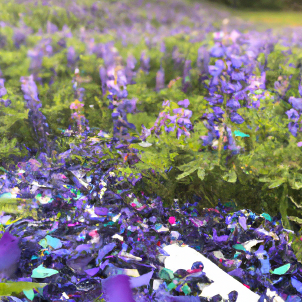
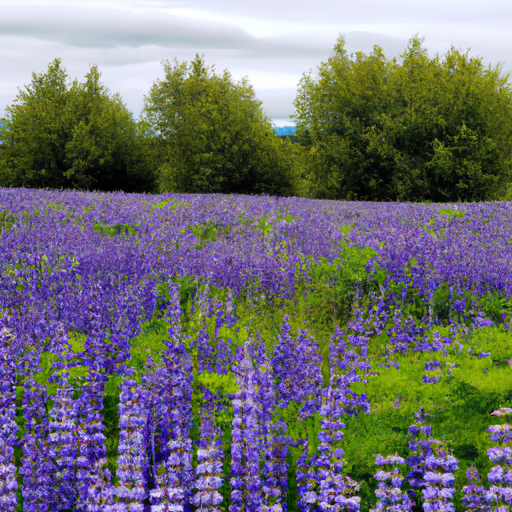
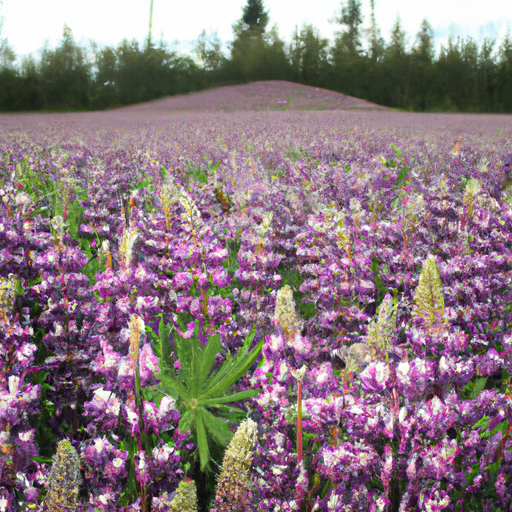

## [life in a quiet place - self-love in the rural countryside](https://www.youtube.com/watch?v=YzR8mofGiJE)

<table align="center">
	<tr>
		<td align="center">
			
		</td>
		<td align="center">
			
		</td>
		<td align="center">
			
		</td>
	</tr>
</table>

I remember reading a book, Miss Rumpus, when I was a child about a woman who went about throwing lupine seeds on the ground where she went and how eventually she cultivated a heavenly world of abundant flower fields. This trail behind my home reminds me of her story and how the beauty of her soul lived on and the legacy she left in nature. It makes me want to pursue my passions knowing that if I am true to myself and find a way to do my small part in making the world a better place, then my legacy will stand the test of time. People might not remember my name, but I can still be part of something beautiful nonetheless.

It is so quiet right now, even the wind is blowing just so softly. I know that some of you have asked before if I ever feel nervous out in the wilderness or in the forest, and I would say that I don't. I do carry with me bear spray and everything for basic safety, but for the most part, I just feel so peaceful out here. It feels like home, where you come to heal, think, and encounter yourself. You are surrounded by life, yet still left in your own company. From the perspective of not having other humans around, that is powerful. It helps separate the influence of other people on how you think and feel, and the influence you have over yourself.

When you're by yourself, you can really encounter the truth of how you feel about yourself because no one is here to see you or judge anything. You're just in your own company, and you have to be very honest with yourself. How do I feel about me? What is it like to just exist with myself for this time that I'm out here? It really helps separate what the influence of other people have over how you think and feel. Sometimes it can be a wonderful learning experience because you get to a point where you realize certain negative thought patterns or feelings that you want to work on and be free of. Isn't that the goal when it comes to confidence and self-love? To be 100% comfortable in your own skin and in the presence of your own consciousness.

It's powerful. It's very possible that while I'm recording this, all you're going to hear are the birds because they have suddenly started singing so loudly. However, I have to say that as I have gone on a journey to become my best friend, it is really interesting to be out here by myself and realize instead of being uncomfortable only existing with myself, I am in fact so peaceful. It forces you to be honest with yourself. Are you surrounding yourself with people that influence you in positive ways, challenging you to be a better person, but also respecting and embracing who you are? Or do the people in your life affect you very differently? Is there anything you can do about that? Is there perhaps anything that you can put into your life that will help you ground yourself?

Throughout my life, I have struggled to know who I am, what my opinions are, and to be assertive with what I want and what I think. Instead of just defaulting to the most confident person in the room or anyone that I see as superior to me. Yes, those are my thoughts while sitting outdoors in a flower field. It's just starting to drizzle, so I think I'm going to head home. I went down a very steep hill to get my bike down here, so it's going to take quite a bit of effort to get it back up. We'll see if I succeed. Oh, my foot's asleep.

I think that if you seek out these quiet places with intention, you can use it as an opportunity to really ask yourself, if no one is watching, no one judging, if the only words spoken were the ones in your own mind, how would you feel about yourself? I think a lot of insight can come from that sort of exercise. At a point many years ago, doing that made me realize I was in a relationship that was actively destroying my self-esteem and that I only felt like myself when I was away from them. And now, sometimes when I go out and spend time alone, I still realize that I have some lasting effects of that era that I've been ignoring and need to work on. Even now that I feel like I'm in a good place in my life, I'm still learning something from my intentional walks alone.

I certainly think in terms of your physical beauty and confidence, it's interesting how much of that is based on what we think other people see. And perhaps you can get a taste of that freedom of having a healthier relationship with your external self. It's so important not to let other people dictate any aspect of who you are.

I did want to briefly give you a little update on our household. It is a little bit sad, related to losing a pet. I did lose my dear sweet bunny this week, Mr. Darcy. He entered the winter years of his life a long time ago. He's actually been with me for most of my adult life. So even though he's been having some health problems and he's very old, and we knew this day was coming soon, it still has been really hard. He has been such a big part of my life for so long. We have loved him so much, and he has been a big part of this channel too. I still wanted, of course, to make an uplifting video in a celebration of his life. The other day, we buried him in the garden under some wildflowers, and it was really hard and really special. We put a little rabbit figurine there, and right after I buried him, I noticed that there were some lily of the valley growing right next to his little grave. It was really sweet because I hadn't noticed those flowers before. They had just popped up. I actually painted those flowers on the entryway of my house on the door. So in a funny way, it kind of feels like he's still with us, watching over the house. It was really comforting to see those flowers right next to where he is resting now. I just wanted to let you all know, and I do not mean for this little message to be a real downer because it's also a celebration of everything he's given me and to this channel. He's been such a big part of it for so long. I think perhaps one of the main reasons I'm sharing this is that I want all of you to tell someone you love them or give them a big hug or connect with someone you've been meaning to connect with because we don't know how long we have. It's so important to do those things and have those special moments sooner rather than later. Anyway, sending you all my love. I will see you soon. Goodbye.