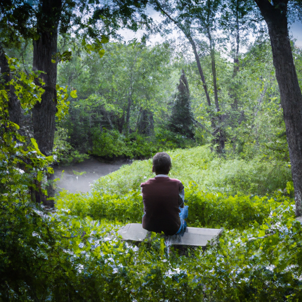
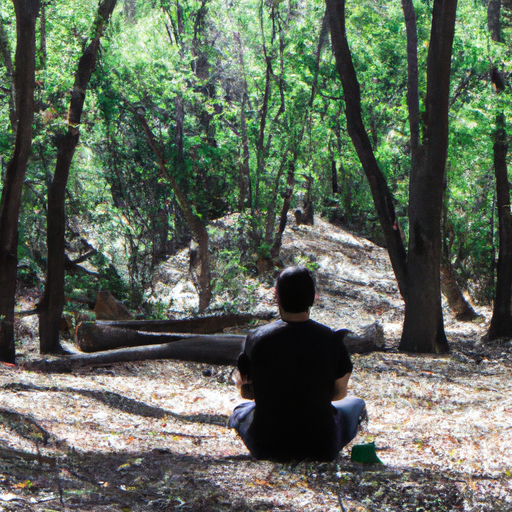
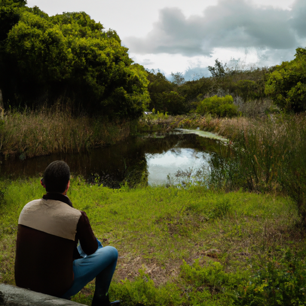

## [making friends when I love to be alone - how I find connection](https://www.youtube.com/watch?v=7Q8d8Vvk6oo)

<table align="center">
	<tr>
		<td align="center">
<<<<<<< HEAD
			
		</td>
		<td align="center">
			
		</td>
		<td align="center">
			
=======
			
		</td>
		<td align="center">
			
		</td>
		<td align="center">
			
>>>>>>> ffe52613361410ad9d371a0f80e81de4dd24175f
		</td>
	</tr>
</table>

[Music]

I spend a lot of time alone. I've been this way since I was a child. I wanted to be many things when I grew up, and one of them was a biologist because I enjoyed spending time out in nature, observing the wild world. What I didn't know was that no matter where life took me, I could still live that dream in my own small way. Nearly each day, weather permitting, I go out with my dog Iger and spend time waiting and watching for the beauty hidden in plain sight. [Music]

[Music]

[Music]

I never feel so whole and so surrounded by life and connection as I do when I'm out in nature. When I think of friendship, I think of the creatures that coexist in my world. My favorite Willow and oak tree that I planted by my home, these are friends, though not in your typical way. [Music] I've always sustained unconventional friendships, and to be honest, I never thought this was odd until I got older and felt obligated to fit in. I made a video a couple months ago about how I struggled to make human friends for a long time. It took a while to get older and slowly build lasting friendships with lovely Kindred Spirits, but I'll never be someone with a large amount of relationships in my life, at least not human ones. [Music] I remember a teacher once called me a Hermit for wanting to sit in a quiet place instead of going to recess. She took away my book and told me to act normal. I do think that in this day and age when we're so connected with each other than ever, we forget that it is completely normal and okay to not have an amazing exciting bustling life or social life for that matter. Perhaps we should take time to understand and accept who we are, our true nature, and find value in the amount of energy we have, even if it falls short of what we think we'd like to be.

I never felt so at peace until I really listened, and I hope you follow where that inner truth takes you, whether you are a very social person or not so much, and find ways to give and to support others in your own unique way. [Music] [Music] [Music]

I found several leaves and some pieces of bark and lichen at the lake today, and so I took them home to kind of take a closer look and study them under my magnifying glass and make an amateur attempt to categorize them and write down my observations. And it's so much fun. I feel like even though I did not pursue a career in the Life Sciences, I can still have fun and really enjoy learning about that aspect of life. At the end of the day, my more artistic sensibilities took over and pushed me in a different direction, but I do think it is so important to really consider those unlived lives and find ways to incorporate aspects of that into your daily life. I think it makes a life experience so much richer.

This is a short but hopefully sweet video. This week, I had quite a few things going on, and so going out to the lake and having a quiet day creating art and all that was so special to me. And it inspired kind of revisiting that theme of friendships. I was so moved and initially surprised by how many people related to the video and have felt how I have felt when I was younger. And it was a very, very moving. It was so lovely to have conversations with people and open that conversation of what does it mean to have close friendships? Is something wrong with me if I'm not a super social person? I also place a lot of value and connection and friendship with things that are not particularly human in origin. I also value time in nature because I find it to be a really self-reflective environment where I can become more of my own friend. There are several people in my life and my family as well that are so close to me and represent such important bonds of kindred spirit, and I really value those people. To find spirits you really connect with, and I am also feel very, very lucky that I have that in my husband as well. Sending so much love to all of you. Thank you for all your kindness and your support, and I will see you soon. [Music]