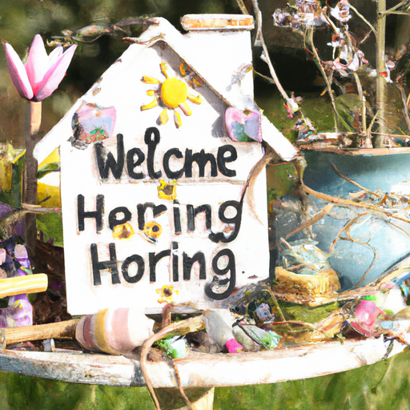

## [making my cottage fit for a fairy](https://www.youtube.com/watch?v=SesSpMP7eMs)

<table align="center">
	<tr>
		<td align="center">
			
		</td>
		<td align="center">
			
		</td>
		<td align="center">
			
		</td>
	</tr>
</table>

With stubborn conviction, I have decided that it is time to prepare for spring. Although it will be many weeks before the snow is completely gone, I can at least make plans and do some late winter cleaning, enjoying the anticipation of a new season. Despite it still being winter, the usually icy morning smell is more subdued, the roads are starting to get muddy, and change is in the air.

Today, I am cutting the last of the winter squash and composting the seeds. I have eaten so many squash seeds this year that I don't think I'll be able to eat more for a long while. Thankfully, they can help feed my future garden. The coming month is a busy time, with much to be done. I am patiently waiting for my seed catalog and will be sharing my ambitious garden plans very soon.

By the end of winter, I usually find that a reorganization and tidy of my home is in order. During the dark days, I often let little tasks go undone, feeling a bit sluggish during my hibernation. But now, the sun is shining a little brighter, winter is slowly receding, and I am very excited.

When I lived in the city, I was aware of the seasons, but I didn't experience them in the same way as I do now. I noticed the cold weather and the turning of the leaves, but that was usually about it. Out here, it is a very different experience. I observe the coyotes' winter mating season, the way the deer wander much closer to my home in January in search of food, and the usually rotund little quail looking thin this time of year, as so much of their body weight has been absorbed simply to keep them warm and alive.

The February full moon is known as the hunger moon, representing the scarcity animals and groups of people often experienced at this time when their reserves ran out. I find this particular full moon very impactful, causing me to reflect on the challenges that those before me went through. It makes me grateful for what I have and inspires me to continue making little choices every day to simplify my life, reuse items, and reduce my waste. It feels like not only a way to show my love to the earth but also to show reverence to others by consuming only what I need to live comfortably.

For example, I love decorating my home. Instead of immediately buying a new item, I look for secondhand decorations or, in this case, make my own. The result is usually very unique and special to me.