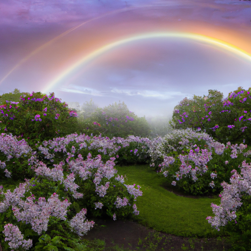
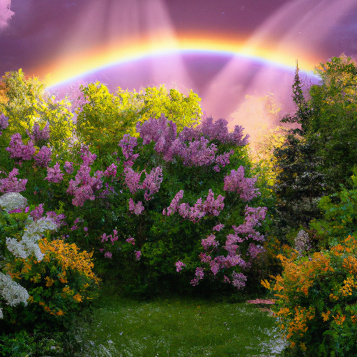

## [married and living in a tiny town - learning to live again at 25 years old](https://www.youtube.com/watch?v=J1_IvXio770)

<table align="center">
	<tr>
		<td align="center">
			
		</td>
		<td align="center">
			
		</td>
		<td align="center">
			
		</td>
	</tr>
</table>

It has been a few days after the wedding. We're both back to work, so I have been busy but trying to take a few little moments to enjoy the last breath of spring. It's going to be summer soon, and I've thoroughly enjoyed this cooler season. It has kept the flowers here for so much longer than usual. Right now, all around the valley, so many flowers are about to go to seed, and so many trees are releasing theirs. It is absolutely enchanting. It feels like snowfall when the wind turns, and I've just found myself laying on the ground outside, just watching them blow through the sky.

The other day, I rediscovered the secret garden, which is the name that my mother-in-law gave this little cove of lilac shrubs that does indeed feel like a very secluded haven of magic. Since all the lilacs were in bloom, it was the perfect time to harvest just a few heads for a very special project. So, the day has come to finally try using my old ice cream maker, and I'm very excited because I gathered lilac flowers, and my goal is to make lilac ice cream because I've made lilac simple syrup before, and it was absolutely delicious.

She is getting so big. Like if you look back just a few weeks ago when she was in the videos, she would fit into the screen so easily, and now she's just enormous. So yes, the wedding was about a week ago, and it was a really interesting couple of days leading up to it. When we had gone to the venue a couple of days before, it had been such a beautiful, sunshiny day. Yes, everyone just agreed it would very likely be a beautiful day. And I got up that morning, and almost immediately, it started to rain.

And I wasn't too worried about it at first because it was just a sprinkling of showers. And then it just started to rain harder and harder and harder. We had everything set up to have the ceremony outside, so we were a bit worried because we do have a lot of older people attending and just, I'm sure, a lot of people that would rather not get all their clothes, their really nice clothes, soaked through completely by a rainstorm coming down full force on their head.

Usually, with things like this, I'm pretty positive. I always think that even the unexpected adds to the story and makes it an even better experience. But this was a little concerning just because I knew that people didn't have a change of clothes, and it was raining really hard. It was a full-on rainstorm. Several people in my family could tell that I was pretty worried about the situation, and it was really sweet of them because they reminded me that in Hispanic culture, it is often considered good luck if it rains. It means that you are being blessed by the heavens, which is a really sweet idea.

But then the time for the ceremony came, and the clouds parted, and the sun came out, and it was sunny and beautiful. There were those beautiful sun rays coming through the clouds. And because it was suddenly sunny, all the insects and little wild animals and all that kind of got really active. We had the ceremony, and even during the ceremony, a little sweet little hummingbird came by and stopped right in front of us to just kind of say hello. They're always really curious birds. It meant a lot. I have seen hummingbirds during quite important moments in my life, and they've always been a very special bird to me, especially lately because they have been so abundant this spring during a time when I've had so many emotions, you know, going into this new phase of life.

It felt very magical because it was just sunny for that portion of the ceremony. And then later, after the rain had died down and it was the later evening, a huge rainbow came out in the sky. I think we, you know, can get these ideas caught in our minds of a fantasy of what we would like a certain day or certain parts of our life to be like, you know, and that things need to be a specific way. And that creativity in the moment and unexpected things in the moment just aren't very welcomed.

And I know for some people, especially me, people who have not always felt like they have control over their own lives or control over experiences or things happening around them, that it can be very difficult to just let go and embrace the creativity of the moment and whatever life is kind of throwing at you. And if it had been a perfectly beautiful sunny day and there would have been no issues at all, it would have been, of course, still a wonderful day. But having all these little kind of hiccups and unexpected things happen, and it's still working out despite it, just such a beautiful, magical day. And it was because it was not perfect. And yeah, I just wanted to share that with you. Embrace your days as they come, even when there are moments that you are not so sure about.

So, I do think I have chatted for quite a long time. So, I'm going to attempt to make some ice cream now. And yeah, we will see. It could all go horribly wrong, but I think there's a really good chance there's going to be some really tasty ice cream by the end that I can eat. So, making this ice cream was an experiment, to say the least. I ended up adding some dried butterfly pea flowers in an attempt to make the color of the ice cream a lilac blue. Instead, it came out way too blue. So, next time, I think I will just stick to infusing the ice cream with the lilacs and then adding a topping of lilac simple syrup, both of which I will leave below as recipes.

I highly encourage you this spring and summer to try using some flowers in your cooking. It is such an exciting way to be a little adventurous with your cooking and try new flavors. There are so many options to use in your cooking, and it can be really fun and smell incredible too. So, let me know if you try anything and it's successful because I would love to get the recipes from you.

So, my initial plan was to save some of the ice cream for Luke, but that didn't happen at all. If my voice has sounded a little odd, it's because I got sick, and I've had quite a bit of laryngitis that just hasn't wanted to quite go away. I wanted to say a huge thank you to anyone who sent kind wishes or an item in regards to the wedding. I really deeply appreciate it. It was so kind and generous. I hope that you all will receive a little note from me very soon.

And also, thank you again for everyone who has supported my shop during this time. It's really made so much possible for me, especially in regards to starting this new life with my husband. By popular demand, I do have a limited signed release of an art piece I made recently that I filmed a little bit of the process of making it. But it was just inspired by all the wonderful feelings of spring and how much joy it gives me. I wanted to let you know that that is available in my shop as a little package included with some stickers and bookmarks, all that are also new and have not been previously available in my shop before.

And so, I have been working on those this week. So, it's been a lot of fun. They're all available for pre-order because I'm still in the process of printing them. I am treating it a little bit as a bit of a mystery package because I wanted to send little surprises in the little packages as well. I just wanted to let you know. It's been just so wonderful working on new art pieces and finalizing some stuff for the book that I'm working on because it has been a process to write a book. It has been so intimidating at times, and I've been trying to illustrate it as well and get photography for it. And so, the whole process has been so rewarding and incredible. And I hope to be able to give you guys more information about that very soon because it has been a huge deal for me, and it has just been truly a dream.

With all that being said, I think I am going to go and take care of some little chores around the house that I've had to since we had the wedding. I have about 16 vases full of fresh flowers that still haven't wilted. I'm going to put them all around the house in order to bring spring into the home. I'm sending you all my love. I hope you have very sweet dreams if you're about to go to sleep, and I'm wishing you a wonderful week. And I will see you very, very soon. Goodbye.