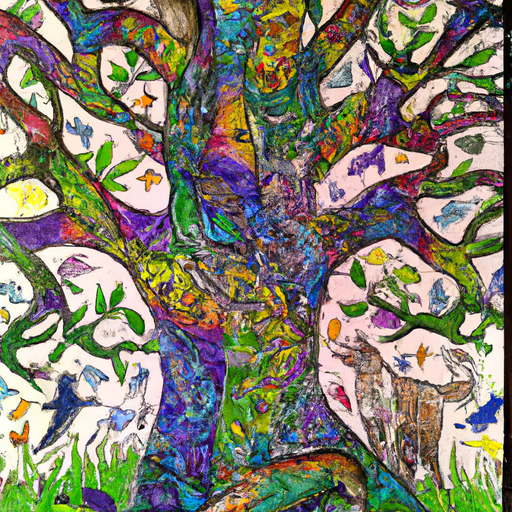
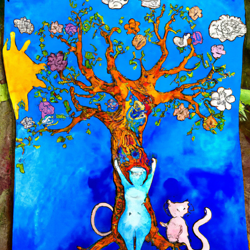
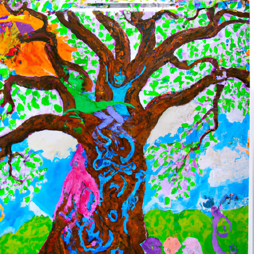

## [modified working as an artist in the countryside - being a creative soul without fear](https://www.youtube.com/watch?v=yHmM8u7vlpY)

<table align="center">
	<tr>
		<td align="center">
<<<<<<< HEAD
			
		</td>
		<td align="center">
			
		</td>
		<td align="center">
			
=======
			
		</td>
		<td align="center">
			
		</td>
		<td align="center">
			
>>>>>>> ffe52613361410ad9d371a0f80e81de4dd24175f
		</td>
	</tr>
</table>

Lived the Spirit of Hope. It was her duty to remind the forest animals and humans of their Inner Light, the only cure for the great Darkness. The spirit fell in love with the fairy King and gave birth to two beautiful daughters with skin as dark as Walnut ink and hair the color of Raven's feathers. These daughters were named anger and courage. You may think those names strange but in fact, they represented these daughters well. Anger was no shallow fairy spirit, for she was honorable. She refused to accept the darkness of the world as she found it intolerable to live in misery like so many humans who locked themselves away and had forgotten how to love. Courage was also a noble creature and was always inspired by anger to go out into the forest and Beyond, carrying the light to the moon on our shoulders, spreading rays of peace and good dreams to those who are willing to open the shutters.

Hope soon realized that her life force was bound to her daughters, for together they gave each other strength. With this knowledge, she asked the noble Fox spirits to protect her daughters by watching over the wood. And if you ever find yourself wandering in a forgotten corner of the wood, you may see them in the corner of your eye, and then you will know you are near to Hope, and that anger and courage are there as well, living in peace and waiting to comfort those who wish to heal.

This story encapsulates so much about my journey as a creative, and this sentiment of Hope and Magic is imbued in every single piece of art I create, be it watercolors or poetry, crafts or music, even more complicated feelings such as anger and pain. Because I go to Art when I feel these things. I've always been a dreamer and someone who has been ever perplexed by more negative viewpoints of the world and its inhabitants, people who wish to assume the worst of others and often seem deeply unhappy, much like anger. I couldn't understand why someone might no longer see the beauty of a dandelion growing on a sidewalk or the gift of breath in their lungs or the miracle of life itself. Seeing life this way does not avoid tragedy and struggle, but it brings sunsets and Imagination and noticing the random acts of kindness all around you. It depends on your perspective, but also, I think, on Courage.

Art is all about recognizing both the dark and light and creating paintings utilizes these elements. I find that the practice of painting Fantastical possibilities fills me with purpose and reminds me of how we cannot Thrive without dreaming, without hope. And my art is a way that I remind people that little simple things are as important as the big ones.

I choose watercolors primarily when creating art. I never consistently paint the real world, and when I briefly took College art classes, I struggled to find my place as I had a hard time forcing myself to paint what I didn't find interesting or inspiring. I was told that we had to compete in order to have our art in a gallery someday, but from what I knew, that was going to be very unlikely for the woman who liked painting fairy bunnies instead. I was going to accept this with Grace and embrace a life of painting for myself and letting my fairy tale sensibilities guide my path.

With great luck, I was able to open a shop and make a partial living for my art, and I still can't believe it sometimes. I tell my story not as a way to put myself down or anyone who has stayed within their comfort zone because I'm proud and happy and at peace with what I love to do. And there, to my question of am I good enough, yes, because I'm creating what I love. And comparing my art with others is like comparing two strangers' life paths. It doesn't make sense.

I am a firm believer that there are many moments in life where we need to push ourselves in order to grow, to step out and practice discipline and embrace uncomfortable feelings. But not everything in life can be that way. We also need to have things we simply like to do and do them, not worry about becoming the best or the brightest.

I have been painting with watercolors for as long as I can remember, and I've not been interested in painting anything but fairies and bunnies and wildflowers. It's me, and it's enough. And that is how I shine my light and nurture hope for a brighter tomorrow, by imagining what wondrous things it could be and knowing that I'm part of it, as are you.

I have tried to make it a goal of mine this year to try to paint some more because I don't always prioritize it, and yet it is so therapeutic for me. I know that, especially when it comes to creative things, art but pretty much anything in particular, it can be quite difficult for people to try new things because they're afraid of not being good at them. That very thing inspired me this week because I've always loved watercolors, and I encourage all of you, if you are thinking about trying to get a little creative, that this could be a really good option. It is one of the most environmentally friendly options for paint, and something about the use of the water and the brush strokes is so calming. If you are able to let go of the importance of the end result with watercolors, it's really about the journey getting there.

When I've painted with pastels or acrylics, I often have a lot of control over the pigments. But when it comes to watercolor, it has a little bit of its own spirit because the water moves and dries in ways that you would never expect. And so, I think the very nature of this sort of painting is what makes me attracted to it because you never quite know what's going to happen. And it's a really good exercise in letting go and accepting that the water and the paint is kind of going to do whatever it wants. At the end of the day, you can only nudge it and encourage it to go in certain directions.

Well, I am working on a painting of a tree, a very whimsical tree, but it is based off of a large oak tree that is near my home that I visit quite often. Even though in real life, it doesn't look quite like this, I like to reimagine it and think about not what things are, but potentially what they could be in another world.

I remember being in school and being surrounded by other artists and seeing the incredible work that they could do and admiring them so much. I remember thinking at the time, the art that I wanted to create didn't feel as professional or impressive or something that would demand respect compared to the incredible murals and architectural and anatomical, you know, art that so many artists were creating around me. I certainly didn't think that bunnies in petticoats would be at all notable.

I did find that I enjoyed it so much that I just couldn't stand doing any other type of art but what I loved. And so, I just stuck to it and I accepted that. I realized how important it was to not compare your art with other people, in the same way of just comparison in general. I think that's the easiest way to lose all your passion and creativity for what you do. There will always be someone out there that you might perceive as more talented or more successful. And even if you make an enormous achievement you didn't think you could make, if you have that mindset of always comparing, that achievement won't mean as much, or at least it won't for the long term because soon you will be only aware again of those who have achieved something even greater. And it is a never-ending cycle and race to a destination that I don't really know what it is.

Speaking of someone who has been there, I do not know what the destination is of constant comparison and chasing success. That mindset of scarcity, of "I'm not enough, I'm not good enough, I'm not talented enough, I'm not going to achieve enough." Then no matter what you accomplish, that mentality isn't just going to go away overnight because it's going to become your habitual way of thinking. And that was the case for me for some time, especially in university, which was a very competitive environment for me. So, I'm deeply enjoying now changing that pace, changing that mentality. And I am so much more at peace and so much prouder of my work now.

I did finally create some new designs for my Etsy shop. I've been meaning to for a good month now. So, I did create this magical oak tree, as well as a little squirrel painting. So, they were just some simple designs, but I greatly enjoyed them because they have been my way to anticipate spring. Because we still have so much snow on the ground, and I am so ready for the next phase of the seasons. Oh my goodness, I just cannot wait. But the sun is out today, it is 40 degrees, and I feel like the end of winter is on its way.

Every day, I'm always just so warmed by how lovely and kind people are. I get to interact with so many of you, and it really means a lot. So, I'm sending all of you my love. Have a wonderful week, and I will see you very soon. Goodbye.