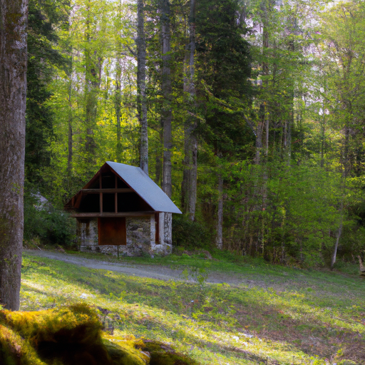
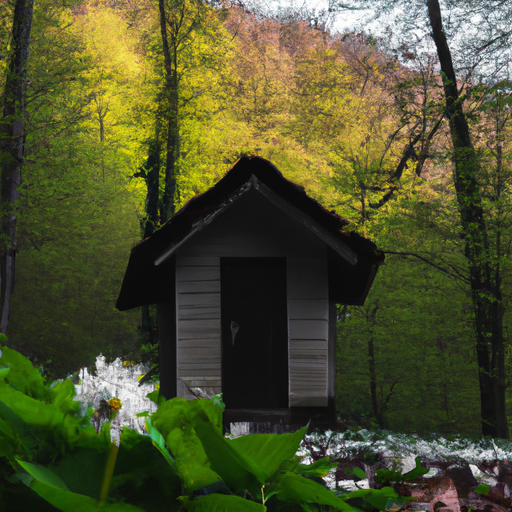
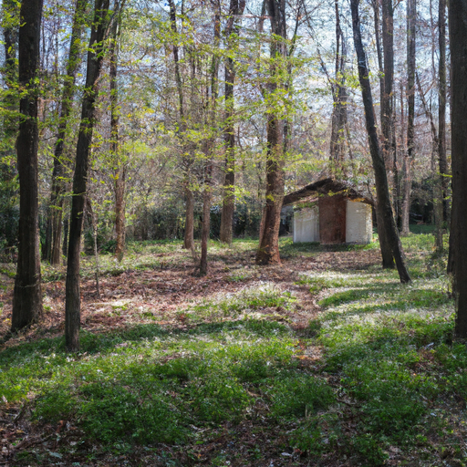

## [moving into my forest home preparing the cottage garden](https://www.youtube.com/watch?v=a_8G0PzVFbc)

<table align="center">
	<tr>
		<td align="center">
<<<<<<< HEAD
			
		</td>
		<td align="center">
			
		</td>
		<td align="center">
			
=======
			
		</td>
		<td align="center">
			
		</td>
		<td align="center">
			
>>>>>>> ffe52613361410ad9d371a0f80e81de4dd24175f
		</td>
	</tr>
</table>

My name is Paola, and I live in a little house in the forest. My town is in the foothills of a vast mountain range. It’s quiet here, perhaps boring to some, but to me, it’s home. I came to this valley to find work, to get help from my parents when I felt I couldn’t help myself. I’d given away so much that I didn’t know who I was anymore.

Over time, I found my song. Over the last couple of weeks, the snow has melted, giving way to spring. I’ve been impatient for this time, everything has come to life again, ready to begin anew. I have made some new friends in the forest lately; our neighbor's cat, Lilly, has been accompanying me on my forest walks. She reminds me to tune in to my senses and practice simply being.

When you are out in nature, you are forced to encounter yourself. No other human is there to influence how to feel and what to think. You’re in the company of your own thoughts. It can make you uncomfortable, but it is also an opportunity to consider who you are and what you need to live well.

For about three years now, I’ve been a dedicated student of daily life. I’ve spent a lot of time observing, wondering, and waiting. And I’ve come to the conclusion that to live a simple fulfilling existence, you must embrace not only your complexity but your own unique path, which is rarely straight, recognizing the wondrous thing you are and will be every step of the way.

The answer to a simple life cannot come from me or anyone else on this earth. It’s up to you, finding a balance between the harsh realities of this world and the happiness and joy you have the power to cultivate. It’s about being in full awareness of the change you want to see in yourself and others, while also being able to celebrate how far you’ve come, the acts of good around you, and the beauty of the mundane world.

Do not avoid asking yourself what is holding you back. Are you choosing fear over love? Are you living in the past or in the future? I truly believe in confirmation bias: That whatever reality you support through your observations, thoughts, and actions will be the one you live in. And that thought is both comforting and terrifying because it puts the burden of responsibility on you. Or you can interpret it in the way I do: that it is not a burden, but a sign of your own power to form your story.

All our lives are limited in some ways, as we are all perhaps blessed in some ways as well. The greatest stories are often lost to the annals of history; they aren’t grandiose and externally impressive. But they do leave a legacy. They are good lives enjoyed within realistic confines.

I cannot go out and do anything and be anything; not everything is possible. But I can work towards my goals, make mindful decisions, and practice love. We need to uplift and support others as well as ourselves as we tell our story. It’s our responsibility to help on a local level, and that ripple effect can truly change the world. It starts in our own hearts, spreads to our community, and beyond.

I often hear the phrase, "I wish I could leave it all behind." And I do appreciate that phrases like that encourage people to dream and consider other realities. But I know that for me, on a practical level, I can’t leave everything behind - my responsibilities, my job, my family, my community. And I’ve come to a place where I don’t want to be anywhere but here, in the midst of the goodness in the darkness, and somewhere in between finding a quiet contentment.