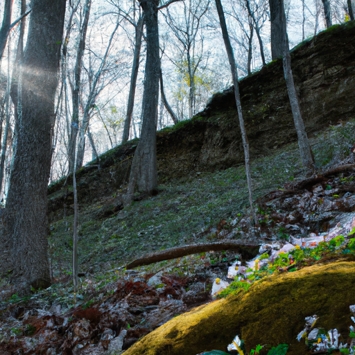
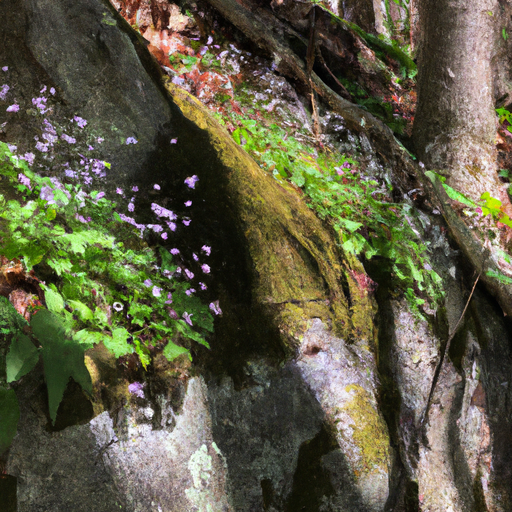
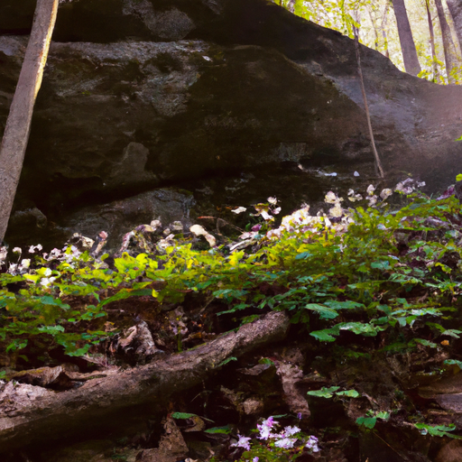

## [moving to a new house is hard - I wasn t expecting to feel so lost](https://www.youtube.com/watch?v=GF9eMau-cvs)

<table align="center">
	<tr>
		<td align="center">
			
		</td>
		<td align="center">
			
		</td>
		<td align="center">
			
		</td>
	</tr>
</table>

It is so quiet here. You'll probably be able to hear my dog throughout this entire thing, but besides him and all his noises… it is so quiet and lovely right now, the sun is peeking through the trees and it's shining light through the petals of the spring beauties on the side of the cliff. And it's, it's just stunning. It is my favorite time of year for sure, and it's funny because for me, spring is a very sacred time - for lack of a better word - it's always a very special time it's it's always the time where i find myself feeling the most energetic and the most joyous and it's been interesting to come to this season, that is such a special season for me and find myself not feeling well. And that's been an interesting wake-up call, so it inspired me to sit down and kind of make a unplanned video and connect with you and ask you how you're doing and if you're taking care of yourself.

For me, several months ago, once we realized we were going to - thanks to the kindness of Luke's parents - purchase a home next to them, I decided to extend my work hours because I knew it would be extremely helpful. I was just constantly in that mindset of preparing for this change for me, last week was a really profound experience because I made a video. I filmed a lot of that video in this forest and there was this moment while I was filming where I was just standing next to a tree without shoes on, just barefoot and staring up at the branches, just trying to decide what I had in mind for the video and I realized I am so happy right now and I've not spent that much time in the forest… and then I also realized - it kind of hit me like a wave - of how bone tired I was from the last few months. How I just felt like constantly working was allowing so much that I wanted to happen but the flip side is that you do hit this wall. I found that my anxiety was getting a lot worse and that I was waking up at night with just kind of palpitations in my chest and and this feeling of numbness through all my limbs and having a really hard time sleeping because everything felt so tingly and numb and it was a very strange and rather frightening experience.

Will I be able to provide for the people I love, will I be able to have people rely on me and not fail them? When I made last week's video I loved every moment of making that video and that leads me to what I wanted to say, which was thank you, because no matter how I'm feeling, filming videos being outdoors or being indoors baking or doing crafts or doing anything that I'm able to edit and put together in artistic ways brings me so much joy and peace in my life. And to spend more time outdoors to spend more time connecting with the trees and with the earth and with my spirit and prayer. There is still parts of my life where I'm letting fear dictate my actions. I think I need to take a little bit of time to work on that. If you feel so inclined, if you could share your words of wisdom in the comments section. A community of so many lovely people has so much more wisdom and so much life experiences and so much beauty to offer each other than I could ever offer to you.

How do you find peace in your daily life when you truly don't have time, when you don't really have options when you have responsibilities or people relying on you. If you don't have any option but to work as hard as you've been working you know how do you rejuvenate in the midst of all that. That's how I've been feeling recently, I've been feeling all these, a lot of weight of responsibility, a lot that I just put on myself. Offering love and support to all of you and I think it is so important for all of us to ask for help if we need it, yeah so i'm going to try to take some time to work on my breathing and feeling calm because all this numbness and palpitations and kind of panicky moments yeah really aren't good for me… and take some time to breathe, and finish up all the paperwork for this house, and finally move in permanently. It's all getting ready for a new beginning and it's happening and I am sending you all my love and I will see you very soon. Take care, goodbye.