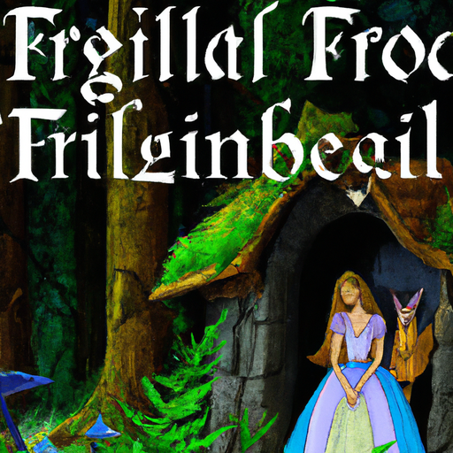
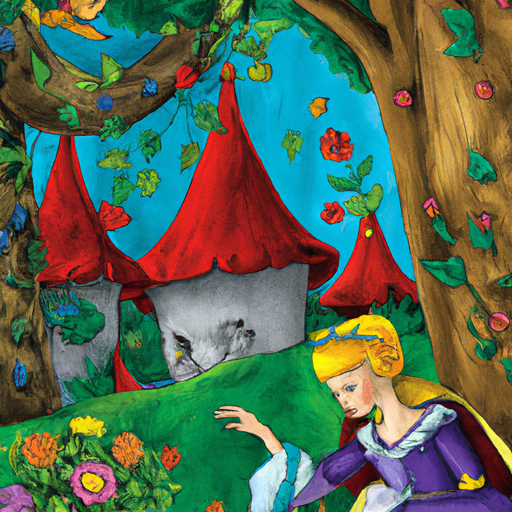
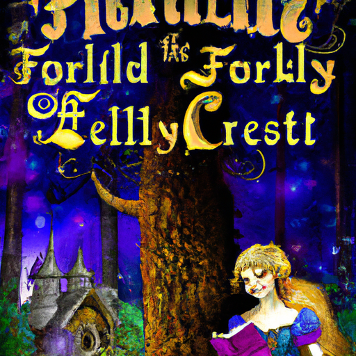

## [my fairytale book recommendations + book shopping](https://www.youtube.com/watch?v=NflL7_QFGYw)

<table align="center">
	<tr>
		<td align="center">
<<<<<<< HEAD
			
		</td>
		<td align="center">
			
		</td>
		<td align="center">
			
=======
			
		</td>
		<td align="center">
			
		</td>
		<td align="center">
			
>>>>>>> ffe52613361410ad9d371a0f80e81de4dd24175f
		</td>
	</tr>
</table>

Foreign Music

Shopping at my beloved local bookstore, Trails and Books, they were the first to support me when I became an author, and I hope to find myself working there again very soon. Since today I felt like shopping for books, this was the perfect place to go. I came home with several new fairy tales to read and decided I would share with you some of my favorite books in my fantasy and folklore book collection. Lately, I've been in the mood to escape to far-off enchanted places, and I hope you will find some new books to read this season. Without further ado, here are my favorite whimsical book recommendations.

Hello everyone! I wanted to make part two of my kind of book style videos, recommending books related to a certain topic. I'm certainly doing this for my own bookish self-interest, and again, I understand not everyone is readers. But those of you who are, I thought that I could make some recommendations related to my love of fairy tales and folklore. I feel that there are so many themes in fairy tales and folklore that are all about healing that inner child and nurturing yourself, and finding that truth within. And not being afraid to be who you are, being someone with imagination, being someone who fights for what they believe, as so many heroines in fairy tales do. And there is no season that feels more fairy-like than springtime. So I thought this would be the perfect time to share these books with you, and hopefully, you might enjoy them and they might inspire you.

I made one video before on book recommendations about elevating ordinary life and slow living in mindfulness, so I will leave that link down below. I will begin with the book that I read most recently that I did enjoy. It is not one of my all-time favorites, but I thought I would share it because it has been quite popular lately. It is Emily Wilde's Encyclopedia of Fairies. It is a very interesting book about an academic named Emily Wilde who finds herself in this strange isolated town where she wants to study the local fairies in folklore. The fairies in this world are very traditional-style fairies that are often not to be trusted and rather cunning. If you prefer sweet little flower fairies and Tinker Bells, this is not going to be the type of fairy you find in this book. However, it was very atmospheric and enchanting, and I really enjoyed it. It is a romance, and I'm not always a huge fan of romances, mostly because I personally feel that in many romances, the characters often portray quite unlikable qualities. I don't know, maybe it's just the romances I happen to have read, but I still enjoyed the romance, so I will put this on your list in case you haven't heard about it before. It might be worth looking into.

"East of the Sun, West of the Moon" by Jackie Morris, "The Wild Swans" by Jackie Morris, and "Snow and Rose" by Emily Winfield Martin are all retellings of fairy tales. The reason I put these books together is because they are iconic to me because of their illustrations. The illustrations are enchanting and beautiful and transport you into another world. I highly recommend them for their art, if not for their stories, because I think both the poetic style of Jackie Morris's writing and the art of Emily Winfield Martin are just beautiful.

Another kind of fantasy folklore-inspired book is "Daughter of the Moon Goddess." It also has elements of romance, but it is not the very main part of the book, which I can appreciate. I like when the heroine has a plot and a story outside of the romance as well, and I found it to be very enchanting and interesting. I did not enjoy the last part quite as much as the beginning, but it was very atmospheric and it really ignited my imagination. Sulin Tang as well has a lovely writing style that I found very easy to read.

"The Wolf and the Whale" by Jordana Max Brodsky is a book that has elements of fantasy as well as just within the normal fiction category. It does have inspiration taken from actual history, and it does share some Inuit folklore and legends that are beautiful and really thought-provoking. I really love the main character in this book. It tells the story of an Inuit woman who wants to be a warrior, and it is an interesting adventure all about culture clashes as well as going into the ancient mythology of the Inuit people.

I also have "Woodland Folk Tales" and another book in the same series called "Botanical Folk Tales." They just go into several stories related to Britain and Ireland that I really enjoyed and were kind of simplistic, more fairy tale stories, and they were beautifully written. I also enjoyed "By Oak, Ash, and Thorn" by Melissa Harrison. The illustrations are just so cute, and the story is wonderful, and of course, about little tiny people that live in the forest.

I also love "Howl's Moving Castle." If you were a huge fan of the movie, I will warn you that the main character of Howl is a little bit different in the story. He, in my opinion, was not quite as likable as in the movie, but he was still really fun to get to know, and all the characters are so charming. I also enjoyed "Eva Evergreen: The Semi-Magical Witch." It was just a really cute, heartfelt story, very positive, not too stressful, which is really good. It's just a story of a little witch who is starting to try to make her new life and open a magical repair shop in a town to become a well-respected witch. It is a really sweet story, and I believe there's another book out as well in the series.

"The Girl Who Circumnavigated Fairyland in a Ship of Her Own Making" by Catherine M. Valente is a beautiful story. If you are a fan of Alice in Wonderland, if you like that sort of kind of absurdist fairy tale storytelling, you will love this. I felt like it just hit all those same cozy feels that I feel when I read kind of enchanting nonsensical sorts of fairy tales, and it just makes my imagination run wild. So I really love it.

For graphic novels, I really loved "The Moth Keeper" by Katie O'Neill. I also enjoyed the chapter book "The Spiderwick Chronicles." I grew up with this series, and I've talked about both these books a lot, so I'm not going to talk about them too much. But yes, and of course, because I love fairies and this is the Cottage Fairies YouTube channel, I have, of course, "The Fairy Handbook," which just has all the information you could possibly need on the fairy folk. It feels like reading a really long magazine. It is very easily digestible writing, and just a little bit of everything is in this book, so you might enjoy it no matter what your age if you love fairies like I do.

This is definitely the weirdest book I have, but I personally love it. It is, however, not for everyone. It is called "The Land of Stone Flowers: A Fairy Guide to the Mythical Human Being." It is very strange. The art in it is very different. You will see all sorts of interesting art in it. So if you like kind of odd eccentric books, you will enjoy this one. It has a beautiful cover, and inside, it's about fairies analyzing humans from a fairy perspective, and it is quite cute and unique.

I'm a huge fan of "The Storyteller's Handbook." On the back, it says, "You hold the map to places only you can see. There are no words to this book. They are just images, and you flip through and you let these images inspire your imagination, and you can create stories of what is going on in the paintings. The art is so unique and thought-provoking, and I found myself coming up with all sorts of stories. It is a very beautiful meditative exercise as well.

Stories are doorways. The imagination has no boundaries, no walls or borders. All doors are open to us, especially when we make them ourselves. But that is my last recommendation. I do have other books related to fairy tales and folklore, but these are definitely the ones that most come to mind when I think of this genre. Maybe if you are interested in kind of fantasy, fairies, and folklore, you could look into these books or share your recommendations down below. That is everything. I actually don't know what other types of book-related videos I should do, so I'm going to stop here for now. But I wanted to mix these in just now and then, maybe once a month or so. I hope you enjoyed this, and I will see you very soon. Take care. Goodbye. [Music]