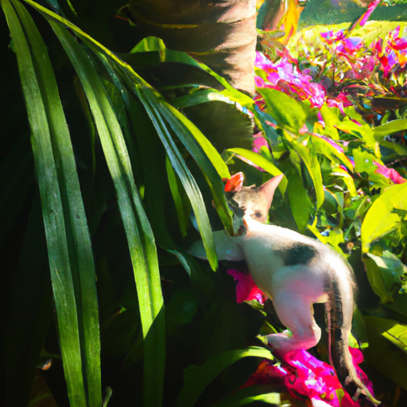
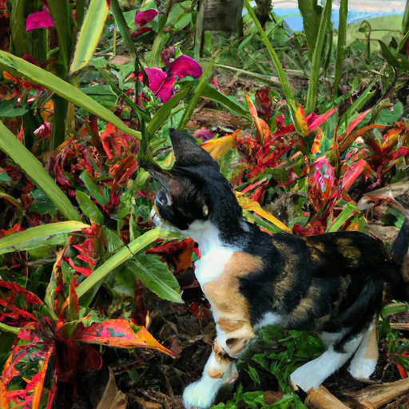
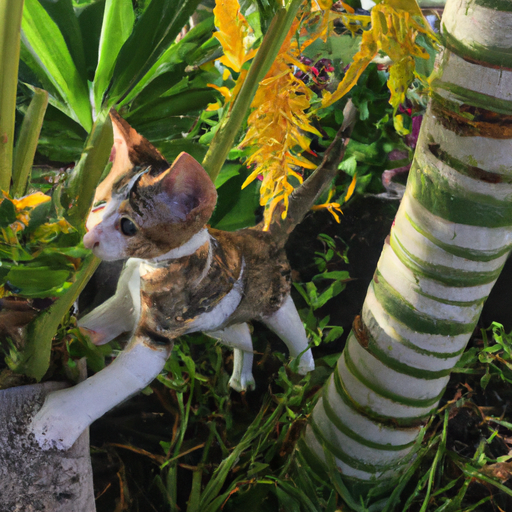

## [my family is growing - something happened at the cottage](https://www.youtube.com/watch?v=Jo8D9XKf_0s)

<table align="center">
	<tr>
		<td align="center">
<<<<<<< HEAD
			
		</td>
		<td align="center">
			
		</td>
		<td align="center">
			
=======
			
		</td>
		<td align="center">
			
		</td>
		<td align="center">
			
>>>>>>> ffe52613361410ad9d371a0f80e81de4dd24175f
		</td>
	</tr>
</table>

We have a new addition to the household. She came into our lives rather unexpectedly. I'd had my heart set on a kitten for a long time and perhaps by fate she found her way to us. Even though I enjoy my days spent working by myself, it is so lovely to have a sweet companion.

All this happened in the best way because I recently had to take a break from my bookstore for several weeks as things were very slow. Waiting until tourism picks up in late spring, I was worried that I might find the change a bit lonely. And it's funny how the moment I got that news, I also realized that we were going to get a kitten. Funny how when you have an open heart, little angels find their way into your life and provide much-needed company.

One reason I love cats so much is because they're so incredibly observant. Everything from the light, shadows, movement, even the rustle of the wind, she notices all of it and reminds me to notice it too.

So yes, a few days ago, I by chance heard of a kitten that was available in great need of a home just a couple hours away. And so, I pretty impulsively got into the car and went over there to see her. I fell in love and so I took her home and she has been finding her place here. She already has made really good friends with Mr. Darcy and he's so gentle that they've really been snuggling up a lot and getting along really well.

I am so happy to have a cat in my life again. If you have any name suggestions, please let me know. I was thinking I might call her Mavi. It's the name of a very tasty drink in Puerto Rico made from fermented tree bark from the Mavi tree. So, I thought that going along with the tropical theme might be good because the last cat that I had that was very dear to my heart, her name was Mango. And so, I would love to keep going with kind of tropical names. It would be really fun and to honor Puerto Rico for sure.

I spent quite a bit of time today transplanting all my herbs. I wanted to challenge myself and try to grow a large variety of herbs this year, which I know I can dry and use for the winter. So, that is the goal today.

I'm wishing you all the very best. I'm gonna go get changed. I am covered in cat hair and so I'm going to put on a new dress and go for a walk and go enjoy all the wildflowers and the balsam root which just bloomed. So, I will see you very soon. Sending my love. Goodbye.

Due to having so many wild animals in this area, I've decided that the kitten will be an indoor cat. However, I do have to compromise in regards to the spring flowers as I can't imagine life without them. I take her on my walks in a little carrier and let her enjoy the flowers for a few minutes before we go back to the safety of home. Seeing the natural world through their eyes reminds me that there's so much magic everywhere.

I've been finding myself at night going out on the porch and looking at the moon and enjoying the ambiance of being in a forested area, which feels so different from the prairie where I used to live. And it's really sometimes eerie but also comforting at the same time at night when there are so many trees around. And I've been really enjoying it. It just feels so different and it's very magical for sure.

As you can see, it has been a very eventful, very wonderful week. And I have just been enjoying so much time with the kitten. It is so wonderful to have her company. And since I'm now spending more time at home because I'm taking a break from the bookstore until tourism speeds up, I wanted to have some extra company at home. It's so lovely how things work out and I'm just so happy to have her around.

We actually don't have Wi-Fi in this house right now. We tried to get Starlink, but we are not able to get it until next year. I think there's a lot of demand in this area. And so, I hope that we will get it soon enough. But in the meantime, I have to admit, watching the kitten run around and do little tricks and is, oh my goodness, it's just more than enough entertainment for us. So, we've just spent evenings together just watching her play and it is just so entertaining.

Anyway, the house is still not quite complete. There's still work being done and so I cannot show you too much of the house at this time. But we are getting there. I am sorting through things and trying to decorate. And hopefully, I'm going to paint the bottom level of the house soon. So, a lot of plans are in order. That video will be coming very soon. And in the meantime, I will be sharing with you all the delights of spring over here.

I had such a hard time a couple of weeks ago. And while I had been trying to recover and feel better with all the overwhelm of moving, it has been just so wonderful to have so much sunshine. Anyway, we have some vet appointments next week and I hope the kitten will continue to be as happy and healthy as she is. And yes, please let me know if you have any name suggestions. It is kind of funny though how sometimes kittens name themselves too. She is very brave, very outgoing. And so, we'll see what name suits her.

I was looking at the calendar today and I realized that I'm getting married in almost exactly a month. And so, it made me realize that there's still quite a lot to do. And so, we will be definitely very busy over the next few weeks. And I will keep you updated on how things are going. My abuela is visiting from Puerto Rico and so is my sister Lyanna. And I am just so excited to see them. We're going to have all the family together.

Kitten is growing so quickly, so I'm sure by the time you see her next, she will already be considerably bigger. So, I am enjoying every minute of having her around at this age. Hello, baby. Goodbye.