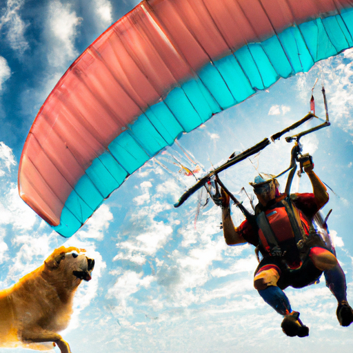
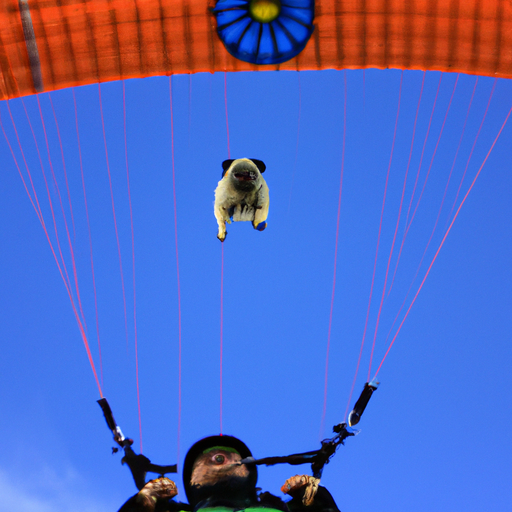
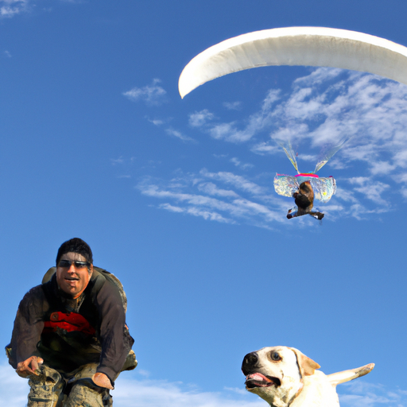

## [my first sit down chat - answering more personal questions](https://www.youtube.com/watch?v=iyisP7jtkmA)

<table align="center">
	<tr>
		<td align="center">
<<<<<<< HEAD
			
		</td>
		<td align="center">
			
		</td>
		<td align="center">
			
=======
			
		</td>
		<td align="center">
			
		</td>
		<td align="center">
			
>>>>>>> ffe52613361410ad9d371a0f80e81de4dd24175f
		</td>
	</tr>
</table>

It can be really hard to talk to the camera, so this is really good practice for me. I was gonna do a Q&A in October, but just things worked out in a certain way that I realized it might be just better to do it this week instead. And if you are not interested in a Q&A, don't worry at all. I will be back next week with my more usual content. I thought it would just be fun to get a little more personal and learn about you guys as well because I would love if you there was a paraglider in the air and my dog saw him in the sky and just freaked out. He's still freaking out. Some people wondered how you pronounce my name. One thing that I do to explain how to pronounce it is that it rhymes with hola in Spanish, like hello in Spanish. Hola rhymes with my name, Paola. So you kind of break it up, you go la, Paola. The other common question was my birthday, and I was born December 5th. I am 24 years old. I'm gonna be turning 25 this December, which feels monumental, so it's really exciting. My brother, he is 23, and my sister is 27, and her name is Lyanna. And my brother, who you guys kind of know already, his name is Rohan. So another question I got was about my parents and the languages I speak. And my father, he was born and raised here in Washington state, actually. And my mother, she is native Puerto Rican. I would definitely say I am fluent in English and Spanish, but my spelling in Spanish is not very good. I had quite a few people ask me how I'm doing, and I thought that was really sweet, so I wanted to say thank you. I'm doing very well, thank you very much for asking. It's been a very relaxing, lovely month for me. If you had to choose a different path for yourself, what would it have been? If I had chosen a different path, I think there is a likelihood I would have gone on to do more advanced studies in English literature, and I might have become a professor. But it just wasn't the right time, you know, and I wanted to experiment a little more with my more creative side. It was very important to me to find ways to involve my art and creativity into my daily life, and being a professor didn't seem like the right path at this time. Also, when I was much younger, when I was a teenager, I was very convinced I was going to be a veterinarian. I cared a lot about animals and working with them, and it was something very meaningful to me. I think I will always have rabbits in my life. They're such sweet and kind and gentle creatures if you were able to raise them from very young and teach them to be comfortable with humans. I've just always enjoyed them, but yes, being a veterinarian was definitely not the path for me. Another great question I got was what do you do to relax, and I wanted to go over that because it's probably some things that might surprise you. I actually am a bit of a nerd, and I love board games. And thankfully, my brother and my dad and my boyfriend all love board games as well. That is one thing I love to do to relax. It's always wonderful because I get to spend time with my family too. And recently, one of my favorite games to play is called Everdell. And I will show you some images of it because you will see why. It is all based off around little adorable animals, and it's really cute. So this is definitely not a game for people who have never tried board games before because it is a bit complicated to learn. But if you're already kind of experienced with more nerdy board games, you will definitely enjoy it, I think. Another thing I do is that I have a little mini projector. It's really cheap, so the image quality is not that great. But I love to project it on my wall at night, and it has a speaker too, so I can play kind of ambient music. And I really enjoy that at night. It's very relaxing. I also love lighting candles. That is actually a brand new hobby of mine. So I have recently amassed a little bit of a candle collection, and I really love them. And there's an adorable fantasy-inspired candle business I love that I shout out on Instagram a lot because how much I love it. And I will leave the link to them down below too if you're interested in some fun little more nerdy candles as well. So I also love to go to fantasy fairs and Renaissance festivals. I've not been able to go to that many this year because none of them have been happening. But there is one happening soon that is outdoors where you can still kind of keep social distancing. And so I think that's really great. You know, so I hope to go to that one, and I will definitely share that one with you. So those are some ways that I like to relax. There's many more, but kind of those are the main ones: candles, board games, fantasy fairs, projectors, you know. It's all sounding more and more nerdy as I think about it. But yeah, obviously reading too. I love reading and listening to audiobooks. I got a lot of questions and requests for book recommendations. So to prevent myself from talking for three hours about my books and not getting to any other questions, I've put a lot of my favorite books down below as well as taken that opportunity to answer some really common questions that kept popping up. If your question isn't answered on the video, please check down there. And if I still don't get to your question, I hope to do another one of these at some point in the future. So one very good question I got from several people was, "What are the downsides of living rural? What are the downsides of your lifestyle right now?" And there is definitely downsides of living out here as opposed to the city. One of them is that when you are in such a rural area, there just aren't that many people. You may not be able to find a large group of people that share some of your hobbies or interests. And so that is definitely something that you need to keep in mind before moving very rural, that that can be challenging. But also, you know, my experience here has been that I really have embraced learning about new people with all types of different backgrounds and interests. And even though they don't share my interests, I can still learn and gain a lot from knowing them. So it all depends on your personality and how important it is for you to have a large group of people that are similar to you or have a similar background to you. Another downside for me personally is kind of a very silly one, and that is internet connection. It's not always easy to find a really good internet connection. It would be really nice to have Wi-Fi in this house just because it would make working a little bit easier. I wouldn't have to move somewhere else in order to use my computer and all that. It's something silly. I don't need it, so I make it work. I think living rurally sometimes forces you to face a lot of small inconveniences. You are forced to separate what you need with what you want and seeing what you want as convenience things that aren't always necessary to live happily. It's been really good for me, you know, but it completely depends on who you are and what type of job you have. Some people are completely prevented from living more rurally because they need to rely on a very stable internet connection. So it completely depends. I got one really cute question that I just had to answer really quick, and it was, "What is your favorite flower?" And that changes every single day because I love all flowers and I'm obsessed with them. And sometimes I put way too many flowers in my house and it just pretty much smells like pollen. So yeah, I love flowers, but I would say currently my favorites are flax flowers. Another question I got was, "What made you move to your cottage from the city?" And I think the answer to that is really boring. I needed a job. So again, like I mentioned before, I worked in customer service and I lived in a university town that really only offered more minimum wage customer service positions. And it was really hard to find a job that helped me move forward a little bit and put some savings in the bank and be able to really plan for the future. So I applied to be a school teacher over here and I was able to get that position. And it gave me the perfect amount of stability while I worked on my art business and got that going. And now I've been able to do that full-time. That is a dream come true. So I'm so thankful to all of you who've shown your support. To be able to have my business allow me to be creative but also have something that is completely my own and to be able to create art and even these videos and all that has just been so meaningful. And it's just transformed my life in many ways. So I'm very thankful for that. So I really, I'm really thankful for that. Okay, another question I loved was, "What is the most exciting thing about the countryside for you?" And I love that because again, wherever you live, there are positives and negatives. And for me, the positives are being able to hike and walk anywhere. And I just love that. It is just so much fun to take my dog and let him really experience the world so freely. And being able to bring my camera and share those places is so exciting because I feel like I can support this valley and support this area in one of the most meaningful ways for me, which is to be able to bring awareness to natural areas and consequently help preserve them and plant trees and inspire people to get involved. But that's definitely been a driving force in everything I do in regards to this channel. Another fun question was about safety. A lot of people were interested in what it's like to live so near wildlife. And I always find this question very interesting because I personally have never experienced a lot of anxiety about wildlife. But I have come to realize that a lot of people do. These animals, especially predators, they want to be left alone. I'm not fearful of them, but of course, that is never a reason to just throw caution to the wind. You want to go on your hikes with your bear spray and whatever you need to go with to feel safe. But it doesn't feel dangerous to me. Another question I had was about being alone and being lonely in the middle of nowhere. And that's also one I wanted to address because I have very active relationships with my family. I have my boyfriend in my life. I have a lot of people in my life. But I care a lot about not forcing people to be on camera if it makes them uncomfortable. Even though I have neighbors and I have a lot of people in my life, they're not seen on camera very much. I hope that explains things a little bit. One of the very first questions I got after I asked it on Instagram was if I get angry and if I lose my temper. And I laughed at that one because it was really funny. I've actually had a bit of a journey in regards to that. I am not someone who loses their temper very often. And I don't think I feel very intense anger very often. And I don't think that is always necessarily a good thing because for some personalities, it can be really hard to be assertive and sometimes be louder and to be very clear with how you feel and what you want and what is frustrating you. While that doesn't mean losing your temper and being disrespectful to other people, or there's nothing wrong with getting upset sometimes and being very clear with how you feel. In fact, it can be very liberating to be honest with people when you really need to. While losing your temper may not always be the best thing, I don't think suppressing how you feel and not being assertive when you need to is a good thing either. For me, I've actually gone on a bit of a journey of trying to be more clear with what I want and more clear with what is frustrating me and what I need. Another common question I get is where is your clothing from? And there is a reason that I have never answered this question, and that is because I have a lot of family members and extended family that gift me clothing. And I have a lot of clothing that I get from thrift stores, which is one of my favorite places to find clothes. I don't share the brands because I don't want to encourage people to just go buy brand new clothing from these brands. I try to wear the clothes I already have and secondhand clothes, and I enjoy dresses and all that. But clothing isn't a big part of my life. Every dollar I spend on something else could be something I spend on a book. So if anything is going to grow exponentially, it's going to be my book collection. I got a question about my boyfriend and how I met him. We were actually set up by my mother. I wasn't happy about it initially, but things changed and worked out very well. So I had one question from a woman asking what strategies I use in order to deal with grief. And that's a hard question because I think every person deals with grief differently. But I will say this, and it is some words that were given to me by an old friend. They described losing, for example, losing someone important in your life or having a really a time of loss as you become a living memorial to the people that you have lost. I really like that idea that we continue to breathe and walk this earth as memorials to people we have loved and we no longer have in our lives. And through that, we keep them alive. I love that way of looking at it. A time of grief after losing someone will always be transformative. While you cannot physically bring back those people in your life, you can share their story. I hope that makes sense. But thank you for that question. It's one I will have to think more about and speak more on in the future. Another question was, "What do you think is the bravest thing you have ever done?" I will say a silly thing and a not so silly thing. I think the silliest brave thing I've ever done is gone skiing. I spent a portion of my childhood in Puerto Rico, and then I spent a lot of it in the south of the states as well. And my mother is from the tropics as well, so we just never experienced winter sports very much. And I went skiing for the first time last year, and it was just about the scariest thing I've ever done. My mother is outside. It's okay. Another thing that I would consider brave is something I do try to do often, and is to be open to yourself and really seeing your actions and your feelings and everything in a very honest light. And authentically asking yourself if you are wrong. I encourage myself to look at things from different perspectives and understand people. I think it's very brave to try to have those interactions with an open mind. One of the bravest things maybe is to come up to someone and say, "I'm sorry." Or also, when equally necessary, to say, "I love you." Saying sorry and reminding people we love them are two very important things that all of us need to do. Not all human interactions are about who's right and who's wrong. Sometimes it's just about love. Are there snakes here? Yes, there are snakes. There are rattlesnakes and bull snakes and all types of snakes in this area. But again, just like bears and cougars and predators, they really don't want to be bothered. So it's definitely something to be aware of and be careful about. Some people thought I had built this cottage and that it is off-grid. And I have not built this cottage. I've built fairy houses before. They've been about this big and very foundationally unsound. So there you go. The second and last question I got was about English and what I studied in university. I assume there are at least several students watching this, so I don't know if this will be helpful to you, but at least I can share kind of what I did. So I ended up applying to University College Dublin in Ireland, and I had a lot of fun. I did gain a lot from it, and I enjoyed it, and I enjoyed studying English over there. But I ended up wanting to go back to the United States once my parents also moved back there. I've always been very family-oriented, and it means a lot to me to just be near my parents and my siblings. So that was always the motivating force in all my decisions, even coming over here. So yeah, I finished my literature degree, and actually in a Western Washington University in Bellingham. I think with a lot of degrees in the arts, you can make it a lot more or maybe even slightly less challenging depending how you approach it and how much time and energy you put into it. And I cared a lot about my degree, and I was thinking about being a professor, so I put a lot of effort in my English degree, and it has been extremely useful, and it has helped me a lot, especially in the area of presenting myself in writing in a very eloquent way. I learned a lot, I read a lot of books, I started my love of just historical children's literature, and yeah, and it was very, very fruitful. I really enjoyed it. Lastly, a couple people were wondering if I'm ever going to write a children's book, and for sure, yes, I have a lot of ideas for children's books. I would love to write one in the future. I have not quite had time, but I am actually working on a book for adults right now. So that is something I've been working on for about three, four months now, and I hope to have something produced by next year. So I'm very excited about that. It's been a lot of fun, and I'm trying to do a lot of illustrations for it and photography. So we will see where that goes. But definitely, I will write a book and a children's book in the future. That is an enormous goal of mine. Again, I answered a lot more questions in the description bar, so if I didn't answer it, do check that out because I didn't want this to be too verbose. Well, I know that you guys asked a lot more questions, but I can't remember any more of them right now. So I think I will leave it there. But yeah, I hope to introduce you to my family very soon. They have agreed to be part of a future video, and I would love for you guys to meet them. And that's something else that will come up in the future. I will see you next week with my more usual content, but let me know if you enjoyed this because it's kind of fun to do from time to time, and I would love to get more comfortable in front of the camera because that's a goal of mine, and it's hard to do. I don't know how so many people do it so well. So wishing you all a wonderful day or night, and I will see you next week. Goodbye.