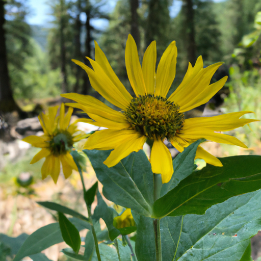
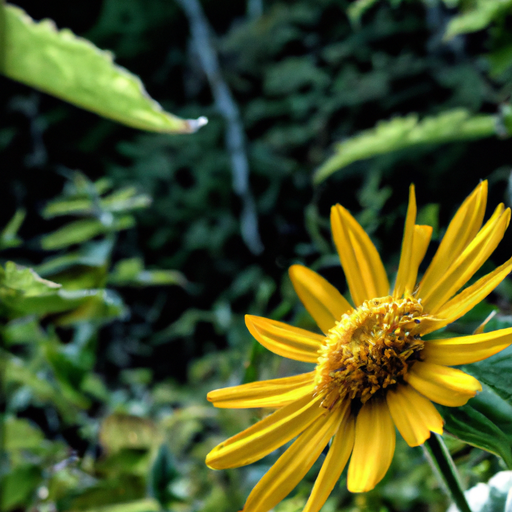
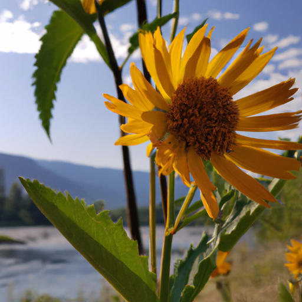

## [my life is changing and so is this channel](https://www.youtube.com/watch?v=sWfcgeDth_w)

<table align="center">
	<tr>
		<td align="center">
			
		</td>
		<td align="center">
			
		</td>
		<td align="center">
			
		</td>
	</tr>
</table>

As you may already know, I recently made the decision to step away from my job at the school where I was working. This was a big step for me as I wanted to explore new opportunities and pursue my dream of becoming an art teacher. Currently, I am in the planning stage of this new chapter in my life. 

On a positive note, I have found a new space for my work station, which is incredibly exciting for me. This change was prompted by a rather embarrassing incident when one of my customers found three black dog hairs in their package. It was a wake-up call for me to establish a proper work space.

Adjusting to a new routine without the familiarity of my school feels strange and sometimes scary. However, I am fortunate to have the guidance and support of my mentors to help me navigate this transition. One source of inspiration for me has been the wildflowers, particularly the balsam root plant.

The balsam root is a flower native to this part of Washington state, known for its vibrant yellow blooms and arrow-shaped leaves. What makes this plant truly fascinating is that its true story lies beneath the surface. It has an incredible root system that can be harvested for food or medicinal purposes. The main taproot can reach deep into the ground to find water, while the wandering tendrils prevent erosion. This survival mechanism is crucial in the dry and hot environment where I live.

Reflecting on the balsam root's hidden strength, I have realized the importance of developing my own root system to find stability during this uncertain time. My life has undergone significant changes this year, and I understand that it will never be the same again. While this realization can be both exhilarating and scary, I have come to believe that there are multiple paths in life that can lead to fulfillment.

In the past, I used to fear making the wrong choice and regretting it later. However, I now understand that it is not the choice itself that determines its worth, but rather what we do with that choice. This perspective has helped alleviate some of my fears about the future.

I am grateful to be going through this transition in the spring, as it is a time of healing and renewal. Additionally, I have some personal news to share related to this channel. My brother, who has been living in Australia for almost two years, has recently moved to my area to reassess his career. With his newfound free time, he has generously offered to help me improve the quality of my videos and teach me how to use a proper camera. Starting next week, you will notice a significant improvement in the videos I create.

Lastly, I wanted to mention that I have loved ones who are currently battling an illness, and I am deeply worried about them. I would greatly appreciate your thoughts or prayers during this difficult time.

Sending my love and wishing you a wonderful week.