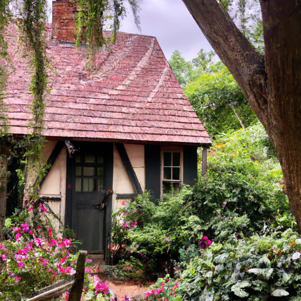
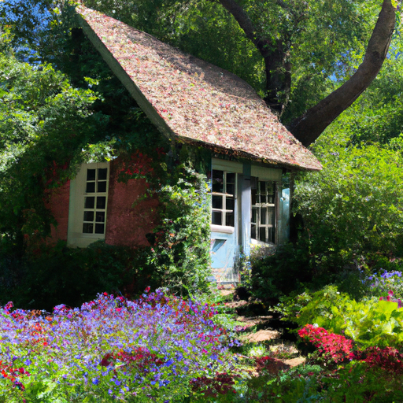
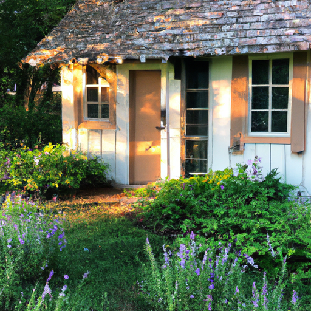

## [my money mindset and spending habits while living simply part 1](https://www.youtube.com/watch?v=4KdqikuuGf0)

<table align="center">
	<tr>
		<td align="center">
			
		</td>
		<td align="center">
			
		</td>
		<td align="center">
			
		</td>
	</tr>
</table>

I was visiting my grandmother this weekend on the coast where it is much warmer than back home. I had the opportunity to visit a botanical garden and Greenhouse. It was such an enchanting experience and made me ache to my very bones for springtime. I enjoyed my trip to civilization as this Garden was near Seattle, an enormous City on the corner of my state. I have to admit, I'm always surprised, having gotten used to rural living, at the sheer amount of advertisements and businesses that are on every corner. It is surprising to be bombarded with Billboards and malls and supermarkets full of a hundred different choices for cereal and lotion and everything in between. The amount of choices is always a tad overwhelming, but I do like to use my trips into the city as a chance to stock up on some bulk items for a lower price. Living in a town with one small grocery store means the local prices can be very high, so we try to purchase in bulk when we travel.

This year, I wish to continue being careful when I'm thinking about buying unnecessary items. Taking time to wonder where it comes from, if I really need it, or if there's an alternative I can make at home. But I think that simply resisting purchasing isn't as helpful or effective as going within and reflecting on your own philosophy in regards to what items nurture you and what simply adds to clutter or purchased to suppress emotions that are asking to be heard. To my inner emotions, the more I realize that nothing will resolve them unless I stop, listen, and nurture myself with nothing else but quality time with my soul.

As an artist and Etsy shop owner, I love to support other creators and small business owners and share their work with the world. I know it can be difficult to make a living in that field. I enjoy mindfully spending when I wish to purchase something useful, beautiful, or enriching instead of impulsively picking up a bunch of clothes I may only wear a couple of times. It helps me live in alignment with what I believe, even though I still falter often.

I've made several videos on my love of thrifted old things, from vintage knickknacks to centuries-old books. This year, however, I wish to keep an eye out for friends and relatives who I know will enjoy one of these treasures and share with them a piece of what I love. When I first started selling art, I sold primarily small prints that fit into envelopes because I liked the idea that the purchase would be shared with other people. Not only must we share necessary resources for survival with others, but I think we also need to share beautiful things we have crafted. It matters in ways that are harder to explain but valid nonetheless. I think of that quote from Dead Poets Society that there are things we need in order to sustain life, and then there are things that may not be needed but make life worth living. For me, that is Art in all its forms. In a world that did not relish it, would be a sorry place indeed.

One goal I have that will certainly impact things this year is going through my box of some old clothes that I've been meaning to mend for a very long time. I have not because I know there are a lot of pieces in there I will use if I can just adjust them to my size or mend some tears. So that is what I'm working on today, and I plan to do that so that I don't need to make any new clothes purchases this year. I remember when I was younger and clothes were quite important to me because I was quite insecure about my height. I really felt like certain types of clothes would make me appear better, even though I realized later that it really is the clothes that make you feel better, that make you more confident and less insecure. As in comfortable clothes, clothes that make you feel good in your own skin and don't make you feel self-conscious. Even though I was never a big spender with clothing, I still think back to all the pieces of clothes I purchased for the wrong reasons that I probably only wore maybe once and did not make me feel good. Usually, they were secondhand items anyway because I was very frugally minded in University, but still, it felt like a waste. Now I focus on practicality and things feeling comfortable. And if you are thinking that Prairie dresses and skirts are not practical, then you should know that in my world, they very much are. Cottage-style dresses will always be practical in Paola's Fairyland, so don't worry about that.

Another goal I have that will impact my budget is that I do want to visit family members. My siblings now live far away, and I really do want to be able to see them. I am keeping that in mind this year because even though I'm not the best traveler over long distances, I really do feel it is important to see them and still have them in my life. Because phone calls and zoom calls are just not quite the same. So yes, my goal is to simplify finances as much as possible, even though I know that is not always easy to do. This is not a strict regimen. It's not like I'm not going to allow myself to get a treat or do something just for fun now and then. I really don't believe in being super strict about these things.

Throughout University, I always felt very, very stressed about money, and especially right after. I did not find it easy to get a well-paying job with a literature degree. I struggled for quite a while to figure out what I wanted to do, and I even started working at a preschool, which was slightly unrelated. I had this constant awareness of how hard it was to be independent, and I stressed about it for so many years. Now that I have my little Etsy shop and this Channel, and I am married to my husband who works as a surveyor, we have finally entered this era of feeling safe and feeling stable and secure. And we are able to entertain the idea of being able to start a family, and that is really exciting. And I am so grateful every day for that opportunity.

If you are at a point, maybe in University, maybe you're just starting out in your career, or you're in a different situation altogether, and you are feeling stressed about finances, I will share with you something that really helped me throughout the years. Taking a moment to, while you're breathing deeply, think about all the things you are grateful for and the fact that, hopefully, at this very moment in time, you are safe. I would take always a moment to be grateful for my breathing, my physical self. I would go through all the things in my life that made me happy and brought me joy and made me feel grateful for being here. And I would allow all that feeling of abundance, all the things that I did have instead of focusing on what I didn't have, fill up my heart. And even though it didn't resolve the issue I had regarding finances, it helped put things into perspective. And I was able to come back to that problem that I needed to solve with a calmer mind and think a little bit more patiently about who I could go to for help or what I could do to resolve the situation.

Everything is impermanent. You might be really stressed right now, but you hopefully will get to a place where you can feel much better and more stable. And things change all the time. If there's only one thing I've taken from life so far, it is that few things stay the same. You evolve and change, and whatever challenge you're facing, take comfort in knowing that a day from now, a week from now, maybe years from now, you will be in a completely different place and be a completely different person. And you will get through this.

So at the end of every month, you will find me going through my purchases and being mindful and looking back at the last several weeks and thinking about what I did, what I want to do differently in the future, and really considering my long-term goals as well. And really nurturing that inner self that doesn't need to purchase things in order to feel fulfilled. We really take heart and think about not necessarily what we are buying, but why we are buying it. And I found that it has offered me some very deep fulfillment to be more mindful about that.

I still worry sometimes about the future and not always knowing if I'll be in a place to easily provide for my future children and the people I love. But Luke always reminds me that we are safe right now, we are secure right now, and we just need to take deep breaths, be generous and support others, and be involved in our community. And have faith that we will find our way and we will receive back the love that we give if we ever are in need in any way.

Last but not least, thank you everyone who has supported this channel. I would not be able to make a living as an artist without people that appreciate art. I just got disturbed by my lovely mother. She stopped by to walk my dog with me and spend some time with me. So I'm going to go do that with her. I'm sending all of you my love. Have a beautiful and wonderful week, and I will see you very, very soon. Goodbye.