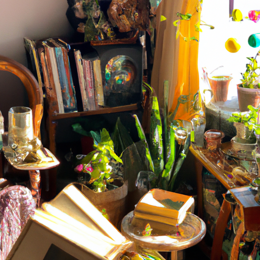
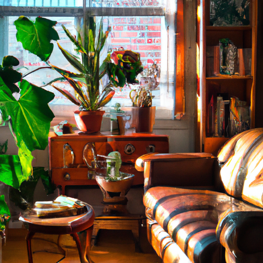
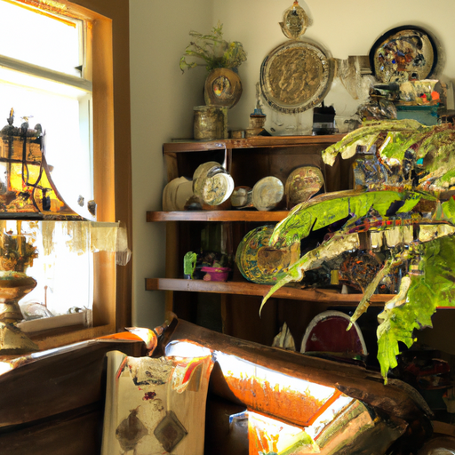

## [my new life in the countryside - making a house a home](https://www.youtube.com/watch?v=74RzmKXQbfU)

<table align="center">
	<tr>
		<td align="center">
<<<<<<< HEAD
			
		</td>
		<td align="center">
			
		</td>
		<td align="center">
			
=======
			
		</td>
		<td align="center">
			
		</td>
		<td align="center">
			
>>>>>>> ffe52613361410ad9d371a0f80e81de4dd24175f
		</td>
	</tr>
</table>

It is a sunny spring morning here, the birds are so talkative right now, busy finding mates and making plans for the warmer months. It feels like nature’s symphony outdoors.

As you can see I found this sweet sewing box while shopping at a second hand store. One of the legs is broken but it could easily be fixed, so I got it on a good deal. While I will not use it for sewing it accommodates my art supplies really well. If you are an artist or crafter you will understand that a box that properly organizes all your things is a treasure.

I’ve spent some time in a nearby town shopping recently, which feels strange because I don’t spend that much time outside of my valley, much less purchasing items for my home. It’s exciting and feels very different, my fiancé has encouraged me to make this place feel cozy.

Even though I was only looking for a couple thrifted items, I did find some cute little knick knacks. I also received some lovely gifts from you and some family members in celebration of the housewarming. Thank you, all of it has been so comforting during this shift in my life.

Some of you asked me recently what some of my favorite candles are in my collection. This one smells exactly like a fresh cup of herbal tea, it brings back many sweet memories. I will leave review on some of my favorite scents in the description bar down below.

One of my favorite low budget ways to decorate is just to decorate with books. You can find interesting looking books almost anywhere second hand for very little cost. I like to get ones that I’m interested to read, but also just others that speak to me. The covers may be intricate or the stories that are told can teach me something about the people who lived in the past and their perception of the world. Next time you go to a thrift store, keep an eye out for some fun books within a specific color scheme or style. I find it always adds something really unique to the space and you can usually get a lot for very little if you keep an eye out for deals.

So far I don’t think there’s a secret to decorating a space in an inviting and unique way except that it takes time. Over the course of years instead of being in a rush you can find so many interesting things that can be repurposed or up-cycled.

I have kind of just ended up putting all my plants and some of my favorite things in this corner because there is a lot of construction renovations going on in the other part of the house you could probably see I’ll have to turn the camera but there is a doorway being cut into this wall because the stairs from the first floor are going to meet the second. Luke’s father is working on it today so it’s a lot of things happening in the house still so it definitely is a space of transition and a little bit of chaos right now, which is really exciting and wonderful and it’s starting to feel like we are getting really close to having a more completed home and it has been so beautiful to see how hard Luke’s father and Luke have been working on the space.

I did get really excited the other day though because I went to an antique shop because I was looking for a rug for the back room and I found a old vintage ice cream maker which is really exciting. My eyes looked at it right now, I actually have it right over there. It is a beautiful kind of green color and it is in very good condition on the inside and so I’m really excited next week to try to make some different types of ice cream because if I’m ever in a time of great change and many emotions ice cream usually resolves 95% of it so I’ll be trying some recipes and sharing the process with you. It’ll definitely be an experiment because I have never used it before but I am excited to learn anyway.

About a month or two ago I asked for questions on Instagram. First there was some more personal questions one was how are preparations for the wedding going. I actually have to say so far there have been challenging sometimes a little bit stressful at times in the process of planning but overall the wedding is going to be very small and very simple and it’s actually going to be on a little farm not too far away. It’s not been too hard to plan but there’s always moments where you feel little bit overwhelmed but yeah definitely keeping it simple has really helped yeah we’re very excited. It’s just gonna be very close family and I think it will be absolutely beautiful because it will be in May and there’s gonna be so many beautiful flowers out and we’re gonna have a little local string quartet come and play as well and yeah it’s gonna be a beautiful day. So far it has not been too stressful but we also are still a ways away so that may change. I have already found my dress, I found it for a few hundred dollars at a little wedding boutique when I went to visit my sister in Houston she and I went to go wedding dress shopping because she loved that experience and I wasn’t so sure but I ended up enjoying it very much as well and yes I found a sweet simple little dress I don’t know if it was meant to be a bridesmaid dress or a actual wedding dress and it has embroidery on it as well which I really liked and floral elements so I will no doubt show you at a future point.

I noticed there are some new people here recently so feel free to introduce yourselves in the comments and tell us what country you’re from all the different places people around the world are tuning in from it’s always really interesting and I think it bringing us altogether.

Anyway, my microphone stopped working briefly after this, but I still want to wish you a lovely and I will see you very soon.