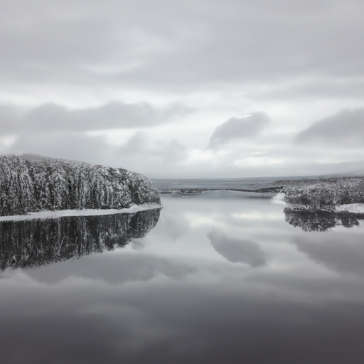
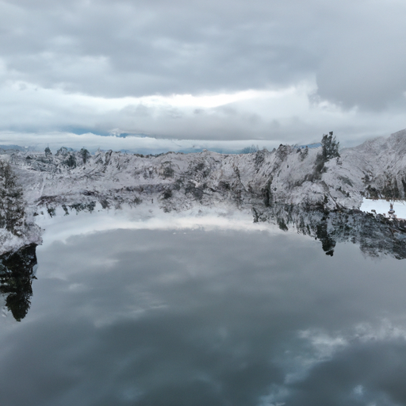
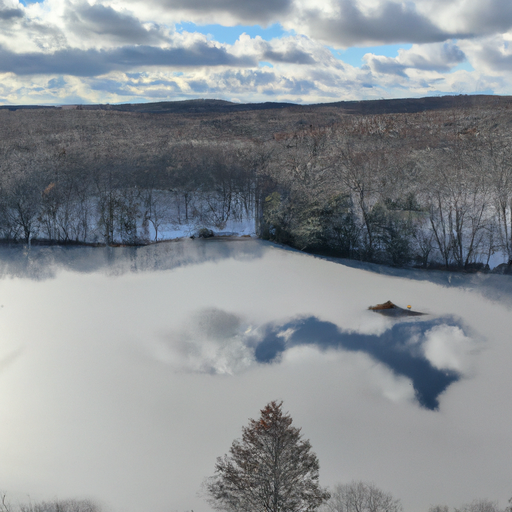

## [my past and how things came to be - winter in a little house](https://www.youtube.com/watch?v=BYbRGWJ5B-c)

<table align="center">
	<tr>
		<td align="center">
<<<<<<< HEAD
			
		</td>
		<td align="center">
			
		</td>
		<td align="center">
			
=======
			
		</td>
		<td align="center">
			
		</td>
		<td align="center">
			
>>>>>>> ffe52613361410ad9d371a0f80e81de4dd24175f
		</td>
	</tr>
</table>

Hello everyone, I hope you're having a lovely season so far. It was my birthday last weekend and I turned a quarter of a century. As a celebration, I borrowed an old canoe and went out on the water. The lake is so still that it reflects the clouds. My brother had a drone he let me use while I was on the water. It never ceases to amaze me seeing things from a bird's-eye perspective. The earth is so beautiful and so strange, the way it shifts and changes over thousands of years. My valley used to be an enormous glacier, and now it's this. I can't begin to imagine what wondrous thing it will become.

I've never really been one for celebrating my birthday, even as a child. I preferred going to other people's parties instead of having my own. But I still try to take a few moments to say goodbye to one era and welcome the next. The coming season holds within it a hundred and more possibilities. I happen to have a couple of friends who are also December babies, and they describe this to be the starting point of their quarter-life crisis. I found this to be a very funny but apt way to describe how most of us reach a point in early adulthood when we begin to seriously question who we are and where we are going.

I remember for a while as a university student, I would follow my friends to clubs and parties nearly every night. I wanted so desperately to feel like I belonged. My friends enjoyed that environment and it made them happy. It was their best space to relax and make memories. But it just wasn't really mine. I didn't like the deafening noise and blurred memories. Going home and feeling alone and anxious. It didn't suit my personality, and it took a long time to admit that to myself. Particularly after I realized that that lifestyle was feeding an addictive side of my personality and not helping me gain control over my life path. While my lifestyle would have worked very well for others, it just wasn't the best thing for me.

I connected living that way as what made me interesting, and I think it's because for many years I thought I just wasn't interesting enough on my own. I wanted to label myself as someone I wasn't. I think we often use labels in order to feel like we belong when we're inevitably more complicated than that. I think, in a way, it's very important to have tough moments where we question things to see ourselves better, to choose our friends with more care, to admit how complicated we are and that we don't have things figured out. We have both darkness and light within us. We can feed the flame through living the life that suits us best.

Much like bodies of water, we have great potential for depth, to go deep and find what's there. Yet often, we simply reflect our environment. Like the water, we can always change over time and recognize our own unique beauty. Someone once told me that everyone is special, no one is more special than someone else. But we are nonetheless. I really like that. It's a sweet sentiment of recognizing what is sacred in each of us.

As a side note, I've recently started dividing my videos. The first half is my usual content, and then the last half, I get to talk to you directly in front of the camera. I've been enjoying it a lot. It's been really fun to share more details and to connect with you all on a more personal level. So let me know if you enjoy that, and I will continue to do it.

So, I recorded this whole thing and I was completely out of focus the entire time. I was completely blurry. So we're gonna try this again. If I sound really odd, it's because I've been coughing all day. I don't know why. I don't feel sick, but I've just been coughing and my voice just sounds really strange. I've aged like 20 years. Anyway, I hope you're all having a wonderful day so far. It's been a fun week over here. It was my birthday on December 5th, and on that day, we didn't have any snow, barely any actually. And then it came, and I think this is the permanent snow for winter, which is very exciting. During November, the snow comes and goes quite a bit and it just melts away. But this seems to be sticking, so I'm really excited. I'm definitely ready for full winter. It is always so beautiful over here.

As you can see, I've been having a lot of fun decorating. I always like to make at least a couple wreaths or buy some wreaths this time of year. They are kind of my equivalent of a Christmas tree or a winter tree. And while I love the way trees look in houses, I personally don't want to kill one of the beautiful trees out here because they're just so lovely. And I don't really want to bring them into my home. I really love how they look out there, especially when the snow falls on them. And I want to know that they're going to be able to live many years.

I got some very practical birthday presents this year. I was laughing. I feel like the older you get, the more you just want practical gifts instead of really pretty things. I feel like that's maybe just a me thing, but I remember one year I wanted art supplies, and then the next year, after college, all I wanted was my groceries covered for that week. So it just became very boring. But this year, I really needed socks, so I got socks. I noticed that pretty much every sock I owned was just worn beyond repair and had a bunch of holes in it. So my mother was very happy to send me a lot of socks. I also desperately needed a new winter jacket. It's just really important to have good winter clothes over here. It's downright dangerous if you don't. And last year, I saved up and invested in a very, very nice blue jacket that was very warm and I absolutely loved it and used it all the time. And then one day, I left a tiny piece of a dog biscuit in my left pocket. I forgot completely about it, and my dog found my jacket and he proceeded to rip open the left half of the jacket to find the dog treat. And he ripped out a bunch of stuffing and the pocket, and he opened the pocket and he got his dog treat. But yeah, the jacket was definitely destroyed. So for my birthday, I got myself a new winter jacket, and I definitely needed one. And this one's definitely my favorite. It's very, very warm. Yes, having a dog definitely creates a lot of unforeseen and unexpected events in your life. Definitely some inconveniences at times. There is never a dull moment with Eiger.

I really don't like driving in the winter. There's a lot of ice on the roads, and even though the main roads are sanded, a lot of the rural roads just don't have anything really. And they're plowed, but it can get really icy and slippery. And you have to wear coverings on your boots so that you don't slip on the ice. And I really don't like driving. It scares me a lot. There's a lot of deer here. It's really easy to hit a deer in summer, even more so in winter when you can't stop the car quickly. And so I pretty much try to avoid driving as much as possible.

One thing I do to kind of avoid more trips to the grocery store than I want is that I buy a lot of bulk foods and I put them in the pantry about this time of year before the permanent snow comes. And I usually like to go to Costco because you can get a lot of bulk dry goods for very little money. And it's a really great way for me to be able to get some extra stuff and have it all ready for the winter. Sometimes you might get multiple feet of snow within just a very short amount of time. And if someone who plows isn't here quickly, you're pretty much just snowed in and you have to wait. And so it's really important to have a lot of extra food this time of year.

I did have some dips in my health last season, and I've been trying to get back on track with getting myself back into the kitchen and making large, wholesome, nutritious meals for myself. And I love to cook and bake and create recipes. But sometimes, if I'm working very much or I'm in a rush, I just don't take the time to cook for myself. I much prefer to cook for other people. And so I've recently been using a meal kit service to help me get inspired and back into making some recipes and some just kind of basic meals for myself. And it's been really, really helpful. So along with bulk items and some items from the local grocery store, I also get some meal kits sent to me periodically if I ever kind of need to get my health back on track. And so I usually only do it for two or three weeks because it is a bit expensive. But it's much harder out here to kind of have an in-person therapist or someone to help you with your diet and make sure you're being very nutritionally conscious. And so there just aren't that many resources out here. So that is one thing I do. I just try to invest a little more in really quality food and to help me out. And the meal kit service has really helped recently. So yeah, that's what I've been doing. I'll leave a link down below. I usually do. I think I've left a link in most of my videos. I'm just sharing. None of this is sponsored. I pay for all of it. Yeah, that's one of the reasons I don't do it that much because it's a little expensive. The only reason I'm sharing that information about the meal kits is that it has really helped me kind of get back on track when I am tired or get out of the routine of making good meals every night and really doing wholesome meals. So maybe it will help you if you're in a similar situation at any point. So I just thought I'd share.

I think that's it. It's getting dark really fast. It's always challenging to film this time of year because there is so little daylight and it just goes so quickly. So I'm personally okay with it. I do like the nighttime. It is really, really nice. But anyway, I hope you are all doing well. If you're going to sleep, I hope you have some wonderful dreams. And I will see you next week. Take care. Goodbye.