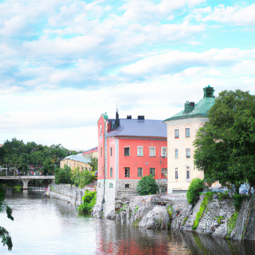
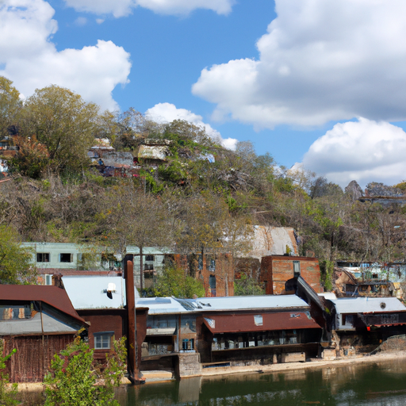
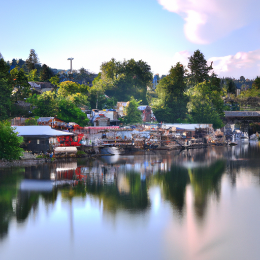

## [my rural town it s kind of adorable](https://www.youtube.com/watch?v=o0CHyygAQUY)

<table align="center">
	<tr>
		<td align="center">
<<<<<<< HEAD
			
		</td>
		<td align="center">
			
		</td>
		<td align="center">
			
=======
			
		</td>
		<td align="center">
			
		</td>
		<td align="center">
			
>>>>>>> ffe52613361410ad9d371a0f80e81de4dd24175f
		</td>
	</tr>
</table>

Good morning everyone, it is a lovely cool morning and I am off to town to run some errands, most important of which is to find a new book to read, which is absolutely an emergency.

I go into town regularly, since I frequent the post office. Things get busy during tourist season, so I tend to get up very early in the morning if I need to run errands so to avoid the crowds. However, comparatively few people live here full time.

I am grateful for this, since it is very important to me to be involved in my community, even if it’s a small one. I have found that as someone who prefers more quiet living it gives me great joy to spend time in town and then be able to go home to a more peaceful haven when I feel like it. I did this in the city too, and prioritized having a peaceful space to go home to after work.

This town is right next to a river, so it is wonderful to be able to walk around on a hot day and then go down to the water to cool off and read. This area struggles with having many vacation homes in the area that are empty most of the year, so it can be difficult to find places to rent.

Thankfully, there are many young people who have gotten creative and found ways to live and work here full time, sometimes living off grid or fixing up old houses. Its definitely useful to be handy over here, as help can be in short supply. My boyfriend used to work in construction and now is a surveyor, and I have enjoyed the benefits of his carpentry skills and experience with home repairs many times.

If there is only one piece of advise I would ever give someone trying to find a new place to live, is to be very patient. In my experience, is that with an open heart, the right home has a way of finding you, if only you slowly work towards your goals, and let life guide you to the right place at the right time.

Of course, if moving to a new location isn’t practical, which is understandable, I truly believe that an abundant and peaceful home life can only be created, not found. For example, my mother researched homes throughout the decades my father was in the military. It took her nearly thirty years. She wanted to find an affordable place within her budget, and at long last she found her dream home. She couldn’t be happier, saying that the adventure that brought her here made her far more ready and grateful for it.

I have taken inspiration from her, and know someday I’ll have my own home, and will enjoy waiting for it as I put aside a little bit every month.

Anyway, I hope you all have a lovely day - next week I will share with you the only other part of my town that I love almost as much as the bookstore, so I’ll see you soon ❤️