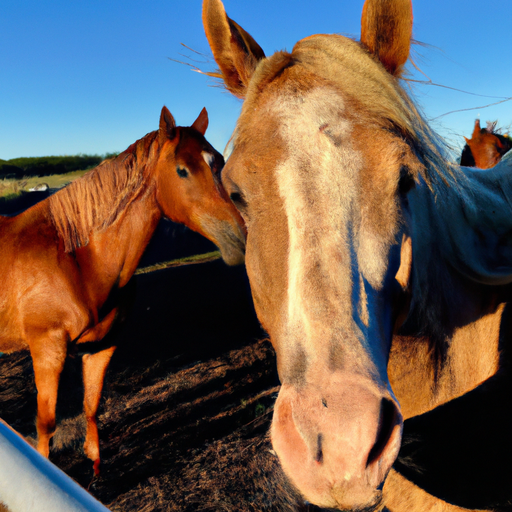
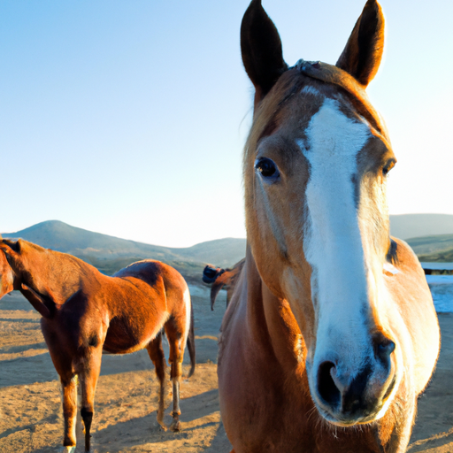

## [my situation in the mountains is..](https://www.youtube.com/@TheCottageFairy)

<table align="center">
	<tr>
		<td align="center">
			
		</td>
		<td align="center">
			
		</td>
		<td align="center">
			
		</td>
	</tr>
</table>

Even during eras of sadness in my life, animals have always been a source of joy and healing for me. The gentle wisdom in the demeanor of these creatures make me feel safe. I always find it interesting how at our lowest points it can be so hard to look outside of ourselves and reach out to others - be it a human or another type of animal - and yet that is so often where healing begins.

I’ve spent time on horse ranches throughout my life. Once I spent ten days in Saddlestring Wyoming riding at dawn and dusk until my backside was incredibly sore. Since I was a little girl I’ve always loved horses. Something about their soft eyes, power, and history in the American West has been alluring for as long as I can remember.

While I don’t think we’ll ever brag about it, one Thursday morning last week my town of barely more than 500 people made national headlines. We had the worst air quality in the entire nation. It’s been an insane week and I really wasn’t sure what to share with you, because I didn’t want this video to be overly sad. I know so many people come to this channel to escape the realities of daily life. But as I was putting it together with my brother I realized that if it ends up being sad, then that’s ok. Sometimes, things are sad and there’s very little to see that is positive.

And yet, even in that realization, life can be ever more poignant, reaching deep into our souls and grasping something there that is so incredibly human that it’s hard to explain. But I do know that it’s a beautiful feeling, sometimes tinged with fear and awareness that you’re losing so much of what you love. But you are also most certainly alive to experience it, it’s fascinating and frightening. I give thanks that I’m here, because I’m able to help others get through it and to practice love with even more conviction that it’s crucial during times like these. During all times.

Today was no different, my valley is in distress and I needed something to take my mind off things. Several new friends and I spent some time walking through town, sharing drinks, and discussing the incredible dedication of our local smokejumpers and firefighters. It’s so incredible to see people risking their lives to save our home, no more than a speck on a map.

Of course, despite everything going on - we need to attempt to at least lead our lives as we always have. It makes no sense to sit on our porches and worry - so when the winds changed and took away the smoke for one blessed morning, we still hosted our farmers market in hopes of cheering up anyone who needed it. It was so wonderful to connect and share smiles and laughs. To exchange stories of happier times, knowing they will come again. Maybe it’s a beautiful day after all.

Of course, I don’t want to focus on these things too much - so for the next several weeks, I won't dwell anymore on the fires. Because life needs to continue, and I will treasure every minute of it. Whoever you are, and whatever type of day you had - be it good or difficult or somewhere in between - I hope you never forget to give and receive as much love as possible. Because this week, I’ve realized more than ever how important that is.

Our material possessions, our achievements, even our very lives, are fleeting and can disappear right now. I have a whole new value for what it means to be truly safe. In the face of a monster of fire eating up my valley, I see now that I will never take my safety for granted again. And I hope you don’t either.

If you wish to take action to protect our lands, as usual I will leave links below. Making changes in our own lives to help the environment is valuable, but pressuring larger companies and organizations to have a change of heart is even more crucial for the future. Take care, if you’re falling asleep I’m sending you dreams full of sunshine and blue skies, clear air, and most of all my love.