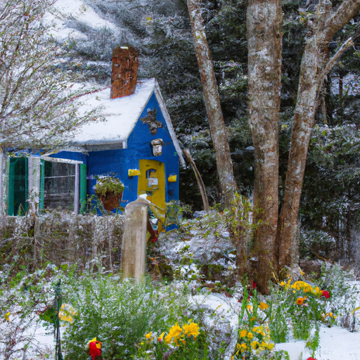
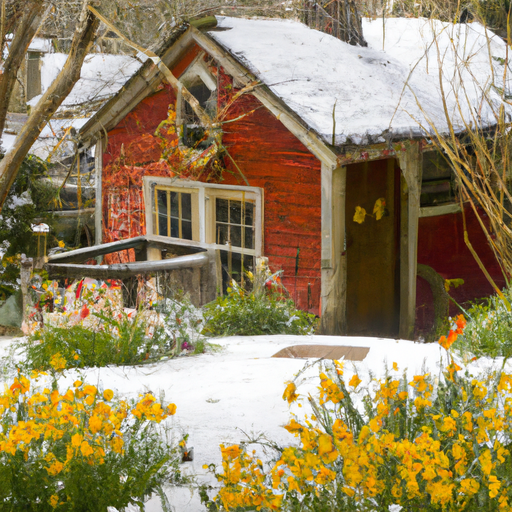
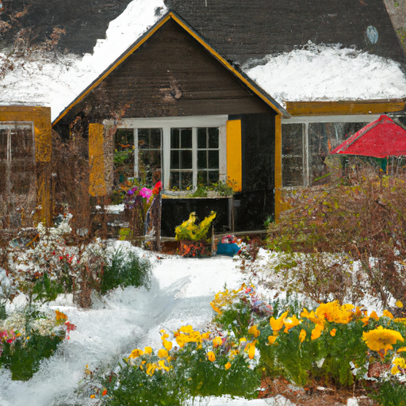

## [new family members join me at my secluded forest home - springtime blessings](https://www.youtube.com/watch?v=TpcoCn09e2k)

<table align="center">
	<tr>
		<td align="center">
			
		</td>
		<td align="center">
			
		</td>
		<td align="center">
			
		</td>
	</tr>
</table>

There is still quite a bit of snow on the ground despite the first days of spring. I can sense my little Valley is starting to wake up after five sleepy months of snow and ice. The warmth in the air couldn't be more welcomed and despite the mud on my boots, I'm in high spirits and anticipating the first spring flowers. I still have a while to wait, but the new season is moving in. The air has shifted, and smells of fresh soil and saplings permeate the forest. This is a time of great change in my quiet secluded life.

I have great plans of future gardening projects, hiking on trails newly uncovered, and as promised, the announcement of some new additions to my animal family. The wood was full of rabbit holes, and in the neatest sandiest told the ball lived Benjamin's aunt and his cousins Flopsy, Mopsy, Cottontail, and Peter. Old Mrs. Rabbit was a widow who earned her living by knitting rabbit wool mittens and muffets. I once bought a pair at a Bazaar. She also sold herbs and rosemary tea and rabbit tobacco, which is what we call lavender.

Bernard and Bianca are two sweet little rabbits that have recently found their way into my life. Once they're old enough, they will be living together in a little rabbit dwelling my husband and I are building in the spring. In the meantime, they're getting used to all the new smells and sounds of the cottage, safely tucked away in a little indoor hutch. They're already bringing me great joy, adding a new vibrancy into my cold and snowy world.

I recently decided to make a little porch garden of herbs and flowers and a vegetable garden in front of my home. With great plans to grow more mint and chamomile for tea. I used to dislike this time of year, somewhere between winter and spring, when all you see is mud and dead grass mixed in with melting snow. And yet, now I like to see it as a necessary time, as we all must accept seasons of scarcity in order to truly enjoy the abundance that is yet to come.

Cloudy and dark days are perhaps not so bad as we think because they always give way to something beautiful if we are only patient. I think I still have mud on me. It is so swampy and wet outside, but I have to admit I'm really enjoying it because I am so ready for spring. It's been, I think, almost five months of snow, and that is a much longer winter than we're used to, and so I just, I just, I'm impatient, but I'm trying to be patient.

So yes, we did invite two lovely new bunnies to come live with us. Luke and I are gonna work on building a wonderful outdoor sanctuary for them for the spring. And if you happen to know where the names Bianca and Bernard come from, do let me know. It is one of my favorite sets of movies. So of course, there is a lot of change on the horizon. Change of seasons, new bunnies, new things to build around the house.

Sales from my Etsy shop this week will be helping go towards building Bernard and Bianca's new outdoor sanctuary. Hopefully, it can be a place to bring rescued rabbits in the future as well. And so, I have big plans. Rabbits have always been one of my favorite types of animals. I think that they are so sweet and so deeply affected by their environment. If they're in a chaotic and loud environment, it is quite difficult for them to thrive, and they really crave peace and nature and quietness. And I feel like our souls are quite similar in that way. So, I'm a huge fan of bunnies, and I'm so happy to have more in my life.

If flowers are blooming and things are bright and blue where you are, that is so wonderful. Please send some of that lovely warmth and magic over here. But the snow will be melted soon, I am sure. Sending all my love. I will see you very soon.