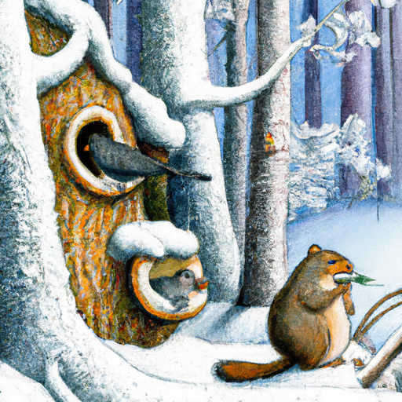
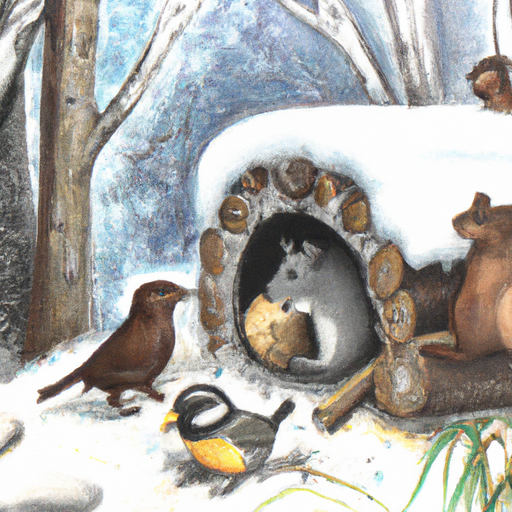
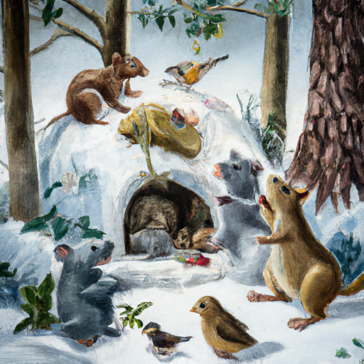

## [on living a boring life - accepting a gentle daily existence](https://www.youtube.com/watch?v=Lm5CG0rDyvk)

<table align="center">
	<tr>
		<td align="center">
<<<<<<< HEAD
			
		</td>
		<td align="center">
			
		</td>
		<td align="center">
			
=======
			
		</td>
		<td align="center">
			
		</td>
		<td align="center">
			
>>>>>>> ffe52613361410ad9d371a0f80e81de4dd24175f
		</td>
	</tr>
</table>

The end of October is drawing near and I'm noticing how all the little creatures are getting busy in the forest, preparing for the colder months ahead. The birds and bears are gorging themselves, and the little squirrels are building their stores and also preparing for the change. I'm excited to see my world transform around me as the first hard frost settles in. 

I have sometimes referred to life in my rural valley as rather boring by societal standards, but in truth, boring is a relative term. I think that our mindsets and perceptions of the world have a lot to do with how interested we are in experiencing the wonder of this life, as well as being open to the challenges it may bring. 

Living here, I don't get out much. Sometimes the most exciting thing that happens is that I drive to the grocery store throughout the week. Outside of a lot of work, I tend to go on nature walks with a good friend, spend time with my pets, and stargaze on clear nights. It's a quiet, rhythmic existence that forces you to encounter yourself, especially when the colder months set in and you wake up to a quiet, snowy world waiting for the plow to dig you out. 

I used to experience boredom fairly often when I was younger. Sometimes I would go shopping and feel a temporary excitement through finding a new piece of clothing or other item that would scratch that itch, a feeling otherwise uncomfortable in my own skin. During certain brief eras in my otherwise introverted existence, I tried surrounding myself with people in order to drown out my thoughts and feelings. I didn't like to be alone, and if I was for too long, I would become desperate for some sort of external stimulation. 

I think that when we become restless or uninterested in our daily routines, when we yearn for something more, it's an opportunity to gain insight as to why we're actually feeling this way. My walks in the forest have shown me that there are a lot of living things that are simply happy to exist. They don't need to be entertained, and it made me realize that whenever I have felt bored, often there's a deeper challenge presenting itself to me, to explore something that was previously unknown, either within or without. 

For I think simple, ordinary lives lived quietly and peacefully are far from boring. If we approach every day as a chance to practice thinking and existing as our best selves, to connect with something meaningful, then every minute matters. As we grow, we see that the myth of what makes an exciting or extraordinary life is a shallow one. We realize that every single person, whether they live in a bustling city, a rural forest, or somewhere in between, has the capacity to live with intention and meaning. And if lived well, each life is as unique and extraordinary as the next. 

Of course, I do try to do quite practical things to keep my life feeling dynamic. I journal a lot and like to set goals, especially in retraining my way of thinking to be kinder to myself. I also like to take field guides out to the forest and discover new plants and creatures. I seek out my community and reconnect with people that are kind and challenge me to grow. And I try to give love as much as possible in any way I can, even if it's through smiling or helping or just being there for those I care about. All these things help me find life beautiful, and each day becomes a gift. 

Of course, when life speeds by, I struggle to enjoy the moment, so I do my best to slow down and remember that planning is important, but being is more so. No one can navigate life without experiencing some level of pain or discomfort. We all carry memories and experiences, both good and bad. We each have questions about our existence and the potential to replace fear with wonder at the mystery of life, to slowly let go of what holds us back and find joy in the pursuit of that something more that fulfills us, that thing that cannot be bought, only cultivated. 

Now, if I ever feel restless or that things are far too mundane for my liking, I don't immediately go shopping or desperately seek out some sort of distraction. I like to sit and ask why and what can I do about it. Usually, there's a hidden layer in my soul that is in much need of uncovering, and these small acts of self-love, of listening instead of trying to avoid who we are, leads to something powerful. 

So yes, I see my life is far from boring, but I also know that the wonder and excitement I'm experiencing isn't one that is always visible to others in a tangible way. It's more something I hold in my heart, and that's enough for me. Perhaps it can be for you too, because your life is already special and full of possibilities. It has nothing to do with your location or how many places you've traveled or what you own. It's already wondrous, and you have the capacity to realize that more every day. 

If you are looking for some autumn recipe inspiration, I highly recommend baked apples. Apples tend to be so abundant in my area this time of year, so if it is the same where you are and they're very affordable, considering the price of grocery shopping right now, it is great to find really inexpensive options for baking some delightful treats. This, apart from poached pears, is another fun recipe I've been experimenting with. You can add all sorts of things, such as butter, brown sugar, vanilla, cinnamon sticks. You can also add some oatmeal, but since this is definitely a dessert, I decided to stick to just some brown sugar this time. But it is also potentially a really wonderful breakfast treat you can create as well. Something about the smell of roasted apples in October is out of a dream, and it cannot get much better than that. 

Hello everyone, I hope you've had a lovely week so far. I have been a little bit under the weather, and my recovery has been slower than I anticipated, so that is why I was not uploading last week. So, I am here now, though. As you well know, this October, I've been embracing simplicity and just keeping things very simple. So, I haven't even decorated very much for October. I put dried leaves on the walls, I updated my wreath above the hearth, focused on really enjoying simply the shift of seasons and enjoying every step of that process. 

Living in the forest this time of year has been really lovely to see all the animals active and preparing for the winter season, grabbing food stores, finding places to put pine cones. It's been very exciting and very interesting. And that brings me to one thing we did discover, which was a very little diminutive wood rat has moved into our shed. Even though it was creating quite an extraordinary nest in there, full of all sorts of interesting objects. It's also known as a trade rat and it's known for wanting to collect shiny things, such as jewelry and bottle caps. They're quite interesting creatures, and they actually have quite fluffy tails. They're not like the naked-tailed rats that you may be accustomed to. These are actually native to the area. They didn't come over from Europe, and they are so cute. Unfortunately, it was making holes in the shed where it was getting very close to electric wires, which would have been quite unpleasant for the wood rat as well as for us. So, we decided it would be safest for both parties to relocate the little wood rat. And we researched where would be the best place to relocate it, and we found a lovely area that should be far enough away from other homes where we let it go. They're actually a very important species for observing the health of an ecosystem as a whole in this area. So, it was a wonderful opportunity to connect with the natural world more directly this October. 

Apart from that, I am looking forward to the holiday season and trying to prepare my home for those things. I have craft projects and other things I would like to get done. I also have an October fairy tale I have written and I would love to share with you. I'm trying to film the parts of the video that I need. Unfortunately, it is hunting season right now, so I'm not always as comfortable going to certain places to film. So, I'm trying to work around that right now. 

Thank you also to everyone who has supported my Etsy shop. I do have orders finally available for "The Fox and the Child". It is a shoestring operation over here, so I do have to only take a small amount of orders at a time. So, I appreciate all your kindness and support, and please do contact me anytime with questions. I'm sending you so much love, and I hope you have a wonderful October. And I will see you soon. Goodbye.