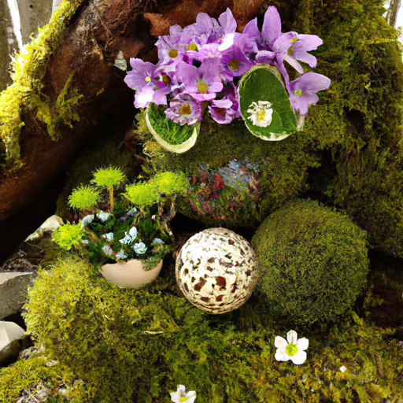
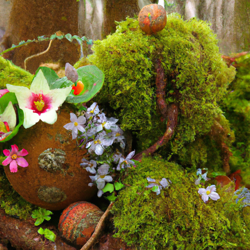
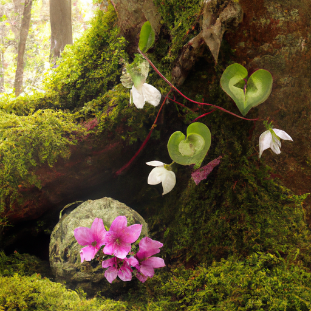

## [on living alone - thriving in a one-room cottage](https://www.youtube.com/watch?v=7mPnBr6K7Og)

<table align="center">
	<tr>
		<td align="center">
<<<<<<< HEAD
			
		</td>
		<td align="center">
			
		</td>
		<td align="center">
			
=======
			
		</td>
		<td align="center">
			
		</td>
		<td align="center">
			
>>>>>>> ffe52613361410ad9d371a0f80e81de4dd24175f
		</td>
	</tr>
</table>

Walking with Iger, I found the very first spring flowers. They're known as glory in the snow and are a symbol of happiness, warmth, and fairy wishes. I couldn't have hoped for a lovelier surprise. The new season has officially begun, and I can feel the renewal of life in my valley through the soles of my feet.

Recently, I've been spending a lot of time alone. There is something mystifying about these cloudy days and April showers. Work has kept me busy, and in my free time, I found myself wandering the woodlands, losing all sense of the day until the dust rolls in. With my husband away at work, I'm in the company of our growing family of animals - a cat, a dog, and two bunnies. We make a ragtag group.

Today reminded me a bit about when I was living alone in my little cottage before moving here. I see more than enough people living in more populated places by homes in this area, only to move away quickly unable to handle the isolation. It certainly isn't the best environment for everyone. It makes me wonder if finding peace is far more about the interior world than without. Perhaps living alone isn't really relevant. More living with ourselves.

I've been thinking about how different my life is now that we're nearly at our one-year anniversary. So much has changed. I learned quite a lot living single, one of them being the importance of not isolating myself, which can be easy to do nestled in the foothills of a vast mountain range. Making the effort to go out, working in town, or volunteering helps me stay connected. I think it is so important to cultivate a nurturing space in our minds, to shift our practices from negativity to loving thoughts, honoring all our emotions without letting unhelpful or untrue mindsets consume us.

I believe creating a loving space at home does not involve things, the perfect apartment, or the best location. It's about the memories you associate with your home. You must fill your space with kind thoughts and words, acts of love, friendship, and life. It may take time to find people with whom you connect, but not all friends are human. My house full of dog hair and houseplants is a testament to that.

I find it particularly important to have a healthy perspective on the world before choosing to live alone in an isolated place. No matter how and where I've lived, I found keeping a positive outlook can be tricky if you're consumed by negative news stories or certain types of content. It is naturally important for me to stay informed on what's going on in the world, the tragedies and injustices. It keeps me caring deeply and taking action in small ways I'm able. But I find it is crucial to balance out what I consume with positive news happening in the world and my local community, which interestingly enough, tend to rarely make the headlines. I can only assume it's because, as humans, we seem to fixate on negative information, more willing to let those harsh truths affect our reality than more hopeful perspectives about our world in the future. I find as I grow older, it's so much easier to honor my negative emotions and experiences while not allowing them to define me and my worldview.

I saw a tutorial online on how to do this, and apparently, it is a tradition associated with Japan. It is called kokedama, I want to say, but I'm probably butchering that term. However, I saw pictures online of these moss balls, and I just thought they were so strange and interesting. And this plant is going to get quite big and bushy, so I thought it will, after a few months, hopefully offset the kind of largeness of the bottom. Here is an idea for a really simple way to pot your plants. It is pretty inexpensive. You just really need moss and a bit of wire and some string, and it's really lovely and it drains really well too, which is always an added benefit. So if you want your home to feel like a forest fairy wonderland or an enchanted witch's garden or whatever else you're going for, here is a fun idea.

I have accepted that my taste in home decor is, um, uh, unconventional, to say the least.

Thank you. It's not an easy path to take to shift perspective and believe in something better. I fail often, but it has helped me love more freely and let go of a lot of judgment. Once you begin to see the world as full of an abundance of love, that love becomes magnified, and even in the darkest of places, it is still there, though it can be easy to overlook. For quite a few years of my young adult life, especially after leaving an abusive relationship, I stubbornly nursed my victimhood and was unwilling to open myself to love from new people and to heal. If I'd made that into a habit, I would have never thrived living alone or eventually met my husband. Maybe none of this is helpful to you. We're all different, and I don't know what works for you, but I thought I'd share some last memories of my days living alone before starting my second year of married life. Perhaps at the end of the day, it doesn't matter how you live, but how you love. Take care.

So, I left the biggest mess in the house. It is absolute chaos here right now because I was working on that planter, and I left um, moss in a dish, and my cat Mavi decided to throw the moss all around the house. And so, in an attempt to procrastinate, I thought I would chat with you guys a little bit in this one clean corner of the room. As an update, a couple of months ago, I made a little terrarium, and it's doing really, really well. I think I'll have to open the top in a little bit to let the little plant grow a little more, but I just wanted to give an update on that. I also have this vanilla bean extract just in alcohol that is brewing, and it's only been brewing for a few weeks now, so it's definitely going to get a lot darker and richer as time goes on. So, it's going to be about six more months, I think, of letting it kind of sit and wait, but it is going to be delicious.

I found my very first flowers on my walk today. It was so exciting. I cannot wait because what is coming next are the spring beauties, and they are always some of the first flowers that come up, besides the buttercups, and then the little bluebells come up as well. I am waiting in great anticipation.

Thank you so much for all the support on my Etsy shop. I bought a couple of new listings, and I'm working on some new projects, so I appreciate all your feedback. Contact me anytime with any issues. Never be shy, and I am more than happy to help you. So thank you again, and I'm sending all of you my love, and I will see you soon. Bye.