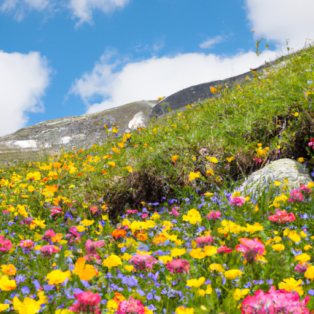
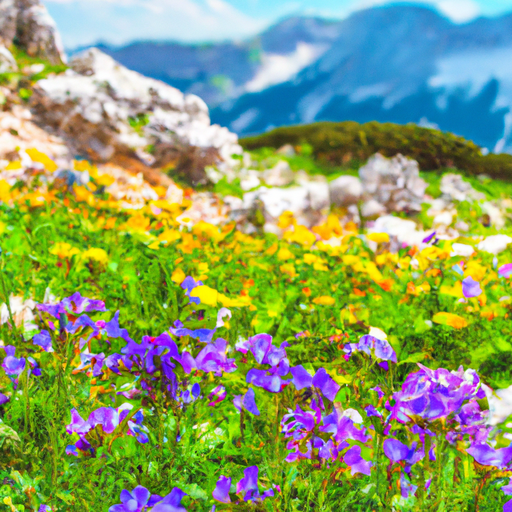
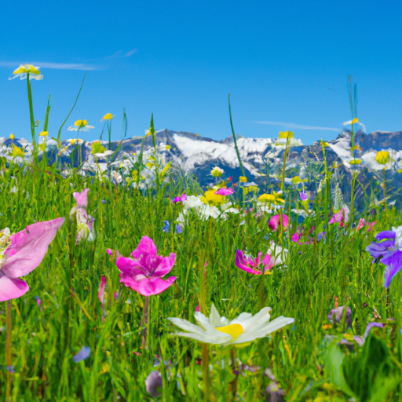

## [pursuing my dreams in a small country town](https://www.youtube.com/watch?v=DbnHLQtjN4g)

<table align="center">
	<tr>
		<td align="center">
<<<<<<< HEAD
			
		</td>
		<td align="center">
			
		</td>
		<td align="center">
			
=======
			
		</td>
		<td align="center">
			
		</td>
		<td align="center">
			
>>>>>>> ffe52613361410ad9d371a0f80e81de4dd24175f
		</td>
	</tr>
</table>

I’ve been recently receiving a lot of questions about who I am. So, I thought I would take the opportunity to briefly reintroduce myself.

My name is Paola and I live in northeastern Washington state in Okanogan County. I moved here a couple of years ago and take a lot of inspiration from the natural area for my work as an artist. Not only do I love to paint and do crafting projects inspired by nature, but I love to make videos that help highlight the beauty of the natural landscape in this area, so that we can continue to preserve it for the future. I will mention more on that at the end of this video. Bye!

Right now I am in the midst of winter, which is not always an easy time. Like clockwork, two weeks into February, when the temperatures are at their lowest, I suddenly find myself looking forward to spring. I deeply enjoy the winter and know how vital it is for the function of our world, and yet I am human and may grumble now and then about the cold. One way that I cope is taking deep breaths and imagining a time of warmth and color (that is just around the corner).

The reason that I always become impatient in February is because my absolute favorite time of year is approaching. I love spring with all my heart and soul, it is when I feel most alive and most creative as an artist. I spend much of my time outdoors and when summer comes I find myself ever attracted to the mountains, seeking higher ground where spring is still at its height and the alpine flowers are blooming. I so look forward to it and cannot wait to share it with you.

In the meantime I find that creating art is the most effective remedy to keep color and life in my heart when the days seem so long and cold.

My greatest dream since I was a child was to create a picture book that both children and adults can enjoy - a bridge between stories for little ones and grown-ups, since I think we have a lot more in common than we know. I've been recently spending more and more of my free time working on this project and hope someday, in the future, to have it complete. But these things take time, and I've had to remind myself to be patient and keep the process of creating meditative and meaningful, lest I hurry the end result and skip the beauty of creation. I believe that is true for many of the goals we set for ourselves.

As an adult I quickly realized it isn't always realistic to hope that somehow you can pursue your passion full-time, and that that isn't a bad thing. For me, much of the inspiration to create comes from having to put a high value on my free time and see it as a gift and opportunity to get creative. I've greatly enjoyed working a variety of jobs while developing creative projects on the side. What helped me was finding a job that facilitated my creativity, for example, I once worked at a bookstore and was inspired by my conversations with other bibliophiles. Later, teaching children and sharing my art with them was an enormous source of creativity. While I'm planning to set aside more time in the future to focus on my art, the journey leading there has been incredibly beneficial to who I am.

Also, my dreams haven't worked out exactly as they were in my mind's eye, and I'm very grateful for that (in retrospect). Things didn't just work out magically, I had to work hard at it and develop my character and self-worth in the process. While it's often impossible to fulfill all our desires, it's usually much easier to simply incorporate what we love into our daily life and see the worth in the process of getting to where we want to go. For me, letting go of the desire for worldly success opened me to begin truly enjoying art, because I did it for no one else and instead painted what I love. And when you put love into anything, the end result is truly beautiful. Not everyone will recognize it, but you will know it's there, and that is all that matters.

Of course, as you've probably gained from watching these videos, it means a lot to me to try to do my part to help preserve the world that I love. So, I wanted to let you know that (with your help) so far this year we've been able to plant 200 trees in the forests of British Columbia which are trying to be reforested at the moment after some heavy wildfires. Also, I have been able to pledge almost 200 to the NRDC, which is an organization here in the US which not only seeks to preserve wild areas, but help improve air quality and reduce pollution in areas where we live as well. I wanted to say thank you since I know this is all made possible because of you and your generous support. I hope this is just the beginning, I plan to do a lot more in the future and I will keep you updated. Thank you so very much and I hope you enjoyed the video. I will see you next week, bye!