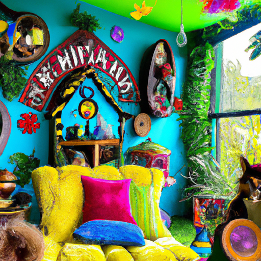
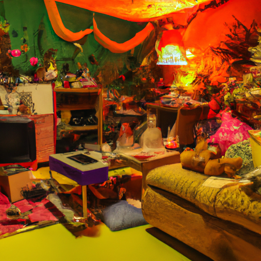
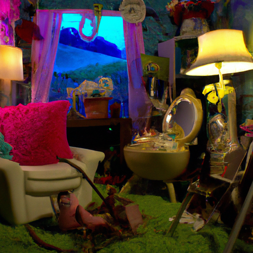

## [putting the finishing touches on my treehouse cottage - fairytale home](https://www.youtube.com/watch?v=gINfZbRiOLg)

<table align="center">
	<tr>
		<td align="center">
<<<<<<< HEAD
			
		</td>
		<td align="center">
			
		</td>
		<td align="center">
			
=======
			
		</td>
		<td align="center">
			
		</td>
		<td align="center">
			
>>>>>>> ffe52613361410ad9d371a0f80e81de4dd24175f
		</td>
	</tr>
</table>

As you well know, I have felt quite a few mixed emotions these last couple weeks. Rather burned out in the wake of great changes in my life, I find one of the first things to leave me when I feel overwhelmed is my creativity. And perhaps the most telling sign of nurturing myself back to a good place is when I'm filled with that excitement to paint and create and decorate again. So, in an effort to call back that creative bug, I decided to do quite a bit of redecorating in my home.

I have a box full of wedding gifts and other new and thrifted items for my home that I've neglected due to work and general business. So, I finally addressed it, deciding to add a little touch of whimsy to my home space as well as a thorough deep clean. Oscar Wilde famously said, "You absolutely must be yourself because everyone else is taken." I remember when I first heard that, I thought it was quite clever.

As I've continued to grow and experience the world as an adult, I have realized its wisdom. It is so easy to set aside who you are at your core in order to be something that you are not. You spend your life living in your own shadow, unable to completely accept some part of you. I did that for a long time, always apologetic for my interests and passions, afraid of embracing myself or that people may think I'm overly strange.

It's wonderful to move past that fear. In my case, as a creative person, it meant unleashing my love of quirky colors and eccentric details in my home. So today, I thought I'd show you some of what I've been up to around the house, trying to get little projects done. You may be able to tell from looking about, I am taking much inspiration from books and movies that have whimsical elements, celebrate nature, and make you think outside the box.

I particularly love movies that have been hand-painted by artists. As an adult, I was always a little bit self-conscious about enjoying animated movies and wouldn't bring it up very much unless the other person also shared the interest. And I'll use this hobby of mine as an example of why you shouldn't ever be ashamed of what you love. Because if you know the reason why you love something and you're comfortable with that, you can embrace it unapologetically.

For example, I love animated movies because they are an enormous collaborative effort of artists. It takes tireless work. In the movies I love most, the goal is to make the viewer imagine other possibilities, to question the confines of this world, to romanticize life, and celebrate hope and friendship despite pain and hardship. I also just find them funny and interesting and safe because I associate them with warm and positive memories of childhood.

Some examples of movies I love are Miyazaki's gorgeous animations, the 1995 adaptation of Wind and the Willows, Song of the Sea, Hilda, The Tales of Beatrix Potter, so so many favorite movies and shows. And this love of whimsy and magic is seen in my home. So, I was gathering flowers from the garden to decorate the home and I came across these little guys that I didn't realize were growing because they just bloomed the other day. And I don't remember planting any little snapdragons.

Whenever I was a child and I would find these in the garden, I would use them to talk to the fairies. Yeah, next time you see some snapdragons along your garden path, do consider trying to talk to the fairies with them. Maybe it'll work, who knows? I hope you embrace who you are this week and take a minute with a journal or just make a mental note of not just the things you like, but why you like them and what that says about you. It can be a powerful exercise and a step towards developing that friendship with yourself.

Thank you everyone for all your sweet, sweet words in my last couple videos. It has been much appreciated. It has really motivated me to kind of get back in touch with what I love about making videos and getting creative in my home and finally get a lot of little projects done that I've been meaning to get done forever. And I just got really caught up with work and busyness of life and I really didn't take the time to complete a lot of projects that I was working on and try some new ones.

And so, to motivate myself, I firstly took a little bit of time off. I actually took a proper weekend to myself, which felt very, very luxurious. And it was really wonderful to have a couple days with just nothing to do. That was very important. To get done quickly and it made a huge difference. And I actually spent a lot of that time reading some of my favorite books that always inspire my creativity at home. I also rewatched my favorite childhood movies for inspiration because so much of what I love about creating a beautiful cozy home is directly inspired by the books, art, and movies that meant a lot to me growing up and mean a lot now.

Getting back in touch with that little cozy part of me I sometimes neglect when I get really busy. With all that being said, I definitely think that if there is anything that can make a home feel whimsical, it is when there is life in it. Bringing plants into your home or just nature-inspired images on your walls, even having a pet, you know, all these elements always make my home feel very vibrant and very full of love and life. And I really like that.

Anyway, I'm sending you all my love. I am going to be closing down my Etsy shop for a while. I'm not quite sure how long, but it is going to be a fairly long time because I need to get some other little projects off the ground. So, if you would like to support this channel in that way, I much appreciate it. I'm going to be including a sticker I created in each order and adding a couple extra items to each. I wanted to find a way to give an extra thank you for your support. It means so much during this time.

If you do happen to find yourself near me at the end of August, I will be doing a book signing at the end of that month. I will leave the details down below for anyone interested. I don't really expect that many people to come because I am in the middle of nowhere, but by chance, if you are able to make it this far away from civilization, I would love to say hello to you. But no pressure.

Well, I'm sending you all my love. Thank you again for your encouraging words and I will see you very soon. Goodbye.