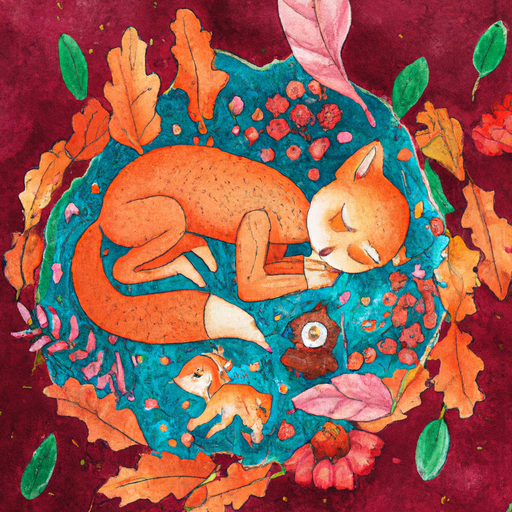
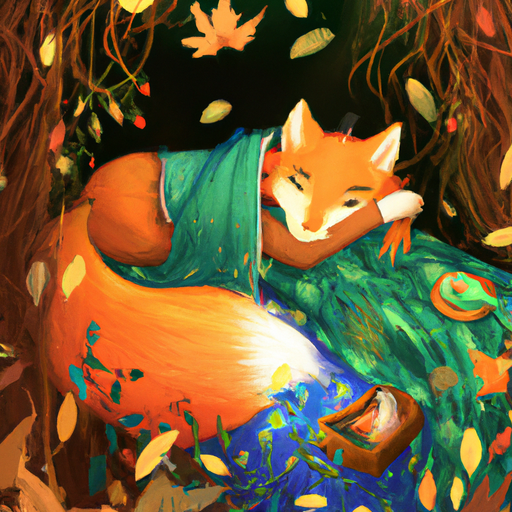
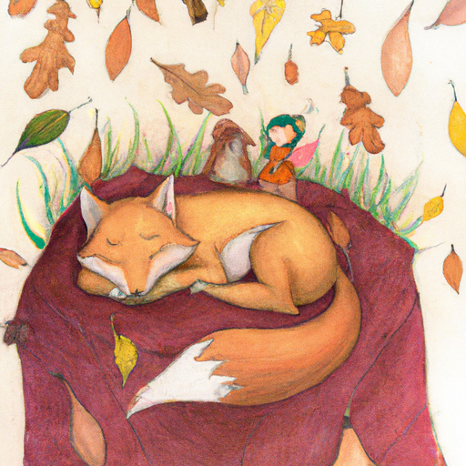

## [rest is not idleness - another pace of life in a forest cottage](https://www.youtube.com/watch?v=a6JnJog6Xsw)

<table align="center">
	<tr>
		<td align="center">
<<<<<<< HEAD
			
		</td>
		<td align="center">
			
		</td>
		<td align="center">
			
=======
			
		</td>
		<td align="center">
			
		</td>
		<td align="center">
			
>>>>>>> ffe52613361410ad9d371a0f80e81de4dd24175f
		</td>
	</tr>
</table>

One of my favorite literary heroines, Shirley, once said, "I'm so glad I live in a world where there are Octobers." And this morning, while baking scones, I couldn't agree more. It's just a bit chilly outside, the leaves are falling steadily, and the colors are radiant. The squirrels are busy collecting their winter stores, and I will be taking a walk in a few hours after I stop by my bookstore. I'm keeping an eye out for natural things I can forage to use as temporary seasonal decorations in my home. For me, this season is all about simplicity and being mindful.

October has been surprisingly busy. It was time to decorate the bookstore for the harvest season and pick out some autumn reads. I recently read a book that made me cry in the best way. While I was walking today, I wrote a little autumn poem inspired by my recent watercolor painting. It's about a girl and a fox, weary from the autumn twilight, laying down to sleep and dream of honeycombs and grand adventures. The leaves gently sway to the melody of the wind, and even the fairies watch quietly, wondering at the beauty of a sleeping fox and child.

Don't let the sunshine fool you, it is quite chilly today. I am enjoying an autumn walk and collecting different types of leaves from aspen, willow, birch, and even some tamarack boughs if I can make it up to the mountains. I'm going to use them to decorate my home for autumn. There's so much freely available out here, and everything I can compost. It's been a peaceful and mindful experience to get out in nature today and just really enjoy October. It is such a special month, with so much folklore and fairy tales related to this time of year where everything is shifting and changing.

After going home, I added some leaves to my windows for added October decorations. I explained to my cat that she could pull them off and destroy them no sooner than November 1st. We'll see if she listens. If you wish to decorate your windows with fallen leaves this season, simply flatten them in a book for a couple of weeks or dip fresh ones in melted wax and adhere them with some removable adhesive. I will add some links down below with more information.

On another note, I'm excited to announce the near completion of our rabbit sanctuary. It was my husband's project, and he did a great job making a safe space for future rescue rabbits. We still need to replace some plants with bunny-friendly alternatives, but they know what plants to avoid and have been chomping down on our weeds. I love to see animals running free. It reminds me to be grateful that cool weather and space to play is enough to be joyful.

Hello! As you can see, this video was just a bit of an update on everything going on in the cottage, the property, and the valley. It's been quite busy this October, and I wanted to share a little bit of that. I hope you can also share your own experiences of October down below. I am not a super spooky soul, to be honest. I shy away very quickly from all things ghosts and scary campfire tales. I love mysteries, but I'm easily scared. That's just who I am. I also really respect people who can handle all that scary stuff. Some of my favorite people love to go to places that are known to be haunted, and I can never do anything like that. I would be the very first casualty in just about every horror movie you've ever seen because I would just faint. However, that does not mean I am not celebrating this October. I have been thoroughly enjoying decorating and honoring nature in the seasons. There are also several books I've been reading that I've been loving lately. I know a lot of people are tired of book recommendations, so I will be very brief. However, a book I recently read changed me as a person and made me cry so much. It's called "The Traveling Cat Chronicles." If you are a cat person or just a general animal person, you will absolutely love this story. It's a perfect autumnal read. The story has that cozy slice of life feeling that I love when it starts to get a little bit colder. It's about making a positive impact on others by simply trying to be a good person, even if you fail sometimes. It's about being aware that every day, who you interact with, whoever you come across, is directly impacted by who you are. If you simply desire to shine your light, you will leave the world a better place. It made me cry, and I'm crying again just talking about it.

Moving on, I'm also reading the new short story release from the Shady Hol series, which is extremely autumnal. If you want anything related to specifically October and Halloween, I highly recommend it. This week's video was a simple update, highlighting all the simple little moments that meant a lot to me. Focusing on things that bring me joy. I hope the same for you. I hope you have a wonderful week, and I will see you very soon with my next video. Thank you again for all the support in my Etsy shop. I really appreciate it. I'm going to be restocking a couple of items in the next few weeks. Sending you so much love. Goodbye.