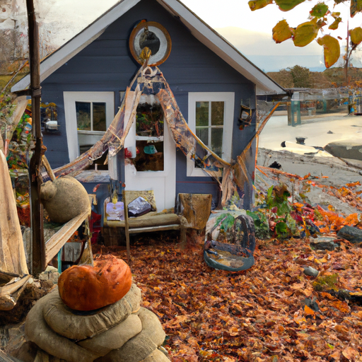
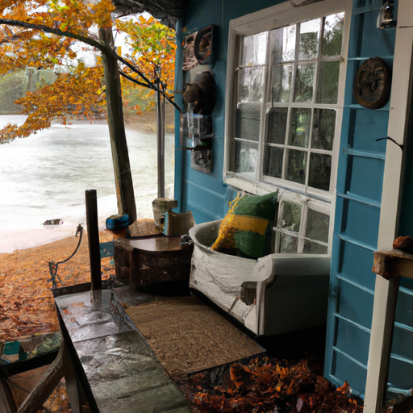
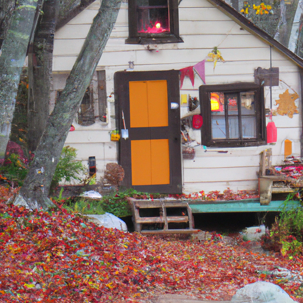

## [returning to my little forest home - how I make the most of autumn](https://www.youtube.com/watch?v=txO-EY69vcI)

<table align="center">
	<tr>
		<td align="center">
<<<<<<< HEAD
			
		</td>
		<td align="center">
			
		</td>
		<td align="center">
			
=======
			
		</td>
		<td align="center">
			
		</td>
		<td align="center">
			
>>>>>>> ffe52613361410ad9d371a0f80e81de4dd24175f
		</td>
	</tr>
</table>

I was heading home from my trip last week but before we did we got to stop by Luke Sands house to visit with her for a while and enjoy her cozy little cabin by the sea. Her family built it a long time ago and it is full of many lovely memories. The mornings here feel like true October, the trees are magnificent all brown and yellow and red painting the roads and walkways with a patchwork of autumn Magic. I simply had to spend the day wandering and soaking in the atmosphere. The air had a crisp minty scent, distinctive chilly mornings and I decided to gamble my luck on picking an old book from the library to read Outdoors. I actually got to learn a bit about the author and found the sweet quote that I shall paraphrase: "take a moment to consider the Romantic expedition you're on," meaning that we should all stop and remember our story is only as Whimsical as we perceive it and make sure to take some notes in the process to remember your adventures. I certainly found myself using my journal more than usual on this trip, a useful tool when immersing yourself in the beauty of imagination. Thank you foreign. I find that no matter where I am, in a city or out in the wilderness, it is listening to my child's heart that guides me to imbue a bit of Whimsy into the season, whether it's a morning walk or an evening under blankets watching my favorite movies. I will share my tips for enjoying October in the last part of this video. Now on our way back home, we did stumble upon a wonderful farm and pumpkin patch and walked away with two wagon fulls of pumpkins. If you had the opportunity to go to a pumpkin patch, I highly recommend it. During the week when we went, it was so quiet and we enjoyed the entire field to ourselves. I will leave the information about this particular Farm down below because if you're in the area, you should stop by as the farmer was so kind and helpful. Foreign. Having loaded our Treasure of pumpkins in our little car, we headed home over the mountains. I had missed my pets and it was so lovely to see them and settle back in as they had been with my family while we were away. There's nothing like coming home after a getaway to be ever grateful to have the Love of Animals, loved ones, and even our houseplants waiting for us. Sending my love to you this October and let me know if you have any lovely or spooky adventures planned this season. Take care. Thank you. Foreign. I am back from my trip. It is so exciting. We are not gone for that long, much less than a week, but it still, you know, gives you time to miss home and miss your animals, and it makes it really special coming home and saying hello to everyone and seeing how excited everyone is. It was just wonderful. It was wonderful. I just wanted to mention really quick that I have reopened and restocked my Etsy Shop finally. I have so many prints now. I'm very grateful. It took me a while to find supplies to print, but my mushroom Bunny and some other of my prints that have been out of stock for a long time are now here. I'm adding some extra gifts to each and every order in the form of some stickers and bookmarks, and I will leave the details down below as well, just as a thank you and a holiday season thank you. I also have some new prints that I've been working on for a while, and again, I appreciate your support of this channel. So yes, our car was pretty much full of pumpkins. We got so many pumpkins that that pumpkin patch, it was just so fun. So if you're ever in that area, I'll leave the details down below for you to check it out. Surprisingly, despite going to a bookstore and many antique shops with a lot of old books, I did not come home with any new books, and that was really good. Do let me know what you love to do in October and what it's like for you. I know it is definitely not cold and autumnal depending where you live. You know, I really think, of course, though every month, every season can be really special, even though it is not cold and chilly where you are and it is not Autumn. I did want to share though a few things that I do in October or perhaps more techniques I use to really immerse myself into things that I love. And one would be nature walks, of course. Nature walks are pretty self-explanatory. You know, if you have access to even a small amount of nature like a park or something like that, it could be really special. What I would add to my nature walk that might be helpful to you, besides of course bringing earbuds to listen to music in an audiobook if you wish, if it would help you enjoy the experience more, I find music for me is really helpful, especially if I'm on a hike and I'm getting a little bit tired and I want something to keep motivating me moving a little bit forward and challenging myself. Another thing I like to do is to bring an activity so I can sit down somewhere nice and catch my breath. For me, I really enjoy bringing a book or a journal or something and just spending a few minutes outdoors really focused on that task, and I find that it's often very enjoyable and a lot of creativity and new ideas strike when you are outdoors. It is rather magical and enchanting that way. Another thing I do, which I have not heard too many people do, but it is really interesting, is to bring a compass with you. Most people have one on their phone, but you can also bring a physical one as well. I find it really interesting to orient myself in the space and be aware of kind of where I'm sitting in terms of the terrain and the planet as a whole. Another thing I'd like to do is have a plant or animal identification app on my phone. Of course, they are not always perfect, but if you're just interested to try to learn a little more about your area, it can be absolutely fascinating. The most simple, most uninteresting looking leaf can often send you down a rabbit hole of information. I know for me, I find it fascinating to just photograph leaves and put them in my identification app because the things you learn are just incredible. Another thing I like to do is often bring a book with little strips of wax paper or a mini flower press with me because then I can collect some fallen leaves and all other types of little things that I find and press them so that they don't get ruined on the trip back, and then I can use them to create some art. And of course, I think no autumn day is the same without some evenings spent cozied up in your blanket watching some of your favorite movies. There are some really goofy movies that I love to watch this time of year. One of them is the Court Jester with Danny K. It's a really old movie, and I'm certain that if I watched it now, I would not necessarily ever watch it again, but because I grew up with it, it just happened to be an old DVD that my parents had, I have just grown to love that movie, so I always re-watch it. It's extremely silly. It reminds me a lot of the cartoon Disney version of Robin Hood. It's kind of got a lot of that slapstick comedy feel. I also really love to watch the BBC version of Sense and Sensibility, I think from 2008. I don't think it's particularly set in Autumn, but it is very stormy and kind of foggy and misty a lot of the atmosphere in it, and I just think it's a wonderful telling of the story, and I really, really enjoy it. I do really also love to watch Stardust this time of year. I know that is definitely a cult classic that many people love. I also grew up watching the movie Pagemaster, which I think is also a pretty goofy movie. I have not re-watched it, but I'm planning to this Autumn. I'm gonna try going back and re-watching a lot of those classics that were an important part of my childhood, so we will see how it goes. So I hope that all of you can share your recommendations of good autumnal movies and TV shows. With all that being said, I hope that this season you can really listen to that inner child and really give it a little bit of love and nurture. I think we all have that little child in our hearts that just really wants to, you know, and be in the moment and really enjoy those kind of silly little things that we might sometimes be a little bit self-conscious about, and I think it's really important to be aware of that side of ourselves, you know, and embrace it. Thank you so much to everyone who has purchased my book. It is coming out in November, at the end of November. There's also links to Amazon and international options down below. Thank you so much for your support of my work, my writing, this channel. It makes all the difference for me, and I am so incredibly grateful to all of you to give me this opportunity. I'm sending all of you my love. Take care. I will see you soon, and I'm gonna go play with the very playful kitten. Okay, goodbye.