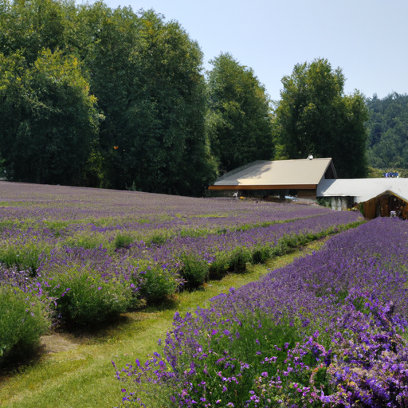
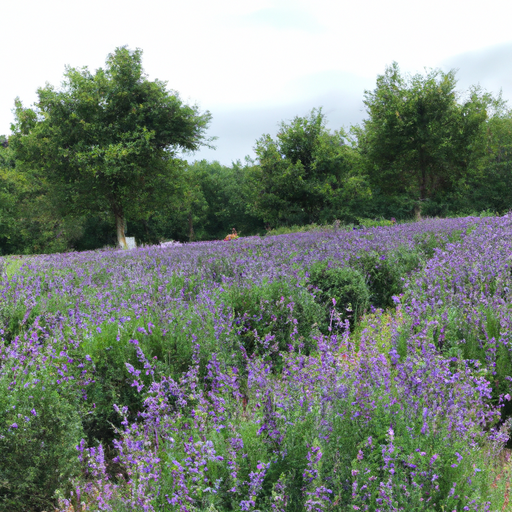
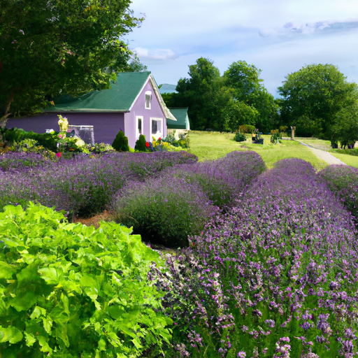

## [simple days at a cottage by the sea](https://www.youtube.com/watch?v=VWXjJCXJimg)

<table align="center">
	<tr>
		<td align="center">
			
		</td>
		<td align="center">
			
		</td>
		<td align="center">
			
		</td>
	</tr>
</table>

I was in Sequim last week, during their annual lavender festival - it seems like the entire town exploded into shades of purple and green overnight. The smell was everywhere, even while driving I could detect it, and led me to this quaint little farm just outside of town.

I also got the chance to spend a day at an adorable little cottage by the sea. My boyfriend and I made a single exception of staying at family homes to enjoy our first ever bnb. It felt appropriate to do something a bit fancier as a treat to celebrate two years of knowing each other. We are not often travelers and it was very exciting.

The biggest struggle I faced during this trip was actually disconnecting from my work life. I find that very difficult to do, and it was a wonderful challenge to truly embrace the days. I can’t remember the last time I had a proper vacation planned out like this. Of course, I still filmed and did what was necessary to keep my business running, but for the most part - I had a lot more time off than usual.

It was so lovely take joy in soaking in the sights and sounds of a new place. The luscious greens of the landscape made me miss springtime at home. And look forward to the autumn rains. It’s so easy to get caught up in work, especially when you enjoy your job or have big goals for the future.

A current dream of mine is to be a homeowner, in my minds eye I’ve always imagined having a family and living in a small cabin by the river or nestled deep in a forest. But I find that the quickest way to turn a dream into something stressful is by setting a strict timeline to its achievement. If I do that it inevitably becomes a sort of race, where my body exists in the present, but my mind lives in the future, imagining a life I don’t have while letting the one I do pass me by.

I found this mentality can negatively affect everything in life. For example, I’ve always been a dreamer and someone with a vivid imagination, and yet it is important to not let that blind you from appreciating the tactile world. The people in your life, your real relationships. These things, solely existing in the present at this moment, have so much value. And if I’ve learned anything this summer, is that your life can change in the blink of an eye. You may very well lose something important when you least expect it. That is the beautiful and complex and heart wrenching reality. You cannot control the future, but right now - at this moment - you can chose to love, and there’s no better way to use your time.

As I enjoy the last days of my trip and prepare to head home, I realize that even though I’ve loved this vacation, it also made me aware of how much I am truly tied to my valley. Even with everything it’s facing right now, I want to be there and to do what I can to protect it. It’s a cathartic moment when you realize you’ve truly found home.

Sending my love, I will see you next week.