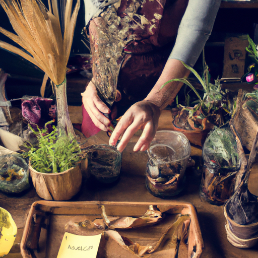
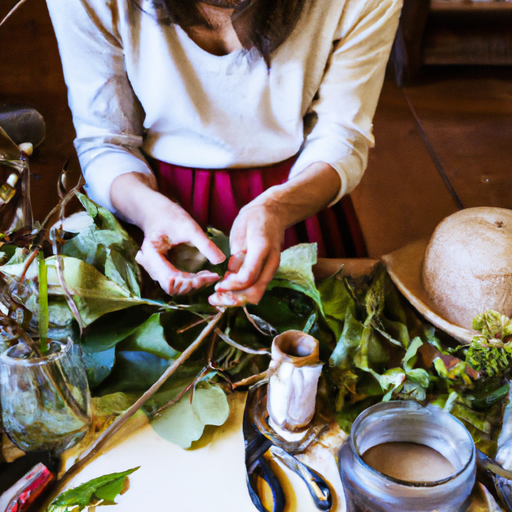
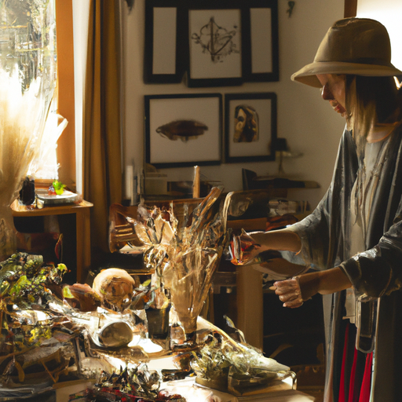

## [taking care of my home is vital for my peace of mind - gentle simple home life](https://www.youtube.com/watch?v=1ZJ7z2VsSUE)

<table align="center">
	<tr>
		<td align="center">
<<<<<<< HEAD
			
		</td>
		<td align="center">
			
		</td>
		<td align="center">
			
=======
			
		</td>
		<td align="center">
			
		</td>
		<td align="center">
			
>>>>>>> ffe52613361410ad9d371a0f80e81de4dd24175f
		</td>
	</tr>
</table>

Good morning everyone, today I'm harvesting treasures from my garden and enjoying the late spring. I'm a little sad it will be summer soon, but I will be outdoors as much as possible until then. In the process of making this video, I actually created an enormous mess in my kitchen, and so I wanted to share a bit about my relationship with chaos for those who might be able to relate.

To begin with, I used to be an incredibly messy person, and in many ways, I still am if I'm not mindful. The day can quickly fall apart into a whirlwind of chaos, starting multiple projects all at once and finding myself surrounded by an enormous mess at the end of the day. Consequently, I will have days where I'm too exhausted to do much of anything because I burn myself out.

And if you think I look quite put together in these videos, that's great because that is my intention. I'm always trying to be a little more put together and improving my tendency towards getting distracted and lost in a hundred different tasks. These videos have helped me slowly improve and learn how to practice deep focus on projects and be mindful with each step, and take things slowly.

Initially, I was quite contrary to my innate nature, but now I've come to find great peace and solace in slowing down. It has reduced my stress, and I've permanently changed due to putting into practice a slower, simpler daily pace. I can't imagine giving into the frenzied whirlwind of activity I used to partake in. Of course, this is only my personal experience. That doesn't mean that there's anything wrong with you if you're highly distractible and get lost in projects. I can relate, and it's part of who I am. But in my case, it was making my life more stressful, so I had to reel myself back in.

Celebrating my chaotically artistic soul while also developing a layer of self-awareness and mindfulness that would help me function in daily life a little easier. Particularly slowing down in order to gently go about the tasks that need doing in order for me to feel more at ease, so I can enjoy my more creative side with greater freedom.

Now, I take joy in spending time taking care of my space and cleaning up after myself. I've discovered a love of taking care of my home, and it has helped me become more positive and peaceful. I feel that homes have a specific atmosphere when you walk into them that goes beyond the physical. In places full of love and laughter, I have felt that love when I enter them. I cannot explain this, but I do know that we connect our memories and our experiences to our surroundings. If we've experienced a lot of turmoil in a place, it continues to feel that way over time. It's almost as if your space reflects you, both in literal and slightly more mysterious ways.

For example, I noticed I was using a lot of negative self-talk when I was in my kitchen because I tend to get grumpy because I despise cleaning the kitchen. I love to clean every other part of my house, but I do not enjoy the kitchen. I think at least a few of you can relate. So, I decided I would try to change things. I tried being more positive, turning on pleasant music, and focusing on making good memories through cooking with friends or baking my favorite treats.

Practicing a deep appreciation for my shelter, food, and memories I have in regards to my space can help me feel more satisfied with how things are, not focused on how they could be. It's so easy to see pictures online of home spaces that are beautiful but just not practical for your interests or lifestyle. Be true to what works for you, makes it the easiest for you to clean, and helps you just feel lighter when you're there. The mindset shift sometimes makes all the difference on its own.

I was so happy to be able to harvest so much mint so soon this year. It is not the perfect time to harvest them, but I was in need of a lot more tea, so I decided to go ahead and take them as they're going to keep regrowing, and I'm probably going to be able to get several more harvests before it gets too cold. I'm going to tie these up and hang them up to dry. I also made some lilac-infused honey, which is delicious. If you have lilacs, there are so many recipes you can make with them. I have made tea and rice pudding and all sorts of things with lilac. I've even made lilac syrup. I'm going to have some of this on toast right now, and in several weeks, it will be far more infused and far more tasty.

My home has been undergoing many changes. I love to decorate, and I'm ever-changing things about, but I do make sure to try to keep things simple enough for me to upkeep, and I'm sure we'll simplify it even more as my life changes. I also like to remember that homes are supposed to look like they've been lived in. I cannot fathom the amount of cat and dog hair I have on my floor at any given moment, but I try to remember that it's just a consequence of having love and life in my home, and that is worth it.

I hope you enjoyed this week's expeditions out in the garden, looking for all sorts of herbs. The herbs that I've been growing this year are not quite ready, but a lot of these more wild varieties that I have planted have been doing quite well, and so I was just so excited to bring in some of those fresh botanical smells into my home. Especially when I harvest and dry mint or sage, it is just such a wonderful smell. So, I've been really enjoying it, and I think it's going to definitely help me feel a lot more peaceful and meditative in my space.

Hello Mia, I think Bianca wants to join us. I have lived in a lot of different places, growing up in so many different types of homes and living arrangements. I've even done some apartments that were very unsafe, unfortunately, for the sake of trying to save some money when I was quite a bit younger. All those experiences, I think, taught me how important it is to fill your home with love and kind words and kind thoughts. Family or friends, or maybe just the company of loving animals and plants. And I think that all those things have the greatest impact on your home space. It's not the things you have in it.

I highly encourage you to keep an eye out for wild mint, dandelions, lilacs, maybe if you are in a place with abundant nature. If not, there are a lot of places you can purchase herbs to experiment with or grow them yourself on a windowsill. It is such a fun and mindful hobby, I think. Well then, we are going to finish our lilac tea, and then we are going to go on some more adventures, pick up some more lettuce for Bernard because I'm sure he is quite hungry. And you ate all the lettuce, didn't you? There's just none left for him. Oh my goodness, oh my goodness.

Thank you again for all the support of my Etsy shop and all the new art pieces I've released this year. I have been working on some new designs and always appreciate your ideas and your input. And I'm sending you so much love, and I will see you very soon. Goodbye.