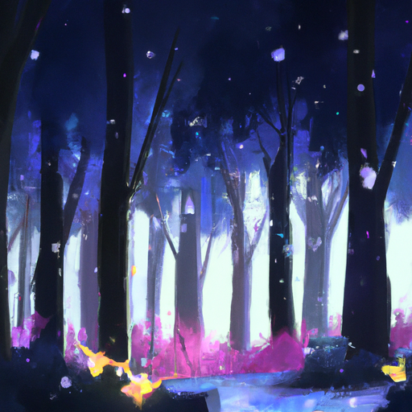
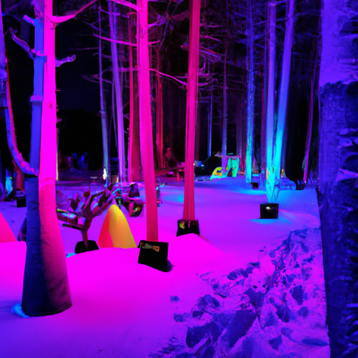
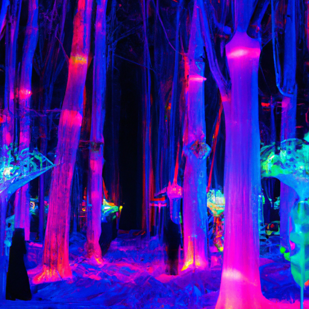

## [the art of a quiet life - wintering for a happier existence](https://www.youtube.com/watch?v=xHvvMGHmwuU)

<table align="center">
	<tr>
		<td align="center">
<<<<<<< HEAD
			
		</td>
		<td align="center">
			
		</td>
		<td align="center">
			
=======
			
		</td>
		<td align="center">
			
		</td>
		<td align="center">
			
>>>>>>> ffe52613361410ad9d371a0f80e81de4dd24175f
		</td>
	</tr>
</table>

Winter has finally come in full force, and the lake is quickly turning to ice. I've noticed the eagles have been busy seeking to hunt one last time in the little pools of unfrozen water before a long, unforgiving winter sets in.

I'm spending a lot of time with my family this December as we come together to celebrate the end of the year. My mother spent well over 20 years following my father around the world to different military bases, and she has always dreamed of having a little house in a secluded area. At long last, she finally got it, and I'm so happy they can enjoy a quiet retirement here.

While I was at their house, I found a very interesting book. It was about mostly forgotten words that describe unusual feelings. For example, "heartsburg" is explained to be a noun for an unexpected surge of feelings brought about by an ordinary thing, like a certain smell or the sound of a creaking door or a train whistle in the distance. I related to this and another word in particular known as "anamoya," which means nostalgia for a time you never experienced. I really love this word. As a child, I used to have dreams about a great forest full of light and color, and a vibrance that seemed to pulsate to a heartbeat deep in the roots of the trees. In that place, I felt an overwhelming sense of love everywhere. That dream never physically existed, but it has stayed with me as a place I yearn for always. It is a memory that comforts me and reminds me to seek out the light no matter how dark the winter days become.

I once read an article that commented on how there is a great void in the English language in regards to describing the complexity of emotions. For example, a word in this book was "marumori," which in essence was described to mean the heartbreaking simplicity of ordinary things. I love that description because it really nails down a feeling I've always had about the beauty of the mundane and the ordinary. Even during the coldest, loneliest months, there is artistry around us waiting to be appreciated, both nature's and man-made. Everything from the paintings I create to the glitter of the snow under the light of a full moon. It is a heartbreaking sort of beauty when truly appreciated, I think, because it pulls us back to a time perhaps when it was easier for us to enjoy simply living, or another possibility, that it gives that elusive "anamoya," a yearning for reality we innately know yet cannot grasp. Our human nature will always leave us unable to enjoy the present. Every day, real life gets involved and things get messy, and that's okay. We cannot avoid it, though we can have moments of being truly grateful for what we do have. To paraphrase a quote from an admired philosopher, C.S. Lewis, "If we find ourselves with a desire this world can't satisfy, a possible explanation is that we were not made for this world." Now, I don't expect everyone to believe this is true. I think there are many compelling explanations for this feeling. Either way, I think it is a good reminder that there is a lot out there that cannot yet be explained, so many mysteries worth considering.

Tiger is sleeping right next to my feet, so we'll see if he behaves himself. You're gonna behave yourself, yeah? Maybe. Oh my goodness, we got gosh, it seems like a foot of snow in one day. It's amazing, it's just so beautiful, and honestly, I kind of just put aside all my plans just to spend some time enjoying it. The first snow is always just so magical. As you can see, I'm at my parents' house. We are planning to play a lot of board games this week. My sister is coming, I think in about a week as well, from Houston, Texas, and I'm just so excited to see her and spend some time with her. We haven't seen her for a while now, and I'm just so excited for her to come over here and enjoy some snow. And we're hopefully going to go sledding and hiking and skiing, and we'll see what we get up to. It's going to be really fun.

I've recently been reading about all the different traditions and holidays that happen this time of year, and it is just amazing how many are out there. I wrote down some of the main ones, but I'm sure there are a lot more. There is, of course, Christmas, which is extremely popular. There's also Soyal, which seems to be a fascinating holiday. I don't know much about it, but I do want to learn a little more. Kwanzaa, Hanukkah, which is a holiday I'd heard about but I didn't realize how popular it was, so I really enjoyed learning about that one. And of course, there's also the winter solstice or Yule. Gosh, there's just so many other ones. It's so wonderful to learn about all the different traditions and celebrations this time of year. It is so beautiful. You know, I've always thought that if we all celebrate the same things, then the world would be just so much less interesting and less full of interesting stories. So I've really enjoyed learning about all these celebrations this time of year. So if you are celebrating something this year, please let me know what you're celebrating. I'm very excited to learn about all these new traditions, some of them which I've not heard about before.

Reading about these traditions got me more interested in reading some more Taino legends. I was reading a Taino myth about the son of a very powerful being in Taino mythology. The powerful being's name was Atabay, and she had a son called Jukajiu. Jukaju wanted to give the darkness of the night more beauty, so he went down into the deepest caverns and took out gemstones. He went up and put the gemstones into the sky, and the gemstones reflected the light of the sun and moon, creating the night sky and all the constellations and stars. I thought that was such a beautiful and creative way to describe the night sky and how it was made in this myth. I thought it was so beautiful.

I think it is so important to have respect and reverence for these stories that were so important to so many groups of people in the past, and sometimes even in the present. I've just found a lot of inspiration from reading those old myths and legends from all over the world, even Celtic myths and legends. On my father's side of the family, he has a lot of European ancestry and a lot of Celtic ancestry, so reading the myths of that area has been so fascinating. It is so exciting to just connect with the past and connect with stories.

Anyway, I'm just so excited to have my family together this month to play games, eat good food, and make coquito. We're going to have such a wonderful time. It's going to be lovely, and I am sure we're going to get probably another foot of snow before the month is out, so I'm anticipating it to be quite snowed in for a while. That will be wonderful.

There is a book I mention in this video called "The Dictionary of Obscure Sorrows," and I thought it was such a funny title. But once I picked up the book and started reading it, I found it to be incredible. It had so many interesting words and phrases that are rarely used or no longer used, or at the very least, not used in the English language very much. I found it really fun to read about. One word, I can't remember what the word exactly was, but it pretty much meant to describe the nostalgic feel that you get when you hear a train whistle in the distance, and how that often gives you a sense of wanderlust. I thought that was such an interesting word to describe a feeling that I think a lot of us can relate to. I thought it was really fun.

Lastly, I wanted to say thank you for all the wonderful birthday wishes. It was a really lovely week. I actually received some very meaningful gifts, and I have not been able to get in contact with all the gift givers. So if your name is Tammy, I want to say thank you very much for the gift you left for me. It was very meaningful and very unexpected, and a wonderful surprise. I have your name, but I cannot find any way to contact you and tell you thank you personally. So if you're seeing this, know that I'm very, very grateful.

Also, a lovely artist known as Eve sent me a beautiful meditation orb that I will show you some images of. It is so beautiful. I've shown her work before, but she sent me this one unexpectedly, and it happened to align with my birthday, which I don't think she intended, but it was really fun. Anyway, I just counted it as a birthday gift, and it was really lovely to receive, and it is just beautiful. So I will leave a link to her work down below in case you want to see more of her carvings. They're just absolutely gorgeous.

Since I wasn't feeling too great, I've gotten quite behind on some replies and messages I've been meaning to send. So I apologize for that if you've been kept waiting. I've been doing my best. It's been a very busy month, as you can see in this video. I've been working so hard on creating a lot of new art pieces and trying to get them all finished for a big book project I'm working on. It has just been a huge feat, so I am doing my best and trying to get on top of things, but we'll see.

Anyway, I hope you're doing well. I know that the holidays can be a sometimes difficult time for a lot of people, depending on what your family life is like and where you are in life and what your hopes are for the new year. I'm sending you hugs and hope that you can find some moments of peace and joy this month. I know usually it can feel quite hectic, but I hope that the new year will provide a lot of incredible new opportunities and some new beginnings, and a time to winter and to come into the spring with new life and new excitement and enthusiasm.

So I will see you guys soon. I'm sending my love. Goodbye.