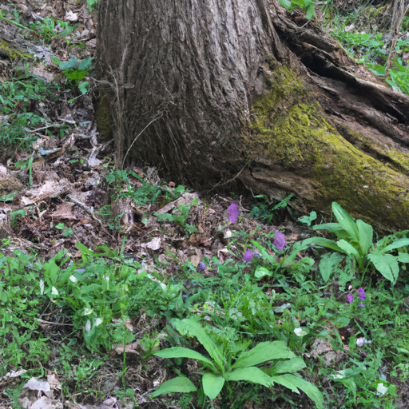
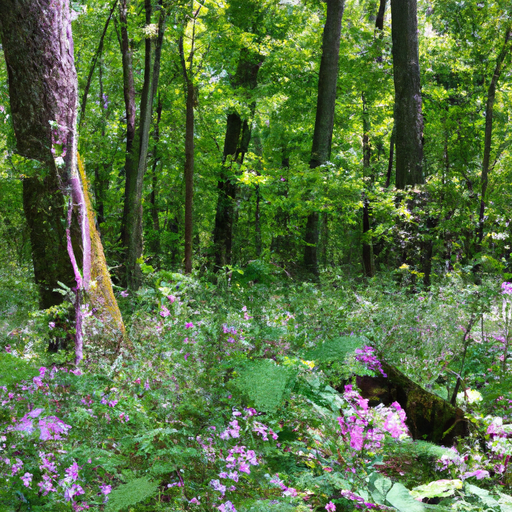
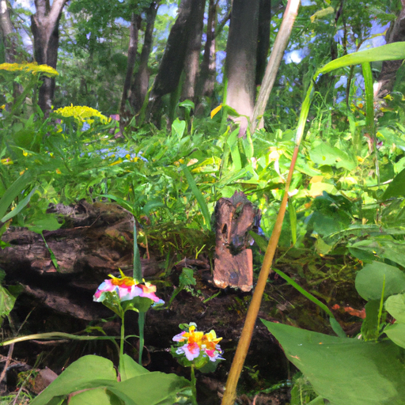

## [the art of living as your true self - the beauty and challenges](https://www.youtube.com/watch?v=G9FsMn_8fu0)

<table align="center">
	<tr>
		<td align="center">
			
		</td>
		<td align="center">
			
		</td>
		<td align="center">
			
		</td>
	</tr>
</table>

Since last year, I've attempted to start my days out with a walk in the forest before work. I started this process when I began writing my book a year ago, bringing a pen and journal to jot down my observations to later include. Now that summer is taking over and nudging the wildflowers to seed, I treasure these cooler morning adventures, keeping an eye out for any little treasures I find along the way. For example, today I found some wild rose and a tasty plant known as miner's lettuce. It has such a crisp and sweet flavor, and I just had to add it to my morning meal.

In this video, I wanted to reply to a comment that's been popping up since I started this channel years ago. If I like quiet and peaceful living on my own, why would I share it online? Doesn't that work against my more introverted nature or contradict it entirely? It's an interesting question because even though I love being alone, I need to be alone sometimes. I still deeply value human connection, and I think that doesn't contradict being a quieter person that recharges through being alone. My interior world is so vibrant and rich with complexity and interest. It's where I get all my energy, and I want to share that with others while still being true to myself.

These videos, for example, are my way to nurse my mental health, to remember that on good days and bad days, there is still beauty, and it's worth observing and celebrating, even though life is never perfect. I may not always be going to parties or socializing a lot, but I still connect with others using my own individual language, and it is unique to each of us. I've made videos on this topic before, but I live with a condition that can leave me extremely exhausted and very, very low at certain points of the month. After getting medical help to manage it, I maintain a happy life despite it, but some days it can still keep me in bed and limit my functionality. This can make it even harder to socialize because out in the countryside, it takes a little more effort to find kindred spirits because we're literally farther apart. And having a condition, along with being more quiet in nature, can make it hard to connect as often as I would in a more populated area.

In my case, I find it benefits my mental health to still make that effort. So once or twice a week, I go and do a social activity, be that working at my bookstore, planning a board game night, or just having dinner with a friend. Even if my more introverted self would rather hide away in their little den, challenging myself in those ways helps me, even though I don't always realize that in the moment.

In addition, working online and sharing the beauty of this valley with you is part of my language of connection. I share because I know that no doubt there are many people who may be able to relate. There is value in turning to the bright side of life when things get difficult, seeing beauty in the mundane, and celebrating moments that are often overlooked when we rush about. I spent a lot of time ashamed of being a person that is alone often and may only have a few close friends because so much of our media is about celebrating very social people. And I think they should be celebrated, as long as we don't forget to celebrate every personality, be that quieter or louder, a little shy or confident. We all have a light unique within us.

And with that, I thank all of you because making these videos has hugely helped me gain confidence and grow as a person. I share things I love online, and that helps me connect in my own way through my art. Knowing that there are many ways to practice love helps pull me out of dark moments and focus on things I'm grateful for, even if it's as simple as the pansies growing in my garden.

I hope you all have a wonderful week. I will be spending mine working on these little pocket journals. Thank you to everyone who ordered one, as well as to everyone who ordered a copy of my book. I so appreciate it. It really means the world. I'm sending you all my love.

So, I do beg your pardon for the background. I still have no home at this moment for my books. I kind of have them everywhere. Also, I'm not sure if you are going to be able to tell on camera, so this may not be relevant, but there is a red lump under my eyeball. Do not be concerned, I am okay. It is a spider bite, the second one I've gotten while hiking, which is bizarre. I have been walking and hiking almost my entire life, and I've never gotten two spider bites over the course of like two weeks while hiking, which is so weird. It's so weird. I am absolutely horrified at the idea that I am walking through the forest with a spider on my face. It's horrible. It's absolutely horrible.

I get this question a lot. I'm going to try to talk about it without giving you a lewd hand gesture, but my middle finger on my right hand looks very strange, and I've had several people reach out concerned about the state of my hand. And yeah, it's uh, looks kind of wonky. And I wanted to explain that it is not any sort of symptom of an underlying medical condition. When we were children, my sister and I had a pair of princess shoes, and I wanted one of the shoes, and I ran after her to get it, and she slammed a door shut, and I happened to put my fingers in the door before she slammed it shut, and I crushed the bones of this finger and lost my nail. And thankfully, everything kind of got, for the most part, repaired, but it just still looks kind of odd. But yes, I just wanted to let you know it is not a medical problem. It's just my wonky hand.

And also, because it sounds like I'm just blaming my sister for all of this, I was definitely an active participant in this event, believe it or not. I was a mischief maker at times. Anyway, my sister and I are best friends, and I don't hold it against her. It's just one of those silly sibling things that happen when you're really young. And yes, so there you go. That is my explanation for my wonky hand.

All that being said, I wanted to say thank you again to all of you who have been really interested in the journals that I made and have pre-ordered my book. It has meant the world. Thank you so, so much. And yes, I would love to hear down below how it is that you connect with other people and what your love language is and how you share your light with the world in what shape or form that takes. I know that I asked a similar question a year or two ago, and I got some people sharing that one thing they do to just connect with people, even if they're not super social people, is to just smile at people on the subway or in the bus or wherever they are. And I think that's really lovely.

One thing that I did recently was put a little bumper sticker on my car that had a really motivating and uplifting message to anyone who might be having a hard day. Another thing I love to do as well, which is actually a huge part of this channel, even though I do not share it regularly, is supporting my local conservation group but also taking part in reforestation and rehabilitation projects through donations and planting trees. And that, to me, is one of my most meaningful ways to connect with other people because even though it is not always directly connecting with a large community, I know that decades from now, all the trees that I've planted will become this amazing, beautiful forest. It's a gift that will continue to not only help individuals but the entire planet for years to come, and I think that's just beautiful.

Please share your thoughts down below. I always find it interesting to hear other people's stories and experiences. And I am sending you my love, and I will see you again very soon. Bye.