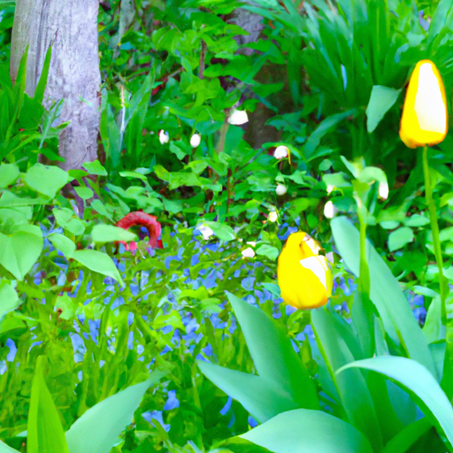
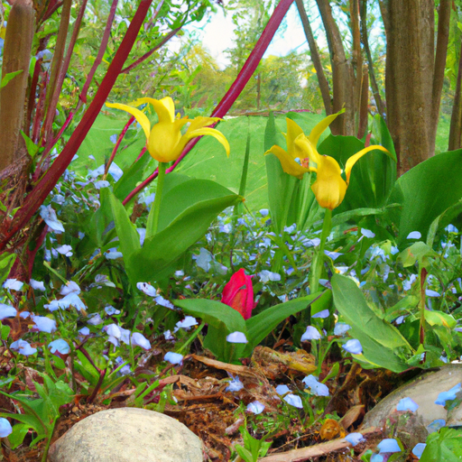
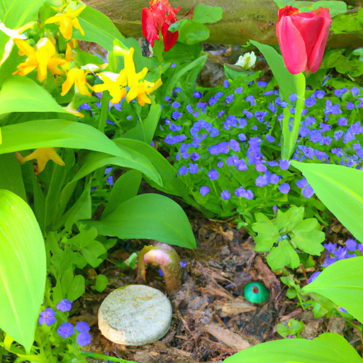

## [the art of living gently - a full year at the new cottage](https://www.youtube.com/watch?v=JIv2Cq_YEYM)

<table align="center">
	<tr>
		<td align="center">
<<<<<<< HEAD
			
		</td>
		<td align="center">
			
		</td>
		<td align="center">
			
=======
			
		</td>
		<td align="center">
			
		</td>
		<td align="center">
			
>>>>>>> ffe52613361410ad9d371a0f80e81de4dd24175f
		</td>
	</tr>
</table>

There is lily of the valley and vinca growing in my garden and in the wildlands are yellow bells and buttercups. As you well know, this is my favorite time of year. I could spend the entire day dancing over Flower Meadows and watching as my tulips peep through the dirt. The work must be done, so today I allow myself only a short couple walks to explore this new world, so long hidden by winter, keeping an eye out for Pixies, of course.

[Music]
[Music]
[Music]
[Music]

Yellow bells and poppy seeds hear the whisper of the breeze and venture curious roots. They come in wake of frost, a burst of Springtime soon lost to memory and a hopeful heart waiting once more for the gentle start. Good.

[Music]
[Music]

I came across a lovely line in a book recently. It asked the question, "Who would you be without fear in your heart?" If I lived without my worries over things I can't control, without fear of failure, without fear of myself, how would I live and who would I be? Like, I like to think I'm on my journey to be that person. I notice for me, the key to finding that courage was to accept that in the scheme of things, there's a lot I cannot control in my life. For example, I can try to take care of myself, eat well and exercise, and while these are great things to do for me, I will still not always feel my best. I will get sick, perhaps I might not even enjoy the privilege of growing old. I really don't know what will happen, and that's rather scary sometimes. But what I find much more frightening is living a life trying to control things that I cannot. For me, it felt like slowly releasing years of behaviors that I relied on to give me a grander sense of control than I really had over my life.

[Music]

A very wise gentleman once told me to find yourself, you must pause, enter the Inner Room of your spirit. You must lock the door because the experience may not always be pleasant, and you may be tempted to leave. But after you slowly work through what needs to be dealt with, you will be left with the seed of something special. That seed is you, the truth, and that is where you find your strength.

[Music]
[Music]

Mavi!

[Music]

I hope I brought a moment of peace or reflection to you today, and I'm sending you all my love. On another note, I recently found some old prints that I once sold as a limited edition release on my Etsy shop. There were a few that I misprinted, and unfortunately, there was this pale line left on the back of the print. I ended up not selling them. However, I thought it would be a waste to just throw them away, so I thought I would include them in a flower listing I have on my shop, in an attempt to hopefully find homes for them to people who don't mind the slight imperfection. I don't have many available, but I wanted to let you know in case you were interested, and I appreciate the support of my work as an artist. It means the world. Thank you so much.

Sir, that's very rude. That is still very rude.

I have been drinking this tea every day lately. It is lavender chamomile oatmeal and hops. It is an interesting combination, but it is so calming. And of course, the best part of tea is holding it in your hands, and it's so warm. Spring is here. I couldn't be happier. This morning, I went to the cottonwoods next to the river, and I took a lot of the little buds that were just growing on the ends of the branches. And if you take those buds and you harvest them and soak them in oil, after eight months or so, you can get cottonwood oil. And you can use that oil to make a healing salve and any other variety of things. I, of course, only like taking very small amounts in places where the trees are very abundant. And so, I just took about two dozen or so buds, and I'm soaking them in oil. And I'm excited to share the recipe in the future. I also filmed this video over the course of many different days, and the weather was slightly different in each one of them. So, I was in a slightly different outfit. And it was funny because on the last day, I climbed on a fallen tree, and while getting off it, my dress got caught on one of the edges of the branches, and I almost took a really big tumble. So, I'm really glad that I do not have any bruises or wounds from that little hiccup. So, you can see traipsing around the forest can sometimes be a little bit dangerous and eventful. So, thank you again. I'm sending you so much love, and I will see you very soon. Goodbye.