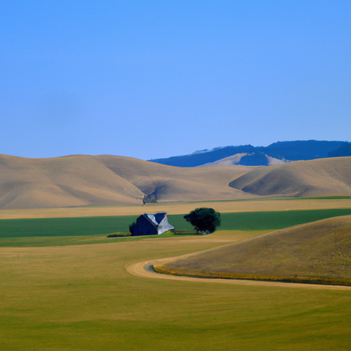

## [the beauty of an ordinary life - social media and simple living](https://www.youtube.com/watch?v=7H3D-6nj_dY)

<table align="center">
	<tr>
		<td align="center">
			
		</td>
		<td align="center">
			
		</td>
		<td align="center">
			
		</td>
	</tr>
</table>

Today I wanted to share something that has been on my mind recently. But to preface my thoughts I’ll explain that I grew up without social media, I did have an account at one point as a teenager, but I rarely used it.

Last year was when I first became consistently active on social media and it has been a wonderful way to connect with other artists and all of you, and I can say for certain that the stories and messages you’ve shared have enriched my life. I have enjoyed it very much, but have also observed how easy it is for social media to fuel a sense of inadequacy and comparison. As someone who hasn’t been exposed to it very much until now, I see how powerful it can be, and cannot imagine the influence it has over people who have had it all their lives.

It is so easy to see what someone shares, especially their lifestyle, as something you wish you had. But in my case, that feeling never went away by moving over here. When I was in the city I romanticized county living, and when I moved, leaving my community and friends, I started to romanticize city living. Out here there aren’t very many people, and so while it is still very possible to make friends who share your interests, it’s not as easy as in a city with hundreds of thousands of people. There are few restaurants, shops, and to get to large stores you need to take a 2 hour round trip.

Initially, while living here I missed my book clubs, my coworkers, and had a horrible sense that I was missing out on life by living in such a quiet area. I kept thinking: “I’m so young, why am I not traveling the world and doing exciting things?” I’d see photos of my friends online going out to restaurants and taking vacations to other places and I felt like I was horribly boring. I was just working all the time on minimum wage and trying to afford my health insurance. If you live in America, you will know what I mean.

While that has now changed and I finally feel financially secure, for a long time I still wondered about the careers and opportunities I may have had in the city. When I was working past jobs it was easy to compare myself to friends who were able to afford things easier and had jobs that I thought were maybe more impressive. When my income increased, I felt more at ease, but I didn’t feel any happier. While of course, I do not blame social media for making me insecure, exposure to it still made me regularly question my own happiness and satisfaction with my life. Especially when online everyone else seems happier than you. It brought up insecurities that I have never experienced before this year.

I quickly realized how important it was to only be involved in online communities that added true value, education or inspired my creativity. I also found that with social media it is easy to project your own dissatisfaction or insecurity on other people, instead of empowering yourself to embrace who you are and that everyone’s timeline is different. As I grew to understand myself better I realized that I was preoccupied with comparison, and judging other lifestyles simply by the highlights I saw online instead of really asking myself would that life suit me? Would that lifestyle help me help other people, and leave the world a better place? I needed to work towards my goals accepting that I may not get instant gratification.

If I hadn’t been able to move the countryside when I did, I am confident I could be just as happy in the city, embracing the chapters of my story and slowly but surely working towards my dreams. And gaining a lot of experience along the way.

That leads me to talk about this channel, and the aspects of life I chose to highlight. As you can see, I share, for the most part, happy or thoughtful days that are full of peace and calm. But I have bad days, lazy days, hectic days, and difficult moments all the time. I am not who I want to be every day, I often fall short and that can make me very self-critical. Sometimes I cry. Actually, I cry very often. Those are usually very private moments, and when I’m upset I spend time with someone I love, like my boyfriend. And it would seem very strange to pull out a camera and start filming those very raw moments while keeping them authentic, mostly because I want this channel to be about inspiration and ideas and peace and art, not my own daily struggles. It is also very important to me to not force other people to be part of my videos if it makes them uncomfortable. That’s why I don’t share everything, because when I’m with someone, or experiencing a very special moment, I want to experience it fully. Pausing to capture it for posterity would detract from that.

Instead, I know that the only way I will keep being inspired to make videos is to make them when motivated and enjoying life. But how I like to communicate those hard moments is through my words, where I try to share a more intimate reality. It’s what makes me comfortable and keeps me inspired, I guess? I hope that makes sense.

Anyway, I appreciate all of you, I really do, and I hope you’re doing well and embracing whatever chapter of your story you are currently in. Each one is precious and has so much to give. There is so much love and beauty in this messy world. Take care, and have a lovely day or night.