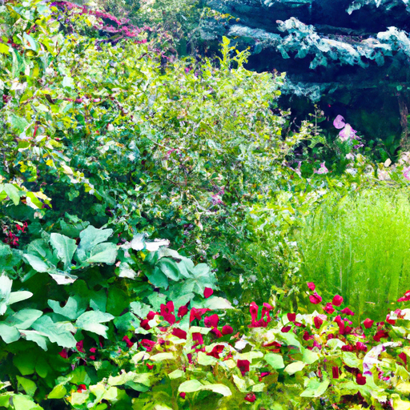
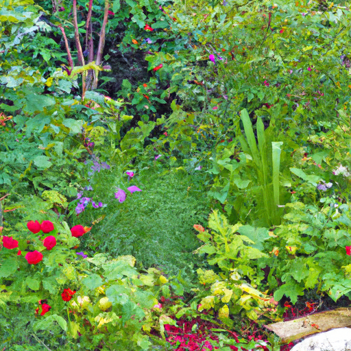
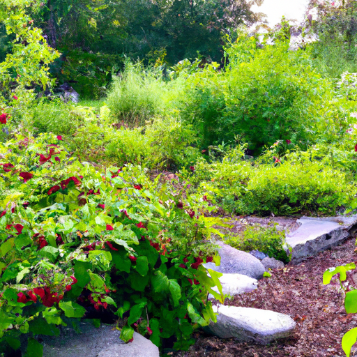

## [the forgotten art of monotasking - an antidote for a stressed world](https://www.youtube.com/watch?v=FdH1jP6mtqI)

<table align="center">
	<tr>
		<td align="center">
			
		</td>
		<td align="center">
			
		</td>
		<td align="center">
			
		</td>
	</tr>
</table>

[Music] Thank you.

When I was in college, you'd find me at 3am fairly often, working on my laptop while listening to the TV in the background and probably checking my phone every few minutes. The moments I was stuck in a waiting room and had forgotten my phone, I would freak out a little bit. What would I do without entertainment? At the very least, I needed something to read.

To be clear, there's nothing wrong with multitasking or enjoying things that entertain us and make the time pass. However, years later, I got to a point where I felt like the days were slipping by without much meaning or purpose. I felt overwhelmed, often fidgety and restless if I had to spend any time doing nothing. My thoughts would race without end. I wanted to change this. I felt I needed to do so in order to feel more fulfilled. I felt that learning how to enjoy delayed gratification tasks would be crucial to tackling challenges and feeling happier and more empowered. So, I decided to rediscover the lost art of monotasking - doing one thing at a time. Something I had once practiced as a child when I could read for hours or play without worrying about how productive I was being.

[Music] Thank you. [Music]

Foreign [Music]

Foreign

When I started monotasking, I noticed two things. Firstly, I was more productive because my usually distractible self improved on being able to finish things I started, which is an ongoing practice. Secondly, the downside was that I felt incredibly bored. I itched to have something to entertain my brain apart from the task at hand. Sometimes, the silence felt unbearable. But slowly, this feeling passed. It took time. I had trained my mind to be addicted to constant entertainment, and that's not easy to change. Slowly, I found myself settling into a peace that I had not felt for a long time. A mind-body feeling that stretched from my head to my toes. I became hyper-aware of my thoughts and how I wanted to practice deep focus in order to change some of my interior dialogue for the better.

For a long time, monotasking was hard in many ways, but it led to something beautiful. Now, I can read and write and create without a desperate need to drown out the silence and my thinking.

Foreign [Music]

[Music] Foreign

If I listen to music, I just listen. The time spent on my phone has been replaced by so many things I love to do more. Daily life is easier, but it is more interesting, and there's a lot more I notice. In many ways, I am happier. Maybe this won't be something that resonates with you, but I thought I'd share because not too long ago in human history, we didn't really have the choice not to monotask. In a way, it's a sacred meditative art form that many of us have forgotten. I get to enjoy a healthier and safer life than my ancestors thanks to the modern world, and I wouldn't ever want to live in the past. But I think there are still important things we can learn about those who came before, and perhaps monotasking could be helpful for you to try. Let me know how it turns out.

[Music] Laughs [Music]

On another note, the last couple of months have been full of yard work. My father has been helping me build berms, and I've been planting all sorts of flowers in the yard. [Music] Foreign

Here's a little glimpse of how the garden is looking. I have wild raspberries and all sorts of herbs growing. Luke is also working on our rabbit enclosure. That's going to be such a wonderful haven for the animals throughout the year, so they can enjoy the outdoors and run freely. I hope to show you the completed project very soon. Thank you.

[Music] [Music]

I was working on my Fireweed syrup recipe yesterday, and it was so delicious. I had the rest of the ice cream today, actually. I did have it for breakfast, I will admit, but it was just too good. I just couldn't wait until dinner. I ended up mixing the raspberries, strawberries, and Fireweed, as well as everything else together, and it was very interesting. I think whenever you make floral syrups, it is quite subtle, but it's a very interesting flavor. I think lilac still is one of my favorites. Fireweed was not quite as flavorful as a lilac usually is, but it is really fun to experiment anyway and just see what you can come up with. There are so many amazing plants out there that are available to be experimented with, as you well know. I've made quite a few videos on this channel about being a highly sensitive person, a child that was predispositioned to being a little bit more anxious about things and just naturally like that. And realizing through certain life choices and lifestyles I had in the past that my stress and anxiety got a lot worse, especially after recovering from being a workaholic as well as having an eating disorder. And that entire process and kind of decade of rethinking and reforming my life brought me to surprisingly greatly value not only mindfulness in general, but becoming a single tasker or monotasking, just doing one thing at a time. I don't do this every day. I am someone that loves to multitask. It is something that comes quite naturally to me, and I'm quite a distracted person, much like several family members. It runs, you know, through our generations for sure. However, especially when I'm feeling stressed or my mind is racing, I think that is such a crucial time for me to focus on doing one thing at a time. When you are speeding up a lot and you are feeling overwhelmed or stressed, slowing down and doing one thing at a time, for me at least, had such an incredible benefit. And maybe it will for you too next time you are in need of a little bit of relaxation and stress relief, but you can't afford to take a vacation or take time off. But instead, sitting in the moment, becoming aware of your breath, and doing one thing at a time. That we have shifted in the way that we see our time. Often, we want to be so efficient now and so productive, and doing multiple things at once and speeding up the process of getting things done. And I think there still is great value in slowing down and doing one thing at a time and finding joy in it. Even something as simple as washing the dishes. You might want to look up articles about doing one thing at a time and how that mindful way of living can have huge positive effects on our brain health. But it is not easy, I will warn you. It might feel unbearably boring at times. Your brain is so stimulated that it might just seem almost frustrating and really difficult to slow down on that level. So do be prepared for that, and it does pass in time. I don't know if any of these things would be helpful to you. I have no idea. But it has been something that has impacted me, and it does seem like there's a lot of research out there to also bring a lot of interesting questions. Maybe we should be treating our time differently. Maybe efficiency and productivity can sometimes tip over from being very healthy and wonderful into maybe sometimes losing track of the day and forgetting to appreciate really important and meaningful moments. With all that being said, I will leave you there. Thank you so much for following me around today. It was certainly a quiet evening, hopefully an enjoyable one. And I hope, at the very least, it brought you a moment of peace. So, I'm sending you so much love. Thank you for your support and my work as an artist. I'm so grateful that I can keep this space free of ads in the middle of my videos and not have to do sponsorships. And that is so important to me in regards to creating a peaceful haven on this channel. So, thank you so, so much. Sending so much love. Goodbye. Foreign.