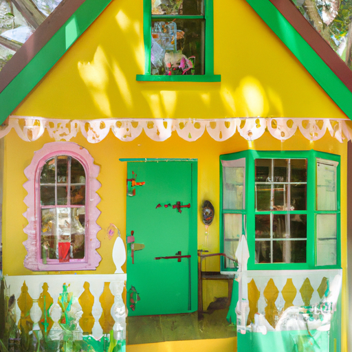
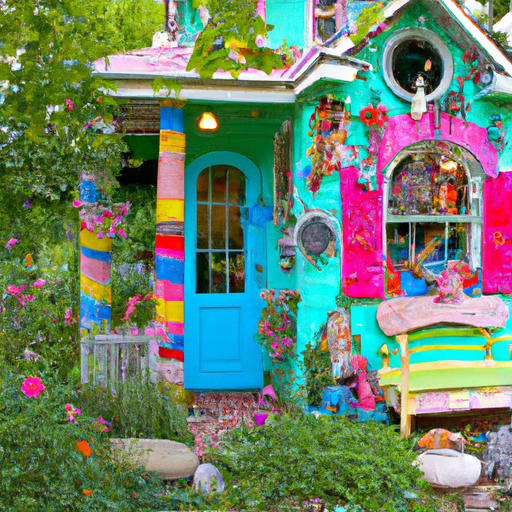
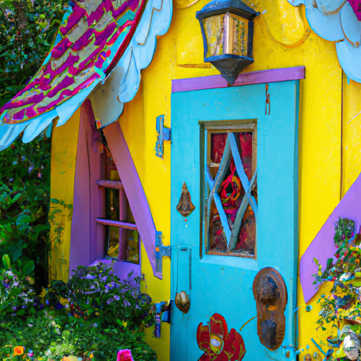

## [the importance of home life - cottage crafting vlog](https://www.youtube.com/watch?v=dsYXD2Ydigs)

<table align="center">
	<tr>
		<td align="center">
			
		</td>
		<td align="center">
			
		</td>
		<td align="center">
			
		</td>
	</tr>
</table>

Hello everyone, today I wanted to share a little bit about how I imbue a sense of whimsy - for lack of a better word - into many aspects of my home and life.

As you can see my cottage is... alternative in its style and I would say rather unusual in comparison to more mainstream home decor. However, to strictly speak on the practicalities of transforming this room, I think, would miss a lot of my philosophy behind creating a space in which you feel welcomed and accepted no matter who you are.

To explain my philosophy I must begin by asking you a question. Have you ever listened to a beautiful song that has touched your soul so deeply that it almost hurts when it's over? maybe you've experienced this when you've watched an incredibly poignant scene in your favorite movie, read an atmospheric book that transported you to another world or maybe simply the feeling of being utterly and completely enraptured by the beauty of whatever it is you have just experienced...

I think that as children it happens more often since we're still new to the world and all its fascinating elements. I remember seeing a butterfly wing under a microscope for the first time when I was 14 and gasped at the stunning intricacy and other worldliness of the design. Since then, I've loved butterflies and you can always spot some in my room.

As we become adults it can be easy to go in and day out without having moments like these. I have again discovered a love of daily life through reclaiming the curiosity and daydreaming of my youth. This has impacted how I decorate and the crafts that I make.

I know not everyone cares to recreate a sense of wonder and surrealism within their living space... also maybe you can't relate to this at all and I'm sounding a little odd right now, it is okay (I'm used to it). Anyway, I would love to know your thoughts.

My reason for speaking on this is because I've designed my space in a way to remind me of those precious and beautiful whimsical moments I wish I could hang on to forever. I love adding little details and cutouts from my favorite books, painting the walls, making things by hand... I'm well aware I cannot live in a fantasy world and I wouldn't wish to... however, having a dreamy space that makes me feel calm, creative, and imaginative gives me strength to deal with the world on days when things seem overly negative or scary.

You can see this philosophy directly impacting these videos, they are creative outlets, an artistic take on home life that sees things - as I said once before - not as they are all the time, but maybe how they could be. I love to emphasize the beauty of plants, art, and sunlight through these videos... but I'm not able to stay in the present all the time and enjoy these things to the fullest.

That is why I love to make these videos and re-center through the process. It forces me to slow down and remember what's important. Life can be beautiful and meaningful not only through its achievements but in its simplest moments.

Let me know your perspectives on home life and how you create a space that gives you comfort because I think that's what many of us are looking for... a haven that draws us in and gives us a sense of safety. I feel embraced by my home because I've put so much time into it, so many handmade items and details. If I'm ever overwhelmed or filled with worry I like to walk into this room and take a deep breath and remind myself that I am safe. Sending you hugs wherever you are.