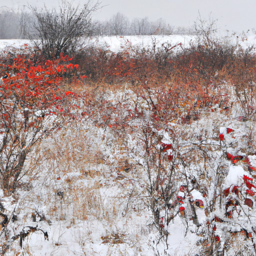
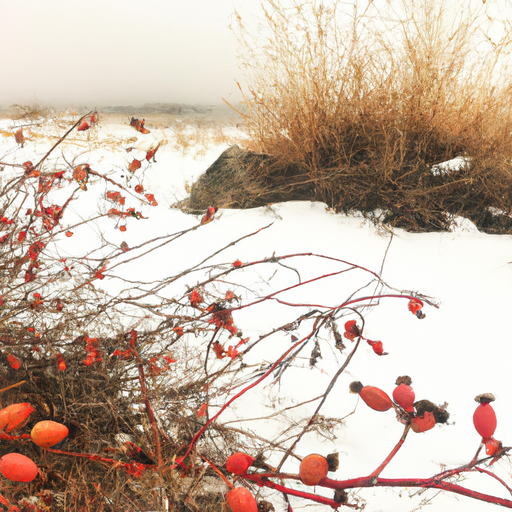
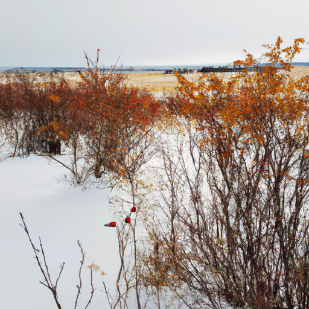

## [the life I should have lived - revisiting my past](https://www.youtube.com/watch?v=g6iq1RfcA0Q)

<table align="center">
	<tr>
		<td align="center">
<<<<<<< HEAD
			
		</td>
		<td align="center">
			
		</td>
		<td align="center">
			
=======
			
		</td>
		<td align="center">
			
		</td>
		<td align="center">
			
>>>>>>> ffe52613361410ad9d371a0f80e81de4dd24175f
		</td>
	</tr>
</table>

I have thoroughly enjoyed these last days of Autumn and little did I know that these fields of wild rye and rosehip would all be buried under a thick blanket of snow only a few days after I took this walk. Thankfully, I filled up my basket with more than enough rose hips to last me the winter, and I look forward to many nights of nutritious tea. I plan to remove and put aside a handful in order to experiment with the recipe, making some sweet dough infused with this fruity wild food. I loved an evening of experimentation with these often overlooked treasures.

I wanted to share something that has often guided me as I go through the chapters of my life, and perhaps will resonate with you. Let me ask you this: when you were a young child, did you ever spend time imagining all the things you might be when you grow up? Perhaps it was an artist, an astronaut, a singer. Maybe you found yourself at a crossroads at some point when you were older - should I get married, should I study this, should I live here or there? Every time we made a decision, we left numerous potential life paths behind, at least for a while. We may try different things, live different ways, but by the end, there's a multitude of options left over that we didn't have the time to discover. If you've ever found yourself wondering how things could have been, you have a treasure of insight into who you are and what you need.

For example, I've always had an interest in people who have lived their lives in solitude. I also love plants and sometimes wondered if I should have been a scientist. But right now, I'm here with the choices I made, and while I'm contented with those, I still like to revisit those unlived lives and wonder what aspects of those possibilities, those "what ifs," I can imbue into my present existence in order to enrich my day.

As a lover of botany, I could take a local class on plant identification. With an interest in mysticism, I spend some time in silent contemplation each day. You see, while we cannot simultaneously live each of those lives all at once and explore their possibilities to the fullest, there's often very little stopping us from taking at least some small gem of inspiration from those other versions of ourselves, particularly if we're wistful or lacking somehow in our present. It has often helped me get through a difficult time by adding a little something into my day. I let that other life inspire and teach me more about my present. We aren't missing out; we're allowing our diverse interests and passions to live with us, even if it's in a small way.

Right now, I filmed gathering the rose hips, and then only about a week later, just an enormous snowstorm hit us, and my mother, I think, had up to two feet of snow at one point. It has melted away a little bit, but there's still so much out there, and the valley is completely transformed, which is exciting. And it seems rather early to have this much snow, so autumn is definitely over, which is rather bittersweet. But winter is always so enchanting.

A while ago, I was rather inspired to make a video on this topic, which I wasn't sure how people would respond. I don't know if this is a very relatable thing, but what I do know is that a lot of us often are worried about making choices. They can seem so monumental and critical, and some of which really are. I know for a good year or two after moving out here, I spent a lot of time wondering if I should have stayed in university. Did I make a mistake choosing life over here? Even though those are questions I'm now at peace with, for quite a long while, I was very worried that I was not making the right choices for myself. And looking back on it, I realized that there wasn't necessarily a right or wrong choice because each choice was going to give me incredible opportunities to grow and to learn.

Even though I'm not pursuing my degree and don't have any plans to do that right now, I know that I still deeply enjoy reading books and learning and reading a paper now and then and exercising my more critical mind. And I can still have that unlived life influence me and enrich my life right now, even though I'm not doing what I thought I would be doing. One way that I allowed that dream that I did not pursue influence me is that I became a teacher at a preschool for a while, and that was an incredibly rewarding experience. And I still hope someday to teach art classes. That is a long-term dream of mine. There's so many ways I can still mentor and teach, even though my life has taken a slightly different direction.

Thinking that way makes me a little less afraid in regards to choosing a life path because that life path can take you in so many different directions. You can follow multiple passions at the same time. Depending on who we are, we all have limitations in what we can and cannot do. And that is why I think finding small ways to bring those other interests into our lives can be really rewarding.

I'll give one last example, and that is my own writing. When I became an adult, I found it very difficult to get my writing out there unless it was for like a local magazine or something like that. I went to writers conferences and I submitted my writing to agents all the time, and I would always get a very quick response of "we're not interested." I think one of the main criticisms of my writing that I would submit, usually in the form of fiction novels, was that my writing style was too archaic and old-fashioned. That made sense because I did have a huge passion for Victorian literature and a lot of older literature that definitely influenced my vocabulary and my style of writing. I heard so many times over that that more archaic style of writing just wouldn't be appealing to many people.

So, I started writing up little scripts about thoughts and reflections on the day and life as a quieter person, and I started to share them in the form of videos. And it led me to having this YouTube channel. For a long time, those videos were a very small part of my life as I was still working full time at another job. But over time, it surprised me and became something much bigger. So now, I'm so glad that I never completely gave up on my interest in writing.

I wanted to say one huge thank you to everyone who has supported me through my Etsy shop. Thank you so so much. It really helps keep this channel going. I am just so grateful. I will be open for maybe three more weeks at most, but I do have to close for the month of December because my little tiny town post office just gets a little bit too busy and cannot handle any more packages. So, I appreciate your support right now, and I will let you know a little bit before I close. Thank you so much, and I hope you have a wonderful week. Sending my love. Goodbye.