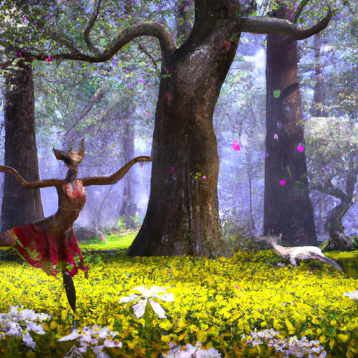
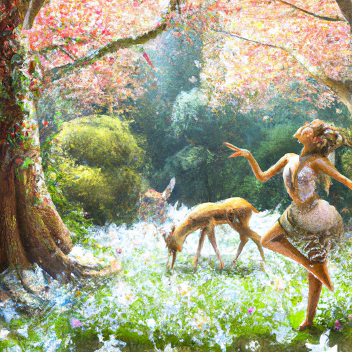
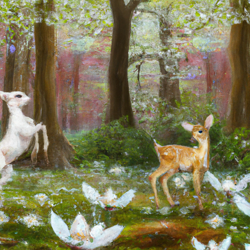

## [this is where I live](https://www.youtube.com/watch?v=EtAKmIy1HZA)

<table align="center">
	<tr>
		<td align="center">
<<<<<<< HEAD
			
		</td>
		<td align="center">
			
		</td>
		<td align="center">
			
=======
			
		</td>
		<td align="center">
			
		</td>
		<td align="center">
			
>>>>>>> ffe52613361410ad9d371a0f80e81de4dd24175f
		</td>
	</tr>
</table>

I love my homelife. However, I have never considered the four walls of my one-room to be the limit of my home. This valley is just as much my living space as my little cottage. And when the weather warms and the spring breezes shiver the new growth of bunchgrass, my world expands. No longer out of my reach due to winter storms, it is a vast wilderness that is as endless as it is varied.

I must share a couple of places that are close to my heart - my home away from home, if you will. Firstly, it’s this forest, a secret location that I go to in order to collect supplies for my art projects. I come here since it is untouched by other humans, and therefore - by using proper foraging techniques, the continuous abundance of nature is preserved. This wood is thoroughly enchanted in my opinion, and if you wandered through the trees until twilight, no doubt you’d spy the dryads and fawns dancing in the shadows and whispering secrets to those who listen. Whatsoever enters this forest succumbs to the otherworldly atmosphere. The whitetail deer, which are normally quite skittish, are unafraid. Our shared respect for one another, perhaps, creates that harmony.

As you have no doubt noticed, the sprinkle of white on the forest flower is due to one of my favorite flowers. It is known as the spring beauty, the first to peek through the melting snow as early as March, a gentle harbinger of the season of new life. My home hosts a large variety of wild growing plants, and whenever I find something I can use or appreciate, I am ecstatic. It is easy to go through your days without noticing these plants, but when your soul is observant and curious, suddenly they are everywhere. Endless shades of green become an assortment of unique and interesting forms of life.

As a connoisseur of herbal teas in all their unusual and wild forms - today I decided to look for wild growing mint and mullein for future experimentation. While the mullein took a little stroll to find, I found the mint almost immediately. All I had to do was follow my nose. The scent is just about the most satisfying I know. My quest for Mullein finally achieved, I found myself next to the lake, my other favorite part of my home. There are few sounds in which I find more contentment than the soft lapping of the lake against the bank. I like to come here often and sit and watch. It is incredible how nature has the ability to remind you of what’s real in your life. What is tactile - not only what you can touch, but feel.