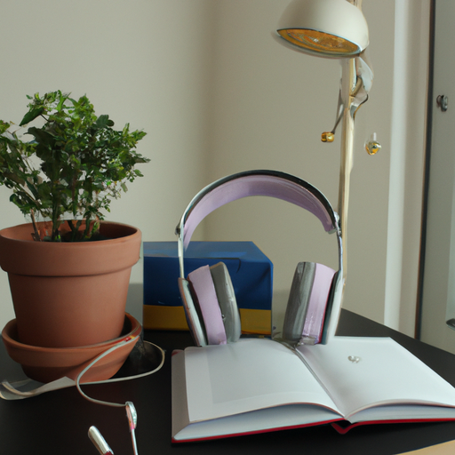
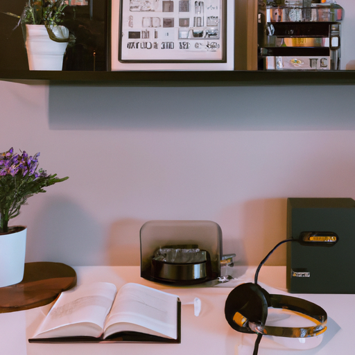
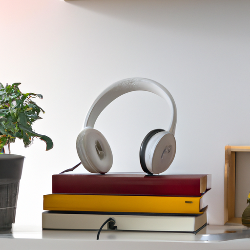

## [weekday life while self-employed - rural living vlog](https://www.youtube.com/watch?v=kbBxCfHzpfI)

<table align="center">
	<tr>
		<td align="center">
			
		</td>
		<td align="center">
			
		</td>
		<td align="center">
			
		</td>
	</tr>
</table>

Good morning everyone, so I normally share videos about what I like to do in my time off, since it’s far more exciting than my days spent working during the week. However, I wanted to share what a weekday is like for me now because in my job as a teacher I couldn’t show that part of my life due to the privacy of my students. I also wanted to chat with you a little bit at the end of this video.

As you can see, my days start around 7am or earlier because my dog dictates my day. Each morning is different, I absolutely cannot stick to a schedule no matter how hard I try, though here I’ll give examples of how I might organize the day. I have recently been making it a priority to wake up early enough that I can read. It’s always been difficult for my brain to instantly wake up and rush into work, so this way I can start at a slower pace. When I worked as a bookseller I also tried to wake up a little early so that I didn’t have to rush to my bus, which would always make me anxious.

I then go to my brand new workspace which I finally have set up, though I’ve been moving things. This office space is not part of my house, and my brother and I rent it together now that he’s helping me make the videos. I usually work here for several hours before going to the post office to send my packages. One challenge I have been facing with this job is that I am not moving as much as I used to. Being a preschool teacher makes you into an athlete, and so I’ve started to put a timer to remind me to get up and stay active. I think I will always miss that more physical part of my former job.

If you have worked with children before you know it can be very hard to get snacks without feeling preyed upon, and this was a big problem for me, so I am happy that I can now feed my body better and more often. As I work I like to listen to audiobooks or music, which has been wonderful. I love to get immersed in a story while I’m wrapping packages. If you’ve seen my past videos you know that I have struggled with being a bit of a workaholic in the past and so listening to music or even just being in a peaceful space helps me stay centered and aware of when it’s time to call it a night. Last year I used to work into the early mornings and get very little sleep and that was putting a strain on me, so while I still work late I try to make sure that I am getting some quality time at home to relax.

I think that while most of us cannot escape a never ending to do list and being very busy, at the least the time we have off - even if it’s just a little - we can really make it count and try to find at least a few moments to breath and ask ourselves what did I gain from today? What little memory will I treasure? For me, my favorite thing from today was taking my dog on his walk, and stopping by a little free library to give away a book and find my next one.

I usually work late into the day, and obviously I skipped over most of it, because it’s boring. I spend most of my week this way and the left over days I try to focus on creating a video. So I do spend some time planning what exciting adventures I’ll be sharing with you. For example, the late spring rains have finally come and so I’ll be taking you along in a mushroom foraging expedition next week. I am so excited.