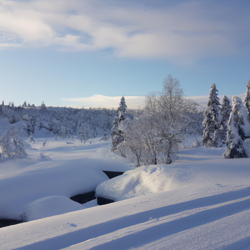
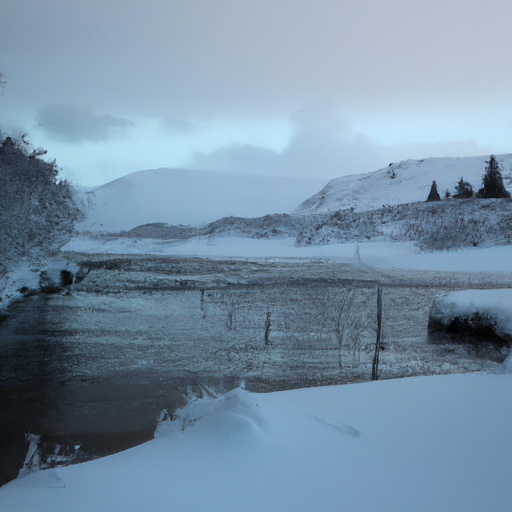
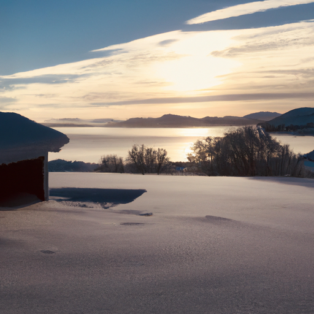

## [weekend life at my cottage - thoughts on loving your appearance](https://www.youtube.com/watch?v=wU_xwCfMEVk)

<table align="center">
	<tr>
		<td align="center">
<<<<<<< HEAD
			
		</td>
		<td align="center">
			
		</td>
		<td align="center">
			
=======
			
		</td>
		<td align="center">
			
		</td>
		<td align="center">
			
>>>>>>> ffe52613361410ad9d371a0f80e81de4dd24175f
		</td>
	</tr>
</table>

Hello everyone, today I had some time off and decided to take you along on some adventures. Since I moved here, I've been teaching myself to skate. I'm not very good at it, but the frozen lake is a wonderful place to practice, especially when there's a sprinkle of new fallen snow over the ice. It doesn't let you gain too much speed, instead allowing you to work on your balance. As you can see, Aegir was very excited to be on the lake today. He first experienced the snow last year when I brought him home as a puppy, and it has quickly become his favorite season.

Did you know that if you light a candle when you glimpse the first star in a clear night sky, the kindly moon rabbit may just stop by your home while you sleep and sprinkle fairy dust on your forehead? It fills your dreams with whimsy and delight. When I was a child, I was definitely convinced that this would happen, and I still love to light candles, just in case.

The next morning, I woke up with the sun and took a long walk with Aegir. I think that there are few joys more deeply felt than a morning walk with a beloved pet. It is one of my favorite parts of my day.

I recently told Luke that I was missing my visits to the mountains, so he gave me some crystals that he had found to remind me of the peaks, now obstructed by so much snow. These crystals probably look nothing like the ones you find in shops, and that is because commercial crystals have gone through a very rigorous process of chemical cleaning. The end result is spectacular, but I personally enjoy these more natural versions as well. They have their own unique type of beauty.

In a strange way, these natural crystals remind me to value my own imperfections. It is so easy to compare our natural selves with the flawless imagery that we see in edited photographs and advertisements. But those images, like polished and cut crystals, come from a labored process of changing something from its natural state to something different. While I respect that a lot of these images are art, I also am aware that much of what we see in my culture is an advertisement. While it may be beautiful, it sometimes omits the origin story that we all have. Every little blemish is part of our personal legend, just as each divet on the face of this crystal is intrinsic to its formation.

You may not have noticed because I try not to showcase it, but the tip of one of my fingers is slightly malformed. This was due to an accident as a child, and I was deeply self-conscious when I was much younger. I don't see it as something beautiful, but I now understand that it is part of my story and I wouldn't want it any other way.

Similarly, by being multiracial, my features are a combination of my ancestors who come from very different parts of the world. If my eyes were bigger, my nose smaller, I would lose the imprint of their lives, their stories, and their appearance. I would feel less connected.

I hope that whoever you are, you love your naturally given features and learn to embrace your imperfections. See that the things you may wish were different are actually just part of your legend, your origin story, and the evidence of the thousand lives that lived before you.

Thank you for sharing a little bit of this day with me. I will be thinking of you, and I will see you next week.