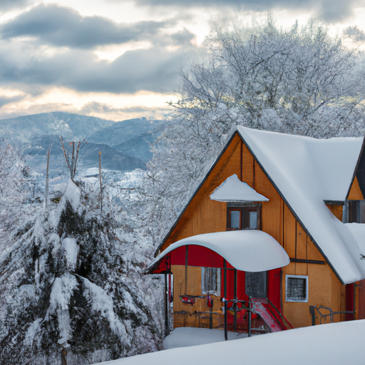

## [when rural living is lonely and boring - deep winter at the cottage](https://www.youtube.com/watch?v=EkndppFl7wA)

<table align="center">
	<tr>
		<td align="center">
			
		</td>
		<td align="center">
			
		</td>
		<td align="center">
			
		</td>
	</tr>
</table>

Hello everyone and welcome to my home. My name is Paola and I live here in the Pacific Northwest in a rural cottage surrounded by forests and public lands. Few people live here and there are a lot of mountains all around. Sometimes they get closed off during the winter. It is indisputably a beautiful place and I wouldn't want to be anywhere else. But nowhere is perfect. I love all the seasons, each is stunning in its own way, but winter offers something quite different from the others.

This time of year has a unique set of challenges, many of them you can guess in regards to dealing with so much snow and freezing cold temperatures. January often finds many experiencing cabin fever. Even though I love pursuing my creative hobbies and being indoors, I miss being able to traipse through the forest barefoot with the ease of the springtime, especially when it's negative 15 and being outdoors can feel so painful and risk frostbite.

I've always had fairly poor circulation in my fingers and toes, so I need to be quite careful this time of year during the very cold snaps. This week had blizzards and I found myself for the most part stuck at home longer than I wished. Snow plows were delayed and rural roads stayed untouched for longer than usual, and sometimes it was quite dangerous to drive. My electricity went in and out, but I am used to this, so don't get me wrong. I love to watch shows and movies and read books as much as the next creative, but after a while without being able to go back to my normal routine, things started getting a bit old.

I found myself for the first time this season, understandably and temporarily, feeling a bit lonely, a bit bored, and out of spirits. I know this is a relatable feeling. I think a lot of people feel those winter blues, especially after the holidays when things get very cold. I think we often associate feelings like this as something we need to cure or see as negative, and I understand. Though I do think sometimes these feelings can be a wonderful opportunity to learn about ourselves and to assert that self-control and believe that this too shall pass.

This week, I definitely felt a bit low. I've had so much family visiting over the holidays, and saying goodbye to my sister was hard as I rarely get to see her. I really do enjoy my time alone and need it every day to recharge, but it's funny how your feelings surprise you sometimes. I am a great believer in distracting myself when needed, so I got busy cleaning the house, reorganizing things, and creating a very lovely and cozy atmosphere that made me fall in love again with my home life.

I do know that I've deeply needed some time alone to recharge, so even though I don't feel as well as I do usually, I am embracing this time. I love doing practical little things that make my life easier. Over the next several weeks, in this case, finishing a much-needed project for my wedding. We needed to make tapers and jar candles, and thankfully I got some help from my fiance. He could finally visit, so we enjoyed a lovely evening together.

Hello everyone, I am sorry in advance, I'm tired. I'm so tired. I don't know, I just didn't sleep well last night. So anyway, hopefully that does not affect my voice. So many people kind of experience the blues this time of year, I think, especially if you're in an area that has so much snow. So anyway, I have kind of used it as an opportunity to just, you know, get all those little things done around the house that I've been meaning to do and really create a cozy atmosphere that makes me feel very welcomed and at peace. So that I've time to recharge.

It was a wonderful December. I received many, many socks as gifts. So I also got a rechargeable hand warmer, which was really important. I struggle a lot with keeping my toes and fingers warm this time of year. I put on gloves and I use the hot packs and I do everything, but still, sometimes it can just get so cold when it's in the negatives, negative 10, negative 12, 15. It really affects me and I guess I just have poor circulation. But yeah, anyway, it's always a bit tricky this time of year. I do find that once chill veins set in, I really need to stay inside for a little bit until my extremities start to heal.

Yeah, so I've been reading a lot. I've been trying out some spooky stories. I read Coraline a couple weeks ago, and I'm now reading a brand new book that's a collection of ghost stories, which I'm quickly realizing is a horrible mistake. I usually don't like scary stories. I'm very afraid very easily, you know. But I don't know why I just decided I should try out books like that because I never read books like that. And so far, I'm a big wimp.

The other thing I've been doing a lot is lighting a lot of candles, even more than usual. I found some beeswax candles at my specialty store recently, and I just really like these. One is in the shape of a pinecone, and one looks like a just whimsical old winter fairy, in my opinion. He's just the cutest little wisest-looking guy, and I just really like it. They are definitely too pretty to burn. As you guys know, I really enjoyed the Mythology Candle Company, and I bought some candles for my family who are also all readers and all love fantasy and fairy tales, and that's what the candles are inspired by. I purchased three candles for December, but then they sent me three more, which was really kind of them. It was very, very sweet and unexpected. The Camelot collection, which was really exciting because not only do I enjoy the Arthurian legends, but my sister grew up just obsessed with King Arthur and Camelot and all those amazing legends. So I'm definitely reserving one of the candles for her.

Anyway, I have slowly become more and more obsessed with candle collecting. I don't know what's happening. It's definitely unnecessary, but I find myself with more candles all the time, and it's wonderful. It's definitely becoming a little bit of a hobby to try out new candles, so I've been having a lot of fun. It's such a simple, kind of silly thing, but it's brought me a lot of joy. I really love when my cottage smells really nice, especially when you have a dog that loves to run around outside and roll in pretty much anything smelly he can find. It's really nice to just light candles and kind of cleanse the space a little bit.

Anyway, I am enjoying this time. I actually do hope that the snow will stop soon so that I can get out a little more and it's a little easier to drive. I am definitely a nervous driver, so I don't like to drive if there is too much snow or too icy, especially because there are a lot of wild animals here and you have to be very careful on the roads. Anyway, I hope you all have a wonderful day. I'm gonna go take a nap. I am so tired. I don't know what's going on. Anyway, I'm sending my love and I wish you all the best. Goodbye.