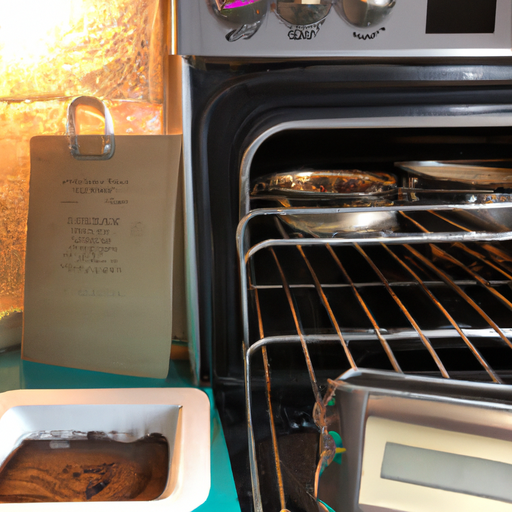
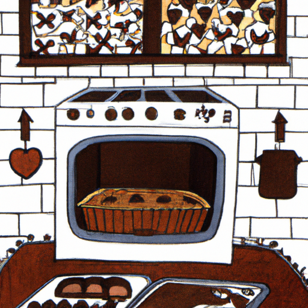
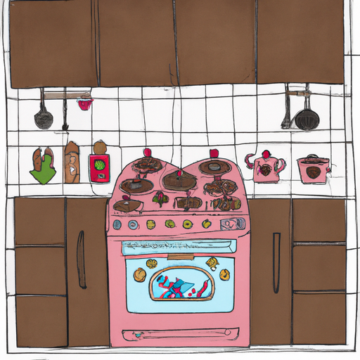

## [why I chose to live alone - two years in a cottage](https://www.youtube.com/watch?v=YpTW1PSiL-U)

<table align="center">
	<tr>
		<td align="center">
<<<<<<< HEAD
			
		</td>
		<td align="center">
			
		</td>
		<td align="center">
			
=======
			
		</td>
		<td align="center">
			
		</td>
		<td align="center">
			
>>>>>>> ffe52613361410ad9d371a0f80e81de4dd24175f
		</td>
	</tr>
</table>

Hello everyone, I missed you last week because I was in bed with a back injury that prevented me from filming. However, I am well again and almost back to normal, but I'm taking things easy and staying indoors for a few more days just in case.

Today I decided to make some chocolate molds. My portable stove top was being finicky so I wasn't able to heat the chocolate properly but I made it work. Though my recipes didn't come out perfect today I think the homemade feel still gives them charm. I also baked a cake since I wanted to experiment with potential flavors for my wedding. Today is raspberries and beets.

In this video, I wanted to answer a question that has been following me for over a year since I started this channel. It was brought up in my last video, I got so many messages about it and it is: why do you live alone? In addition, there are also those who are curious why I don't live with my fiancé. The short answer is that I think how normal my situation seems all depends on your background. For example, within my cultural experience it is normal to live with your family as an adult until you get married, so this is all very relative on who you are and where you come from. While I do have my own little home, I still spend a lot of time with family. In terms of my relationship, I simply wanted to have my own place until we got married. I told that to Luke early on and he said that it was my choice, his love wasn't conditional. I like the feeling of living more independently during this time before I get married. I've never had the chance to live by myself, I always had roommates or shared a space in some way and I really wanted to experience living somewhere that felt like my own. I'd never had that my entire life. After a series of not great relationships, I knew that I would much rather learn to enjoy life alone than be with the wrong person. While I did eventually find someone, I was very ready to live a beautiful life by myself. It had no less value and there were benefits to both lifestyles. While living separately from others isn't necessary, for me it was important and taught me how I wanted to live and what I was willing to compromise if I let someone significant into my life again. As someone who innately wants to please people, it can be easy for me to get swept up and living the way someone else wants me to live instead of understanding how I want to live and what I need. And through that journey of discovery, I found this gentle, quiet rhythm - something I realized I wanted to bring to all my future relationships.

While this time living alone is now coming to an end, it's been extremely fruitful and that's why I'm sharing this with you, because I think it's so important to listen to your heart and not let other forces pressure you into doing something you don't want to do or are not ready for. There will always be people that don't understand and that's okay, what works for one relationship doesn't work for another. For me, I've had my best experience by letting go of what society says is normal or right and instead just listen to my heart. What feels right for me may not be for you, and that's the beauty and complexity of human relationships. Each is different and so interesting.

I missed you guys last week because I hurt my back and it was quite painful. It was really, really hard to do things and this isn't too unusual for me, I used to work at a department store in the basement and it was my job certain days to move a lot of heavy boxes that were dropped off by the post and one day I slipped and fell while holding one of those boxes and I seriously injured my back and I was not able to go into work for a while and since that, at least once a year, something happens where I tweak my back again. It's always a bit annoying but I always get better in a few days of taking a good amount of rest, it's funny how your body kind of lets you know eventually that they just need to stop for a bit and take a break and relax so I did that last week. But I did keep working on Etsy orders and it has given me so much joy to see such lovely responses to my work at the shop. Thank you so much, it has just been so exciting to open again and to get so much lovely feedback and even just answer your questions and communicate with you. There's an option in each order to leave a little note and so many of you have left some really lovely heartfelt notes. I really enjoyed reading them and it's been very, very meaningful for me. So thank you, thank you very much.

Anyway, I usually just don't really talk about my relationship or the reason behind living a specific way that's more private but the questions regarding why I live alone have just continued kind of following me on this channel, which is completely understandable. I understand why someone is curious about that. I have never lived alone and I've rarely gotten that chance. If anything, I've had my own room but I've still shared a space with a lot of people and in many ways I still do that, I still visit my family all the time, you know, absolutely all the time I'm over there hanging out with them. But having a space that is my own was a really positive experience for me and something that I knew I needed to experience, especially before I get married. There are so many ways I think to have healthy relationships, depending on what culture you come from, you know what is normal is very, very different. If anything, living in a place on my own was very strange, exceptionally strange for me because in Hispanic culture it is expected, you know, to have multiple generations under the same roof and that's something I've always loved. My abuelita lived with us for many years and she might live with us again someday and that is something that's always been a very core part of my family life, so I will most likely cultivate that again. You know, of having multiple generations under the same roof when I'm older and that is very normal for me and for my mother's culture and that's something that I have always seen as normal even though people from another part of the world might think that's really strange.

I know not everyone obviously has my personality but something that's always been hard for me is that when I care about someone, when I love someone, I want to kind of allow myself to be absorbed into their world, you know, I want to turn into the person that can make them most happy and that is always a temptation to cater a hundred percent to other people as opposed to really understanding also what I need in order to be my best so that I can help other people as well. That's so important in order to keep that balance and that's something that I've always struggled with. Relationships in the past, I would always get completely absorbed, whatever they liked was what I liked, whatever lifestyle they wanted was now my lifestyle, anything that they approved of is what I would be, whatever they disproved of is what I wouldn't be, and it just felt like I would lose myself in the process and I wouldn't know who I was anymore and that's a really scary place to be that I'm sure many of us experience it someplace or another when you get lost in a situation or a relationship or maybe just generally in life where you come to a point where you're like: who am I? So it was it was been really fruitful to spend this time on my own. Everyone's journey is so individual and unique and specific on their needs and yeah so I just wanted to share that. I will not be living alone for much longer. I am terrified about that idea, it is such a big change. I also noticed some people worried that I was very unhappy with the decision I was making. I wanted to explain that I'm not unhappy, I'm actually very, very excited for the changes coming my way. I'm very excited to live in a new home, finally have a home of my own and all that is just so amazing and wonderful to me but it is a big change and that is terrifying nonetheless. It's been scary but that doesn't mean it's not welcomed. I will miss this home so much but I am ready to also have a home of my own and to start a new journey in a new life with my best friend. Stay safe, take care of yourself, I'm sending my love and I will see you next week. Goodbye.