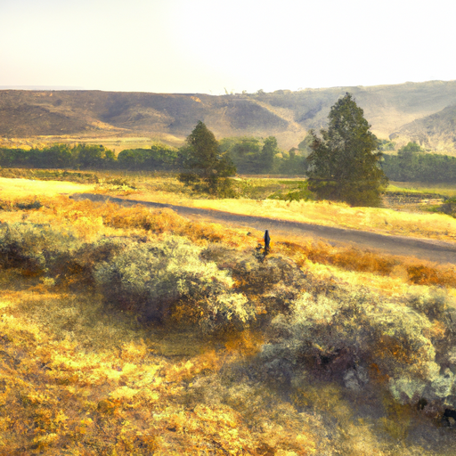
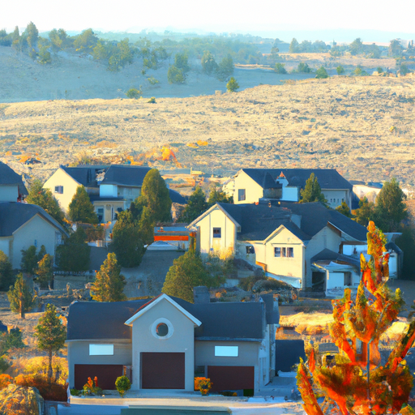
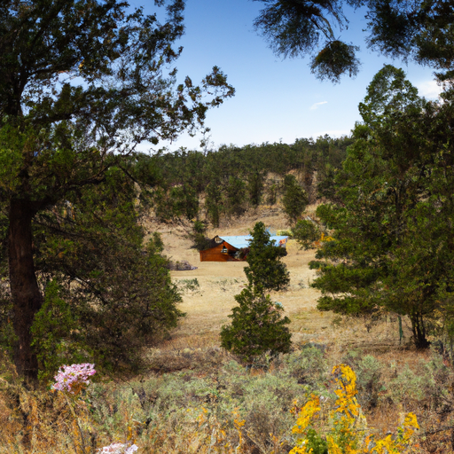

## [working in a rural town long-term - a raw perspective on a simple life](https://www.youtube.com/watch?v=rabKaCmmLhE)

<table align="center">
	<tr>
		<td align="center">
			
		</td>
		<td align="center">
			
		</td>
		<td align="center">
			
		</td>
	</tr>
</table>

It is true, late summer is warm and dry, but there's a scent in the air, soft and easy to overlook, of pine and sage and something else, the barest hint of a crisp autumn approaching. You can feel it in the mornings, cool and soft. It is exhilarating, as after spring. It is certainly my favorite time of year. But this place isn't perfect. Is anywhere? I traveled a lot as a child in a military family, and I can say that nowhere I have lived has been all sunshine.

Here, there live people who are upset about change and frustrated and have strong opinions. And you'd find those sentiments in most places you go. Everywhere you land, there are problems somewhere, something that isn't quite perfect. Over here, like in many places, we struggle with creating opportunities for affordable housing for young working people. They are desperately needed to work at our grocery stores and shops and keep businesses afloat. But they can't find anywhere to live, and even if they did, they can barely afford it working full time. This is a common issue in many communities, but particularly after lockdown, it hit home how much we need working-age people and communities to thrive. And yet, houses and rentals are priced higher and higher in my small town. If we don't have anyone to run our grocery store, that's a big problem because it's the only one we have.

I remember once noticing that there was no milk in the refrigerated section. I inquired and was told that the food was available, but there was just no one to put it on the shelves. As one of the lucky families who found ways to make ends meet, my heart hurts for my peers as well as worries me for my future. I know this is a problem cities and suburban areas alike are facing right now, but it's very true out here as well. I have incredible respect and admiration for all these families getting creative and desperately trying to find new ways to figure things out.

I read the book of hope by Jane Goodall recently, and she made a very important point. When we look outside to everything wrong, we're overwhelmed. But when we look to our families, friends, and local community, there we see opportunities to help, even if it's in a small way. One concern that comes to mind in regards to rural living is your health. My recent emergency room visit brought to light the fact that if you need more help than what a clinic can offer, you may have to drive to a hospital anywhere from one to two hours away. That's a lot of time to wait. I know that sometimes people move away if they have substantial health concerns, so I am deeply grateful that I currently am quite healthy and able-bodied and don't have to worry about that. But I know, for example, if I have a child with health problems or face some myself in the future, it may not be sustainable to live out here. And for that reason, I'm grateful for each and every day I can walk the forest beside my home.

Nowhere in history did communities never face hardship at some point. And for that reason, we desperately need to find ways to enjoy today because our lives keep throwing things at us. And when we feel overwhelmed is when we most need to nurture that deeper purpose and inner richness that reminds us that there is often some small way we can improve our daily experience despite challenges.

My recent health concern made me strikingly aware of the fact that even if everything outside of me is great, I can still someday contract a disease, lose someone I love, and today needs to be lived. My cat's making a lot of noise. I'm sorry. I was reticent to make a video on this topic for a long time because I didn't want to seem like a downer, like I was overly focusing on challenges that my community faces. Thinking it over, I just thought it would make still a very interesting thing to discuss, with the caveat that every single community faces challenges. And I think it is fruitful, you know, of course, to address them. I thought it would be, you know, worthwhile to share those things and bring awareness to them while still showing that obviously, I really love my home and my valley and I care about these issues. And that is why I work hard every day to try to support my community in the ways that I'm able.

For example, something that has always been difficult for me to understand are when people move to a rural area and yet do not have any interest in understanding the ecosystem in which they live and just the more natural aspect of the place they live and caring about preserving that and building their homes and living in a way that they can try to minimize their impact on the land. There are many people that just don't have that on their radar. I could be frustrated about that and let that, you know, affect my mentality. But instead, I think it's just a challenge and a motivator to get involved in my local conservancy group that, you know, reaches out to so many people and tries to educate them and inspire them, you know, to live in a little bit more alignment with the land, just through small sustainable changes. I think that's what matters because I think choosing bitterness would just be easier because it's kind of a reason for me, at least. If I think that way, it's a reason for me not to help and not to get involved and, you know, not try to improve where I live. And that's just not a mentality that works for me. It's certainly not a mentality that leads to my fulfillment and my joy. And so I really care a lot about, you know, really addressing these things and helping in any way I can.

Sometimes communities can be more open to new people and new types of people, and sometimes not. I know here, there is a challenge because my community sees the importance of having young working people here to keep the businesses thriving. But a lot of people are also deeply concerned about losing the feel of the small town and seeing so much change happen over a short period of time. All of these are understandable concerns. And for me, I know that change is inevitable. I think particularly because I right now am alive during a time of great change, and it is both inspiring, um, but also overwhelming sometimes. And I've just had to learn to, you know, accept it. There is so often a silver lining to most shifts and changes in a community. So I do think it's important for me to seek out the positives and negatives of everything and really weigh them and really understand what's happening around me a little bit better. And of course, challenging my way of thinking and really deeply considering perspectives that are not naturally my own.

Another very apparent challenge this community faces, and so many countless communities, you could argue all communities are facing right now, is the impact of climate change. And this area really is no different. I love to showcase the beauty of this valley in my videos and I work to support the wild lands in this area. But last year, we had the National Guard at our front door, you know, fighting rampant wildfires. And even though there is a lot of awareness that wildfires are, in many ways, a quite natural part of this area, you know, what we're seeing now is truly unprecedented. And when you see the destruction, when you live through that time and you see the impact it has on people and know this is not going to be the last time, you feel that way, it can feel very daunting and very scary, you know, especially as someone at the beginning of their life.

While I don't plan to make videos very much in the future, you know, obviously dwelling on these things, I think it is so important to just use it to inspire action. And, you know, whether you give a little bit or a lot to, you know, charity groups and non-profits trying to make a change, you know, whatever you know, you can provide is more than enough. And whatever you can do in your local community to help protect your natural areas or the natural areas of other places you care about, then that is all we need to do. And for me, that's how I see it. We just need to do what we can.

So yes, I hope you found this interesting. Maybe I provided some insights into my community and many communities that you may not have considered before. I think these are obviously I'm mentioning things that mean a lot to me as an individual. I am not an expert on any of these topics. I see so many young people and young families with really small children out here, you know, really getting innovative and figuring out how to just make things work. And it's so inspiring and so incredible. And I, you know, want every young person, young child to feel that way, you know, that they can create that change. Anyway, I'm sending you all my love, and I will see you very soon. Take care. Goodbye.